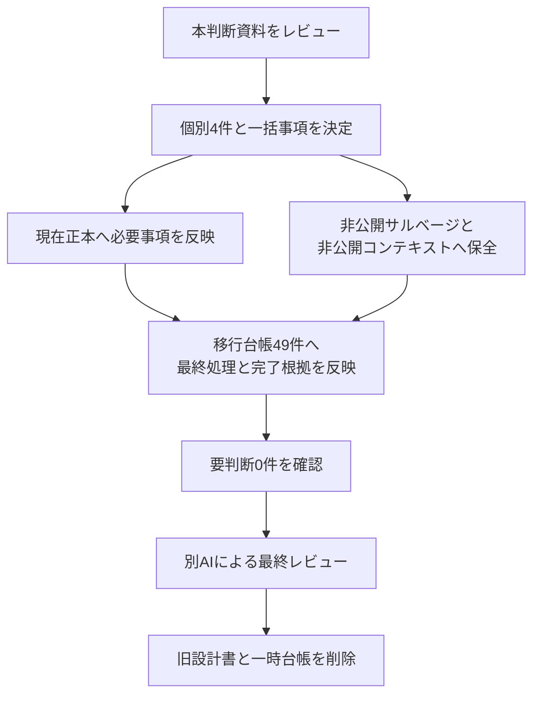

# RAGScope旧設計「要判断」項目の処理方針案

> [!danger] 非公開・一時資料
> この文書は、[RAGScope旧設計移行台帳](./RAGScope旧設計移行台帳.md)の`要判断`49件について、処理方針をレビューするための資料である。  
> GitHubリポジトリへコミットせず、公開文書からリンクしない。判断を移行台帳へ反映した後に削除する。

> [!important] この資料で行っていないこと
> - 現在の正本はまだ変更していない。
> - 旧`ragscope-design.md`はまだ削除していない。
> - 将来案を採用済み設計として確定していない。
> - TicketやBacklogを追加していない。

## 1. 結論

49件を一律に非公開保全するのではなく、次のように処理することを推奨する。

| 推奨処理 | 件数 |
|---|---:|
| 現在の正本へ移行 | 4 |
| 非公開サルベージへ保全 | 38 |
| 非公開コンテキストへ移行 | 1 |
| 現行正本で置換 | 1 |
| 現行計画で置換 | 1 |
| 移行済みへ再判定 | 1 |
| 破棄 | 3 |
| **合計** | **49** |

> [!summary] 全体方針
> - 現在のRAGScope全体に必要な4件は、正本へ短く反映する。
> - 将来Milestoneの設計素材として価値がある38件は、非公開サルベージへ原文・図・数式を保全する。
> - 個人の実行環境条件1件は、非公開プロジェクトコンテキストへ移す。
> - 現行正本で十分な3件は、追加文書を作らず閉じる。
> - 用途がなく、実施時に決め直す方がよい3件は破棄する。

## 2. ユーザーに判断してほしい事項

### 2.1 個別に確認してほしい4件

次の4件は、プロジェクトの要求・用語・非公開前提に影響するため、個別に確認してほしい。

- [ ] `D-010`：`open-weight model`と`self-hosted model`を別概念として公式用語に残す。
- [ ] `D-020`：生成回答が引用したsourceと、評価データ上の正解根拠sourceを区別する要求を追加する。
- [ ] `D-076`：引用の正確性とは別に、引用が必要な主張への「引用完全性」を評価対象へ追加する。
- [ ] `D-060`：現在のローカル実行環境としてM2 16GBを非公開コンテキストへ記録し、モデル選定時に再確認する。

### 2.2 一括承認できる事項

- [ ] `D-072`を現在のシステムアーキテクチャへ反映する。
- [ ] 将来設計候補38件を非公開サルベージへ保全する。
- [ ] `D-083`・`D-087`・`D-090`を、既存正本で解決済みとして閉じる。
- [ ] `D-084`・`D-085`・`D-088`を破棄する。

## 3. 現在の正本へ反映する項目

| ID | 旧設計の内容 | 推奨処理 | 処理先・確認時期 | 推奨理由 | レビュー |
|---|---|---|---|---|---|
| `D-010` | `open-weight model`と`self-hosted model`の区別 | **現在の正本へ移行** | `システムアーキテクチャ.md#1.1` | 現在の文書で`self-hosted model`を使用している一方、`open-weight model`との違いが失われている。重みの公開状態と実行環境の管理形態は別概念であり、短い用語定義として残す価値がある。 | 個別確認 |
| `D-020` | 回答が引用したsourceと、評価上回答を裏付けるsourceを分ける方針 | **現在の正本へ移行** | `RAGScope要求定義.md#2.3` | 生成結果が実際に引用したsourceと、評価問題が正解根拠として持つsourceは役割が異なる。引用評価と追跡可能性の前提になるため、将来実装の詳細ではなく要求として先に区別しておく方がよい。 | 個別確認 |
| `D-072` | 正規化・チャンク化・Embedding生成は質問のたびではなく、文書またはチャンク条件の登録・更新時に行うライフサイクル規則 | **現在の正本へ移行** | `システムアーキテクチャ.md#6` | 文書更新処理と質問処理のライフサイクルを分ける規則であり、現在の全体アーキテクチャに属する。質問ごとに文書処理を再実行しないことを一文で明示すれば十分。 | 一括承認 |
| `D-076` | 引用が必要な主張に引用が付いているかを評価する引用完全性の規則 | **現在の正本へ移行** | `RAGScope要求定義.md#2.6` | 引用の正確性だけでは、引用が必要な主張に引用が欠けている問題を検出できない。RAGScopeの評価能力として独立した価値があるため、引用完全性を要求へ追加することを推奨する。 | 個別確認 |

### 3.1 反映時の提案

#### `D-010`

[システムアーキテクチャ](./docs/design/システムアーキテクチャ.md)の「1.1 検索処理で使用する用語」へ、次の2語を追加する。

- `open-weight model`：model weightが利用可能であることを表す。
- `self-hosted model`：利用者が管理する実行環境でmodelを動かすことを表す。

両者は同義ではなく、open-weight modelをself-hostして使用する構成をRAGScopeの基本対象とする。

#### `D-020`

[RAGScope要求定義](./docs/RAGScope要求定義.md)の「2.3 回答生成と引用」へ、次の趣旨の要求を追加する。

> 回答生成結果が参照したsourceと、評価問題が正解根拠として保持するsourceを区別して管理できること。

要求IDを追加する場合は、既存の続番として`REQ-GEN-006`が候補になる。

#### `D-072`

[システムアーキテクチャ](./docs/design/システムアーキテクチャ.md)の文書取り込みフローへ、次の趣旨を追加する。

> 正規化、チャンク化、文書Embedding生成は文書または分割条件の登録・更新時に行い、質問処理のたびには実行しない。

#### `D-076`

[RAGScope要求定義](./docs/RAGScope要求定義.md)の「2.6 評価」へ、次の趣旨の要求を追加する。

> 回答内の引用が正しいかだけでなく、根拠を必要とする主張に必要な引用が付いているかを評価できること。

要求IDを追加する場合は、既存の続番として`REQ-EVAL-008`が候補になる。

## 4. 非公開サルベージへ保全する項目

> [!important] 保全の意味
> ここでの保全は採用ではない。旧設計の原文、Mermaid図、数式、表、規則を失わないように保存し、対応Milestoneを具体化するときに採用・変更・破棄を改めて決める。

保全先は、非公開の`RAGScope旧設計サルベージ.md`を推奨する。この文書は期限、優先度、進捗状態、作業一覧を持たず、Backlogとして使わない。

### 4.1 v0.1 文書処理・評価

| ID | 旧設計の内容 | 推奨処理 | 処理先・確認時期 | 推奨理由 | レビュー |
|---|---|---|---|---|---|
| `D-025` | LF・NFC・Unicodeコードポイント・半開区間・hash・version更新・境界テスト | **非公開サルベージへ保全** | `RAGScope旧設計サルベージ.md`（v0.1 文書処理） | 正規化とoffsetの厳密規則は追跡可能性の中核候補だが、v0.1の機能設計とテスト方針を見て採用する必要がある。 | 一括承認 |
| `D-026` | `Chunk.content = normalized_content[start:end]`の式 | **非公開サルベージへ保全** | `RAGScope旧設計サルベージ.md`（v0.1 文書処理） | `Chunk.content`と元文書の対応を保証する有力な不変条件。式を失わず保全し、v0.1設計時に採用判断する。 | 一括承認 |
| `D-027` | `section_title`を本文へ付加せずEmbedding入力だけで結合する規則 | **非公開サルベージへ保全** | `RAGScope旧設計サルベージ.md`（v0.1 文書処理） | 検索品質用の入力加工と根拠追跡用本文を分離する案。model・Tokenizer選定後に妥当性を確認する。 | 一括承認 |
| `D-028` | 対応関係のMermaid図と説明 | **非公開サルベージへ保全** | `RAGScope旧設計サルベージ.md`（v0.1 文書処理） | 元文書・Chunk・Evidence・Embeddingの関係図は複数機能の境界を考える素材として価値が高い。 | 一括承認 |
| `D-033` | overlap policy・threshold・Coverage/Densityの数式 | **非公開サルベージへ保全** | `RAGScope旧設計サルベージ.md`（v0.1 評価） | 既存要求の指標名を実装可能にする数式候補。thresholdを含め、評価設計時に確定する。 | 一括承認 |
| `D-034` | 範囲の識別、和集合、異文書、Density分母、retrieval/context別計算等の規則 | **非公開サルベージへ保全** | `RAGScope旧設計サルベージ.md`（v0.1 評価） | 和集合、異文書、Density分母などは再集計の一貫性を左右するため、詳細規則を保全する。 | 一括承認 |
| `D-036` | Recall/PrecisionをChunkSet間比較の主指標にしない、nDCG延期、no-answerを検索評価へ混ぜない方針 | **非公開サルベージへ保全** | `RAGScope旧設計サルベージ.md`（v0.1 評価） | 指標の誤用を防ぐ方針として有用だが、実際の評価データと比較目的を確認して採用する。 | 一括承認 |
| `D-073` | no-answer質問はevidence spanを持たない規則 | **非公開サルベージへ保全** | `RAGScope旧設計サルベージ.md`（v0.1 評価データ） | no-answerとevidenceの表現はデータモデル上の重要候補。answerability導入時に確定する。 | 一括承認 |
| `D-074` | 同じ答えが複数箇所に存在する場合、代表となる1箇所だけを正解根拠にする規則 | **非公開サルベージへ保全** | `RAGScope旧設計サルベージ.md`（v0.1 評価データ） | 代表span方式は評価を単純化する一方で偏りもあり得る。採用前提ではなく、要再検討案として保全する。 | 一括承認 |
| `D-075` | devは日常的な調整に使い、testは一区切りの時点だけ実行する運用 | **非公開サルベージへ保全** | `RAGScope旧設計サルベージ.md`（v0.1 評価運用） | dev/testの使い分けは妥当な候補だが、データ量と実験運用を決めた段階で正式化する。 | 一括承認 |

### 4.2 v0.1 Config・実行データ・データモデル

| ID | 旧設計の内容 | 推奨処理 | 処理先・確認時期 | 推奨理由 | レビュー |
|---|---|---|---|---|---|
| `D-040` | ExperimentConfigが参照するConfig群の関係 | **非公開サルベージへ保全** | `RAGScope旧設計サルベージ.md`（v0.1 データモデル） | ExperimentConfigと各Configの関係は設計の出発点として有用。現在設計としては固定せず保全する。 | 一括承認 |
| `D-041` | Config・Run・生データ・再集計のMermaid図 | **非公開サルベージへ保全** | `RAGScope旧設計サルベージ.md`（v0.1 データモデル） | Config・Run・生データ・再集計の関係図は、v0.1の設計分割を検討する素材として残す。 | 一括承認 |
| `D-042` | 各Configの詳細フィールド表 | **非公開サルベージへ保全** | `RAGScope旧設計サルベージ.md`（v0.1 データモデル） | 詳細フィールドはそのままschemaにしないが、必要情報の候補一覧として保全する。 | 一括承認 |
| `D-043` | EmbeddingSpecは意味、EmbeddingRuntimeConfigは計算方法という区別 | **非公開サルベージへ保全** | `RAGScope旧設計サルベージ.md`（v0.1 Embedding・データモデル） | Embeddingの意味と実行方法を分ける考え方は再利用・比較の設計に有力。 | 一括承認 |
| `D-044` | 型付きConfig→canonical JSON→hashの図と一意編集元の規則 | **非公開サルベージへ保全** | `RAGScope旧設計サルベージ.md`（v0.1 データモデル） | 型付きConfigからcanonical JSONとhashを生成する案は再現性に関わるため、ADR候補として保全する。 | 一括承認 |
| `D-045` | ExperimentRun等6レコードの詳細フィールド表 | **非公開サルベージへ保全** | `RAGScope旧設計サルベージ.md`（v0.1 データモデル） | 実行レコードの候補は生データ保存と再集計の具体化に役立つ。正確なschemaは実装時に再設計する。 | 一括承認 |
| `D-046` | 時間はstage単位、score nullable、stage間score非比較、source_rank/source_scoreを持たない規則 | **非公開サルベージへ保全** | `RAGScope旧設計サルベージ.md`（v0.1 検索・データモデル） | stage単位の時間、nullable score、尺度間非比較は検索結果保存の意味論として重要な候補。 | 一括承認 |
| `D-049` | execution_environmentの具体項目（image digest、OS、CPU/GPU等） | **非公開サルベージへ保全** | `RAGScope旧設計サルベージ.md`（v0.1 再現性） | 実行環境の候補項目は再現性要求を具体化するチェックリストとして有用。 | 一括承認 |
| `D-050` | Document等8 Entityの詳細フィールド表 | **非公開サルベージへ保全** | `RAGScope旧設計サルベージ.md`（v0.1 データモデル） | Entity候補一覧は概念モデルの下書きとして保全するが、現時点の正本にはしない。 | 一括承認 |
| `D-051` | Chunk/Embeddingの一意性・runtime・distance metric配置等の不変条件 | **非公開サルベージへ保全** | `RAGScope旧設計サルベージ.md`（v0.1 データモデル） | 一意性やdistance metricの配置は不変条件候補として重要。migration設計時に検証する。 | 一括承認 |
| `D-052` | 文書・dataset・Config・Run・Hit・Generation・MetricのER図 | **非公開サルベージへ保全** | `RAGScope旧設計サルベージ.md`（v0.1 データモデル） | 主要EntityのER図は今回のサルベージで特に失ってはいけない設計素材。 | 一括承認 |
| `D-077` | `corpus_version_id`を`chunk_set_id`から導出する規則 | **非公開サルベージへ保全** | `RAGScope旧設計サルベージ.md`（v0.1 データモデル） | 導出可能なIDを重複保持しない案として保全し、実際の参照・query要件で判断する。 | 一括承認 |
| `D-078` | 未使用のreranker・generation Configはnullableとし、ダミーConfigを作らない規則 | **非公開サルベージへ保全** | `RAGScope旧設計サルベージ.md`（v0.1 データモデル） | 未導入機能をダミーConfigで表現しない案は有力。nullable設計と制約を実装時に決める。 | 一括承認 |
| `D-079` | 同じ意味を同じcanonical表現にし、canonical化規則自体もversion管理する規則 | **非公開サルベージへ保全** | `RAGScope旧設計サルベージ.md`（v0.1 データモデル） | canonical化規則のversion管理はD-044と合わせてADR候補として保全する。 | 一括承認 |

### 4.3 v0.1 計画・モデル方針

| ID | 旧設計の内容 | 推奨処理 | 処理先・確認時期 | 推奨理由 | レビュー |
|---|---|---|---|---|---|
| `D-065` | 9段階の実装順Mermaid図 | **非公開サルベージへ保全** | `RAGScope旧設計サルベージ.md`（v0.1 計画） | 旧実装順はTicket化せず、v0.1具体化時に見直すための過去案として保全する。 | 一括承認 |
| `D-086` | Embedding・reranker・generationは役割ごとに1 modelへ固定する方針 | **非公開サルベージへ保全** | `RAGScope旧設計サルベージ.md`（各モデル導入Milestone） | 役割ごとに最初は1 modelへ固定する方針は、比較機能を作る前のスコープ制御案として保全する。 | 一括承認 |

### 4.4 v0.1.5 AWS

| ID | 旧設計の内容 | 推奨処理 | 処理先・確認時期 | 推奨理由 | レビュー |
|---|---|---|---|---|---|
| `D-053` | Embeddingのみ、除外機能、EC2直接配置等のスパイク範囲 | **非公開サルベージへ保全** | `RAGScope旧設計サルベージ.md`（v0.1.5 AWS） | AWSスパイクの最小範囲案。実施時のサービス仕様・料金を再確認する前提で保全する。 | 一括承認 |
| `D-054` | Runtime Stack・Artifact Stack・EC2・RDS・S3・Secrets・Logsの構成図 | **非公開サルベージへ保全** | `RAGScope旧設計サルベージ.md`（v0.1.5 AWS） | Runtime/Artifact Stack分離を含む構成図はスパイク設計の有力なたたき台。 | 一括承認 |
| `D-055` | public EC2・private RDS・IGW・S3 endpoint等のネットワーク図 | **非公開サルベージへ保全** | `RAGScope旧設計サルベージ.md`（v0.1.5 AWS） | ネットワーク図は重要だが、AWSの最新仕様・費用・接続要件を実施時に再検証する。 | 一括承認 |
| `D-056` | Session Manager、inboundなし、RDS非公開、SG参照、endpoint等の規則と成功条件 | **非公開サルベージへ保全** | `RAGScope旧設計サルベージ.md`（v0.1.5 AWS） | Session Manager、RDS非公開、SG参照などのセキュリティ案をチェックリストとして保全する。 | 一括承認 |
| `D-057` | secret最小権限、Artifact/Runtime分離、DeletionPolicy、export | **非公開サルベージへ保全** | `RAGScope旧設計サルベージ.md`（v0.1.5 AWS） | secret、Stack分離、DeletionPolicy、exportは作成と削除の安全性に関わる候補。 | 一括承認 |
| `D-058` | 課金対象、作成→実験→export→削除、Budget・snapshot等 | **非公開サルベージへ保全** | `RAGScope旧設計サルベージ.md`（v0.1.5 AWS） | 料金対策と作成から削除までの流れを、設計候補と検証項目として残す。 | 一括承認 |
| `D-080` | AWSスパイクで使用するPython APIをEmbedding・状態確認系に限定し、rerank・generateを使用しない境界 | **非公開サルベージへ保全** | `RAGScope旧設計サルベージ.md`（v0.1.5 AWS） | AWSスパイクで使用するAPI境界は、スコープ膨張を防ぐ候補として残す。 | 一括承認 |
| `D-081` | NAT Gatewayが本当に必要かを確認する規則 | **非公開サルベージへ保全** | `RAGScope旧設計サルベージ.md`（v0.1.5 AWS） | NAT Gatewayの要否確認はコストと構成を左右するため、実施時の検証チェックとして保全する。 | 一括承認 |
| `D-082` | READMEへ削除手順を記載し、削除後にsnapshotなどの残存物がないことを確認する規則 | **非公開サルベージへ保全** | `RAGScope旧設計サルベージ.md`（v0.1.5 AWS） | 削除手順と残存物確認はスパイクの完了条件候補として価値が高い。 | 一括承認 |
| `D-089` | AWS検証で通信経路、IAM、削除、料金、失敗点を記録する具体的な項目 | **非公開サルベージへ保全** | `RAGScope旧設計サルベージ.md`（v0.1.5 AWS） | 通信経路、IAM、削除、料金、失敗点はAWS Experimentで観測すべき候補項目として残す。 | 一括承認 |

### 4.5 v0.2以降・v1.1以降

| ID | 旧設計の内容 | 推奨処理 | 処理先・確認時期 | 推奨理由 | レビュー |
|---|---|---|---|---|---|
| `D-037` | 設定項目と「検索score閾値＋prompt拒否」から始める方針 | **非公開サルベージへ保全** | `RAGScope旧設計サルベージ.md`（v0.2以降 生成・評価） | no-answer能力は要求済みだが、score閾値とprompt拒否の組合せは実装候補の一つ。候補としてのみ保全する。 | 一括承認 |
| `D-064` | EC2直接→container→ECR→ECS/Fargateの検討順と追加候補 | **非公開サルベージへ保全** | `RAGScope旧設計サルベージ.md`（v1.1以降 AWS） | EC2直接実行からcontainer/ECR/ECSへ進む検討順は、将来判断の参考案としてのみ保全する。 | 一括承認 |

## 5. 非公開プロジェクトコンテキストへ移す項目

| ID | 旧設計の内容 | 推奨処理 | 処理先・確認時期 | 推奨理由 | レビュー |
|---|---|---|---|---|---|
| `D-060` | M2 16GBで動作するgeneration modelを選ぶという個人環境条件 | **非公開コンテキストへ移行** | `RAGScopeプロジェクトコンテキスト.md` | M2 16GBは公開製品仕様ではないが、generation model選定を左右する現実の制約である。現在環境として非公開で保持し、モデル選定時に再確認する注記を付ける。 | 個別確認 |

> [!note] 記載案
> 「現在の主なローカル実行環境はApple Silicon M2・memory 16GBである。generation modelなど実行資源へ強く依存する選定では、この環境で実行可能かを確認する。環境は変更され得るため、選定時に再確認する。」

## 6. 既存正本で閉じる項目

| ID | 旧設計の内容 | 推奨処理 | 処理先・確認時期 | 推奨理由 | レビュー |
|---|---|---|---|---|---|
| `D-083` | 実測した文書数・データ量・チャンク数・Embedding数・処理時間をcorpusとmodel決定後にExperimentへ記録する方針 | **現行正本で置換** | 変更なし | 実測値はExperimentへ記録するという責務が文書管理規約にあり、性能・実行環境の記録要求も要求定義に存在する。旧設計の具体的な列挙を別途恒久化する必要はない。 | 一括承認 |
| `D-087` | v0.1では非同期jobを導入せず同期処理とする方針 | **現行計画で置換** | 変更なし | 非同期jobはRoadmap上でv0.5の対象になっている。v0.1を同期処理に固定する旧案を恒久保存せず、v0.1具体化時に対象外として必要な範囲だけ決めればよい。 | 一括承認 |
| `D-090` | GitHubリポジトリ名・CLI command・環境変数prefixなど実装識別子の規則 | **移行済みへ再判定** | `RAGScope概要.md#1.1` | 最新版の概要にはGitHubリポジトリ名、CLIコマンド、環境変数prefixがすでに記載されている。正確な実装は将来`--help`や設定を正本とするため、追加移行は不要。 | 一括承認 |

### 6.1 補足

- `D-083`：実測値はExperimentへ記録するという一般責務と、性能・実行環境を記録する要求がすでに存在する。
- `D-087`：非同期jobはRoadmapでv0.5の対象である。v0.1の処理方式はv0.1具体化時に必要な範囲だけ決める。
- `D-090`：最新版の[RAGScope概要「1.1 名称と識別子」](<./docs/RAGScope概要.md#1.1 名称と識別子>)へ移行済みである。

## 7. 破棄する項目

| ID | 旧設計の内容 | 推奨処理 | 処理先・確認時期 | 推奨理由 | レビュー |
|---|---|---|---|---|---|
| `D-084` | `easy`・`terminology`の分類タグ案 | **破棄** | なし | `easy`・`terminology`を使った検索・集計・運用が定義されていない。用途のない分類を先行して残すと、不要なメタデータ運用になる。 | 一括承認 |
| `D-085` | 最初は5〜10問、その後30〜50問へ増やす評価問題件数の目安 | **破棄** | なし | 5〜10問、30〜50問は初期検証の目安にすぎず、恒久要求でも設計でもない。v0.1具体化時に利用可能な時間とコーパスを見て決め直す方がよい。 | 一括承認 |
| `D-088` | 回答評価でRagasを補助的に使用する具体的library案 | **破棄** | なし | Ragasは回答評価を実現する一つのlibrary候補であり、要求や責務はすでに定義されている。実装前に候補を固定保存せず、v0.4で比較・選定する。 | 一括承認 |

> [!warning] 破棄の意味
> 旧案を不採用の恒久設計として残さないという意味である。将来必要になった場合は、当時の目的・データ・実装条件から改めて決める。

## 8. 承認後に行う作業

1. ユーザー判断を確定する。
2. `D-010`・`D-020`・`D-072`・`D-076`の承認分を正本へ反映する。
3. `D-060`を承認した場合、非公開プロジェクトコンテキストへ反映する。
4. 38件の原文・図・数式・表を、非公開サルベージへテーマ別に移す。
5. 移行台帳の全49件へ、最終処理、保存先、完了根拠を記録する。
6. `要判断`と`要移行`が0件であることを確認する。
7. 別AIによる最終レビューを行う。
8. 問題がなければ旧`ragscope-design.md`と一時的な移行台帳・判断資料を削除する。

## 9. レビュー結果記入欄

> [!todo] 個別判断
> - `D-010`：
> - `D-020`：
> - `D-076`：
> - `D-060`：

> [!todo] 一括判断
> - `D-072`の正本反映：
> - 38件の非公開サルベージ：
> - `D-083`・`D-087`・`D-090`のクローズ：
> - `D-084`・`D-085`・`D-088`の破棄：

## 10. 参照した正本

- [旧ragscope-design](./ragscope-design.md)
- [RAGScope旧設計移行台帳](./RAGScope旧設計移行台帳.md)
- [RAGScope概要](./docs/RAGScope概要.md)
- [RAGScope要求定義](./docs/RAGScope要求定義.md)
- [システムアーキテクチャ](./docs/design/システムアーキテクチャ.md)
- [RAGScope文書管理規約](./RAGScope文書管理規約.md)
- [RAGScopeプロジェクト管理規約](./RAGScopeプロジェクト管理規約.md)
- [Obsidianメタデータ規約](./Obsidianメタデータ規約.md)
- [RAGScopeプロジェクトコンテキスト](./RAGScopeプロジェクトコンテキスト.md)
- [RAGScopeロードマップ](./project-management/ロードマップ.md)
- [v0.0 Milestone](./project-management/milestones/v0.0/v0.0.md)
