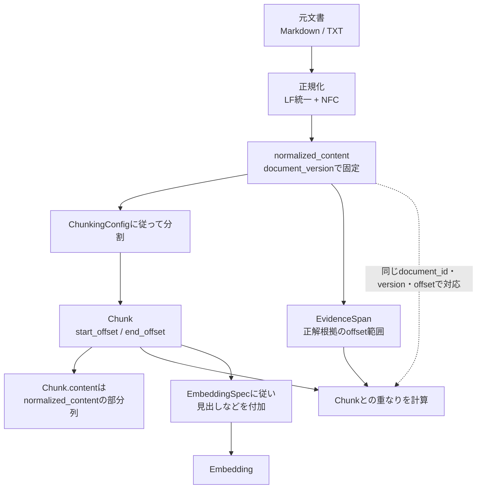
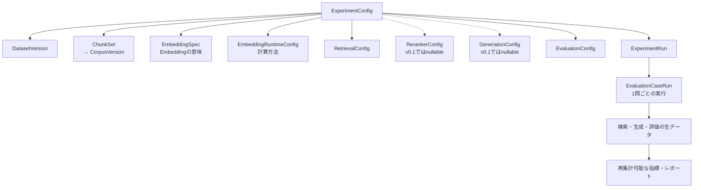
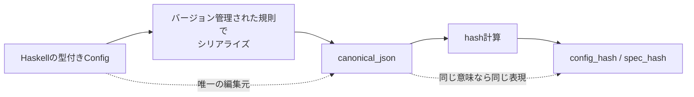
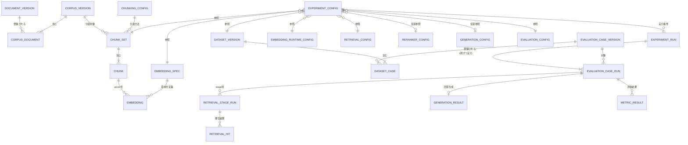
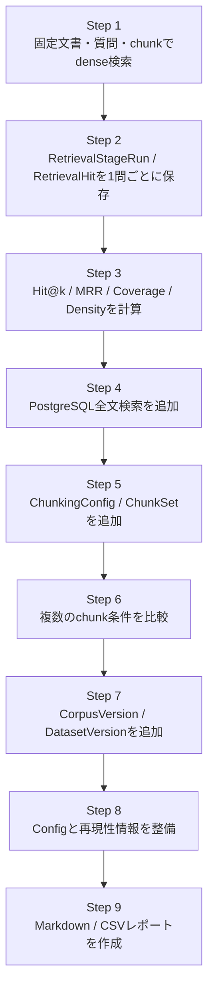
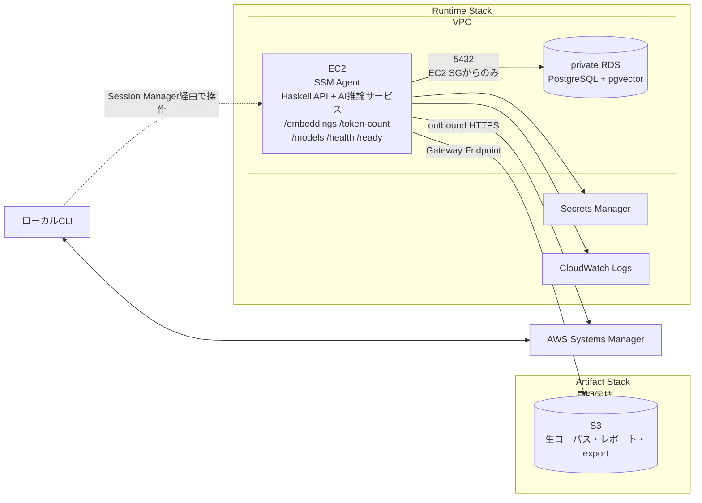
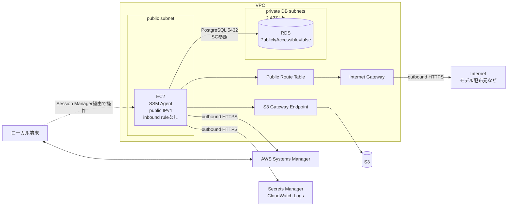

# RAGScope旧設計サルベージ

> [!danger] 非公開
> この文書は、旧`ragscope-design.md`に含まれていた未採用の将来設計候補を、対応Milestoneで再検討できるように保全する資料である。  
> GitHubリポジトリへコミットせず、公開文書からリンクしない。

> [!important] 採用状態
> 本文の内容は現在仕様ではなく、採用済み設計でもない。  
> 対応Milestoneを具体化するときに、最新の要求、実装、技術仕様、実測結果と照合し、採用・変更・破棄を改めて判断する。

> [!warning] Backlogとして使用しない
> この文書は期限、優先度、進捗状態、作業一覧を持たない。  
> 実施すると決定した作業は、着手するMilestoneを具体化した時点でEpic・Ticketへ落とし込む。

## 1. 保全対象

| 対応時期 | 台帳ID |
|---|---|
| v0.1 文書処理・評価 | `D-025`、`D-026`、`D-027`、`D-028`、`D-033`、`D-034`、`D-036`、`D-073`、`D-074`、`D-075` |
| v0.1 Config・実行データ・データモデル | `D-040`、`D-041`、`D-042`、`D-043`、`D-044`、`D-045`、`D-046`、`D-049`、`D-050`、`D-051`、`D-052`、`D-077`、`D-078`、`D-079` |
| v0.1 計画・モデル方針 | `D-065`、`D-086` |
| v0.1.5 AWS | `D-053`、`D-054`、`D-055`、`D-056`、`D-057`、`D-058`、`D-080`、`D-081`、`D-082`、`D-089` |
| v0.2以降・v1.1以降 | `D-037`、`D-064` |

## 2. v0.1 文書処理・評価

### 2.1 正規化とoffset

> [!note] 対応ID
> `D-025`

offsetは、**正規化後の本文に対するUnicodeコードポイント位置**とする候補。

- 改行コードはLF、Unicode正規化はNFC
- offsetは半開区間`[start_offset, end_offset)`
- 正規化済み本文を保存し、`normalized_content_hash`はそのUTF-8バイト列から計算する
- 正規化規則を変えた場合は`document_version`を更新する
- 結合文字や絵文字を含むoffsetテストを用意する

```text
EvidenceSpan
- document_id
- document_version
- start_offset
- end_offset
```

### 2.2 `Chunk.content`とEmbedding入力

> [!note] 対応ID
> `D-026`、`D-027`、`D-028`

候補となる不変条件：

$$
\mathrm{Chunk.content}
=
\mathrm{normalized\_content}
[\mathrm{start\_offset}:\mathrm{end\_offset}]
$$

- Markdown記法は削除せず、LF統一とNFC以外の破壊的変換はしない
- `section_title`はMarkdown見出しから抽出する補助メタデータとし、`Chunk.content`へ付加しない
- Embedding用の見出し等は、元の`Chunk.content`を変えず`EmbeddingSpec`から組み立てる

```text
embedding_input = section_title + "\n\n" + chunk_content
```



`Chunk.content`自体は元文書との対応を壊さず、Embedding用の入力だけを別途組み立てる候補とする。本文追跡用の内容と検索品質向上用の入力を分離することで、見出し等を利用した検索精度の工夫と、EvidenceSpanによる評価可能性の維持を両立する意図である。

### 2.3 評価データの追加規則

> [!note] 対応ID
> `D-073`、`D-074`、`D-075`

- no-answer質問はevidence spanを持たない。
- 同じ答えが複数箇所にある場合は、代表となる1箇所だけを正解根拠にする。
- 普段の調整は`dev`で行い、`test`は一区切りついたときだけ実行する。

いずれもv0.1具体化時に、評価データの規模、偏り、利用方法を確認して正式化する。

### 2.4 evidence spanとチャンクの対応

> [!note] 対応ID
> `D-033`、`D-034`

関連チャンクは、1文字でも重なれば正解とはせず、evidence spanに対する被覆率と実験条件で決める候補。

```text
- evidence_overlap_policy
- evidence_overlap_threshold
```

上位`k`件のチャンクが覆う範囲の和集合を`R_k`、証拠範囲を`E`とする。

$$
\mathrm{EvidenceCoverage@k}
=
\frac{|E \cap R_k|}{|E|}
$$

$$
\mathrm{EvidenceDensity@k}
=
\frac{|E \cap R_k|}{|R_k|}
$$

- `EvidenceCoverage@k`は、必要な証拠をどれだけ回収したかを表す。
- `EvidenceDensity@k`は、取得した文章のうち実際の証拠がどれだけ含まれるかを表す。

範囲は`(document_id, document_version, offset)`で識別する。

- 同一文書内の重複範囲は和集合にし、二重計上しない
- 異なる文書の同じoffsetは別の位置として扱う
- Evidenceとの共通部分は、同じ文書・versionだけで発生する
- Densityの分母には、他文書から取得した文字数も含める
- CoverageとDensityは同じ`k`で必ずセットにして見る
- retrieval結果と実際のcontextは分けて計算する
- 異なる`ChunkSet`間では、この2指標を主指標にする

### 2.5 指標の適用条件

> [!note] 対応ID
> `D-036`

- `Recall@k`と`Precision@k`は`ChunkSet`ごとに関連チャンク集合自体が変わるため、異なるチャンク条件間の主指標にはしない。
- `nDCG@k`は段階的な関連度ラベルを導入した後で追加する。
- no-answerは通常の検索評価へ混ぜない。

## 3. v0.1 Config・実行データ・データモデル

### 3.1 Configの関係

> [!note] 対応ID
> `D-040`、`D-041`、`D-042`、`D-043`、`D-077`、`D-078`

`ExperimentConfig`が参照する候補：

```text
ExperimentConfig
- experiment_config_id
- dataset_version_id
- chunk_set_id
- embedding_spec_id
- embedding_runtime_config_id
- retrieval_config_id
- reranker_config_id
- generation_config_id
- evaluation_config_id
```

- `corpus_version_id`は`chunk_set_id`から導出する。
- v0.1で未使用の`reranker_config_id`と`generation_config_id`はnullableとし、ダミーConfigは作らない。



| Config | 候補フィールド |
|---|---|
| `EmbeddingSpec` | `embedding_spec_id`、`model_id`、`model_revision`、`tokenizer_id`、`tokenizer_revision`、`query_prefix`、`document_prefix`、`pooling`、`max_length`、`truncation`、`normalized`、`canonical_json`、`spec_hash` |
| `EmbeddingRuntimeConfig` | `embedding_runtime_config_id`、`batch_size`、`device`、`dtype`、`canonical_json`、`config_hash` |
| `RetrievalConfig` | `retrieval_config_id`、`distance_metric`、`full_text_search_config`、`full_text_candidate_k`、`dense_candidate_k`、`hybrid_fusion_method`、`hybrid_fusion_parameters`、`fusion_output_k`、`canonical_json`、`config_hash` |
| `RerankerConfig` | `reranker_config_id`、`model_id`、`model_revision`、`tokenizer_id`、`tokenizer_revision`、`reranker_candidate_k`、`reranker_output_k`、`batch_size`、`canonical_json`、`config_hash` |
| `GenerationConfig` | `generation_config_id`、`model_id`、`model_revision`、`tokenizer_id`、`tokenizer_revision`、`prompt_template_version`、`temperature`、`seed`、`do_sample`、`top_p`、`max_new_tokens`、`stop_sequences`、`context_chunk_count`、`max_context_tokens`、`context_ordering`、`canonical_json`、`config_hash` |
| `EvaluationConfig` | `evaluation_config_id`、`evidence_overlap_policy`、`evidence_overlap_threshold`、`no_answer_policy`、`no_answer_threshold`、`answerability_model`、`answerability_model_revision`、`metric_versions`、`canonical_json`、`config_hash` |

`EmbeddingSpec`は生成されるEmbeddingの意味を決め、`EmbeddingRuntimeConfig`は計算方法を表す候補。`batch_size`だけを変えても別Embeddingとして保存しない。

### 3.2 canonical JSONとhash

> [!note] 対応ID
> `D-044`、`D-079`



`canonical_json`を手入力せず、個別フィールド・JSON・hashを別々に更新しない。同じ意味を同じcanonical表現とし、canonical化規則自体もversion管理する候補。

### 3.3 実行データ

> [!note] 対応ID
> `D-045`、`D-046`

| レコード | 候補フィールド |
|---|---|
| `ExperimentRun` | `experiment_run_id`、`experiment_config_id`、`code_commit`、`code_dirty`、`execution_environment`、`status`、`started_at`、`finished_at`、`aggregate_metrics`、`error` |
| `EvaluationCaseRun` | `evaluation_case_run_id`、`experiment_run_id`、`evaluation_case_id`、`evaluation_case_version`、`status`、`started_at`、`finished_at`、`error` |
| `RetrievalStageRun` | `retrieval_stage_run_id`、`evaluation_case_run_id`、`stage`（`full_text` / `dense` / `hybrid` / `rerank` / `context`）、`status`、`candidate_count`、`started_at`、`finished_at`、`processing_time`、`error` |
| `RetrievalHit` | `retrieval_stage_run_id`、`chunk_id`、`rank`、`score` |
| `GenerationResult` | `evaluation_case_run_id`、`rendered_prompt`、`prompt_hash`、`answer`、`citations`、`input_token_count`、`output_token_count`、`model_ttft`、`generation_time`、`status`、`error` |
| `MetricResult` | `evaluation_case_run_id`、`metric_name`、`metric_version`、`metric_value`、`evaluator_config` |

- 検索時間はhitではなくstage単位で保存する。
- scoreがないstageではnullableとする。
- 尺度が異なるstage間でscoreを直接比較しない。
- 同じ`chunk_id`の順位・scoreをstage間で追跡するため、`source_rank`や`source_score`は持たない。

### 3.4 再現性の実行環境

> [!note] 対応ID
> `D-049`

`execution_environment`の候補項目：container image digest、OS、CPU / GPU、memory、Python・PyTorch・Transformersのversion、quantization、dtype、device。

### 3.5 Entity候補と不変条件

> [!note] 対応ID
> `D-050`、`D-051`

| Entity | 候補フィールド |
|---|---|
| `Document` | `document_id`、`document_version`、`title`、`source`、`source_content_hash`、`normalization_version`、`normalized_content`、`normalized_content_hash`、`language`、`created_at` |
| `CorpusVersion` | `corpus_version_id`、`document_versions`、`content_hash`、`created_at` |
| `DatasetVersion` | `dataset_version_id`、`evaluation_case_versions`、`content_hash`、`created_at` |
| `ChunkingConfig` | `chunking_config_id`、`strategy`、`parameters`、`implementation_version`、`canonical_json`、`config_hash` |
| `ChunkSet` | `chunk_set_id`、`corpus_version_id`、`chunking_config_id`、`created_at` |
| `Chunk` | `chunk_id`、`chunk_set_id`、`document_id`、`document_version`、`section_title`、`content`、`start_offset`、`end_offset`、`chunk_index`、`content_hash` |
| `Embedding` | `chunk_id`、`embedding_spec_id`、`dimension`、`embedding`、`content_hash`、`created_at` |

候補となる不変条件：

- `Chunk`は`content == normalized_content[start_offset:end_offset]`を満たす。
- `Embedding`の一意制約は`(chunk_id, embedding_spec_id)`とする。
- 同じSpecのEmbeddingはruntime条件を変えても重複保存せず、runtime条件は`ExperimentConfig`と`execution_environment`へ記録する。
- `distance_metric`はEmbeddingではなく`RetrievalConfig`に置く。

### 3.6 主要Entityの関係

> [!note] 対応ID
> `D-052`



この図は全フィールドを列挙するものではなく、バージョン・設定・実行結果がどの単位で結び付くかを示す候補。`CorpusVersion`と文書バージョン、`DatasetVersion`と評価問題バージョンは、中間Entityを介した多対多として扱う。

## 4. v0.1 計画・モデル方針

### 4.1 v0.1の旧実装順案

> [!note] 対応ID
> `D-065`



この順序はTicket一覧ではなく、v0.1具体化時に再検討するための旧案として保全する。

### 4.2 model数の初期制約案

> [!note] 対応ID
> `D-086`

- Embedding modelは1つに固定する。
- 各役割につき1 modelだけをロードする。

reranker・generationを含む各modelの正式な選定と比較方針は、それぞれを導入するMilestoneで決める。

## 5. v0.1.5 AWSデプロイスパイク

### 5.1 範囲と構成

> [!note] 対応ID
> `D-053`、`D-054`、`D-080`

EmbeddingだけをAWSへ載せる候補。reranker、generation model、ALB、ECS、Auto Scaling、GPU、公開Web UIは使わない。

AWSスパイクで使用するAI推論サービスのAPIは、`/embeddings`、`/token-count`、`/models`、`/health`、`/ready`に限定し、`/rerank`と`/generate`は使用しない候補。



### 5.2 ネットワークとセキュリティ

> [!note] 対応ID
> `D-055`、`D-056`



図中の点線は、利用者から見た論理的な操作経路を表す。実線は、EC2から発生する実際の通信経路を表す。

通信経路の候補：管理操作はSession Manager、DB接続はSecurity Group間の5432、S3はGateway Endpoint、その他のAWSサービスとmodel配布元はoutbound HTTPSを使う。

- public subnetに置くだけでは外部へ出られないため、route、Internet Gateway、public IPv4を用意する
- EC2はpublic subnet＋public IPv4だが、SSH portとinbound ruleは設けずSession Managerで操作する
- EC2のoutbound HTTPSでSystems Manager、Secrets Manager、CloudWatch Logs、model配布元へ接続する
- RDSは`PubliclyAccessible=false`、DB subnet groupは2つ以上のAZにまたがらせる
- PostgreSQL 5432はEC2 Security Groupからだけ許可する
- S3はGateway Endpointを使い、Internet Gatewayを経由させない
- 将来EC2をprivate subnetへ移す場合は、各serviceのInterface Endpointを検討する

成功条件候補は、inbound portとRDS外部公開なしで動作し、EC2からS3、RDS、Systems Manager、Secrets Manager、CloudWatch Logsへの経路を説明できること。

### 5.3 Secrets、Stack、削除方針

> [!note] 対応ID
> `D-057`、`D-082`

- RDS master passwordはSecrets Managerで管理する
- EC2 IAM roleには対象secretを読む権限だけを与える
- secretをuser data、Git、平文設定へ置かない
- Artifact Stackは長期保持し、生文書・レポート・DB exportを保存する
- Runtime Stackは実験後に削除する
- CloudFormationにRDS `DeletionPolicy`、final snapshot方針、Logs `RetentionInDays`を明記する
- 削除前に必要な結果をArtifact Stackへexportする
- READMEへ削除手順を記載する
- 削除後にsnapshotなどの残存物がないことを確認する

### 5.4 料金対策

> [!note] 対応ID
> `D-058`、`D-081`

特にGPU EC2、RDS、ALB、NAT Gateway、EBS、CloudWatch Logs、RDS snapshotへ注意する。

```text
Artifact Stack作成 → Runtime Stack作成 → 実験
→ 結果をexport → Runtime Stack削除
```

- GPUは実験時だけ起動する。
- Budget / Cost Anomaly Detectionを設定する候補。
- log保持期間を確認する。
- NAT Gatewayが本当に必要かを確認する。
- 残存snapshotを確認する。

### 5.5 検証記録項目

> [!note] 対応ID
> `D-089`

AWS検証では、デプロイ結果に加えて、ローカル環境との差、通信経路、IAM、削除方針、料金、障害点、改善案を記録する候補。

## 6. v0.2以降・v1.1以降

### 6.1 no-answer判定の初期方式

> [!note] 対応ID
> `D-037`

候補設定：

```text
- no_answer_policy
- no_answer_threshold
- answerability_model
- answerability_model_revision
```

初期方式は、検索score閾値とpromptによる拒否を組み合わせる候補。

### 6.2 AWS構成の検討順

> [!note] 対応ID
> `D-064`

v1.1は、`EC2直接実行 → EC2上でcontainer実行 → ECR → ECS / Fargate`の順に検討する候補。

追加候補はALB、CloudWatch metrics / alarms、Parameter Store、GPU実験job、AWS Batch、AWS料金report。v1.1でも高可用性や大規模運用を実現したとは主張しない。

## 7. 再確認時の扱い

対応Milestoneを具体化するときは、次を行う。

1. 関係する要求、Roadmap、現在設計、実装状況を確認する。
2. この文書の候補を、現在の技術仕様と実測可能な条件へ照らしてレビューする。
3. 採用する内容だけを機能設計、ADR、Experiment、Milestone、Ticket、機械可読な正本へ反映する。
4. 採用しなかった候補は、理由を記録する必要がある場合だけADRまたはExperimentへ残す。
5. この文書を現在仕様や進捗管理の正本として参照しない。
