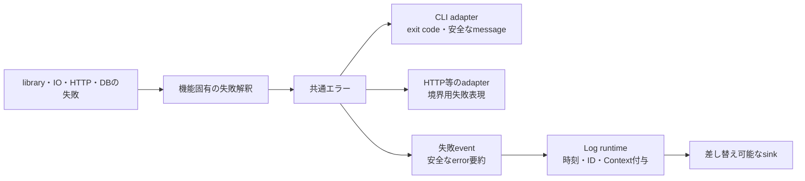
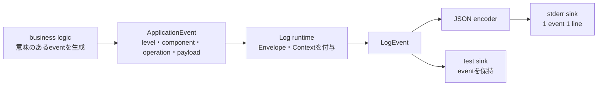
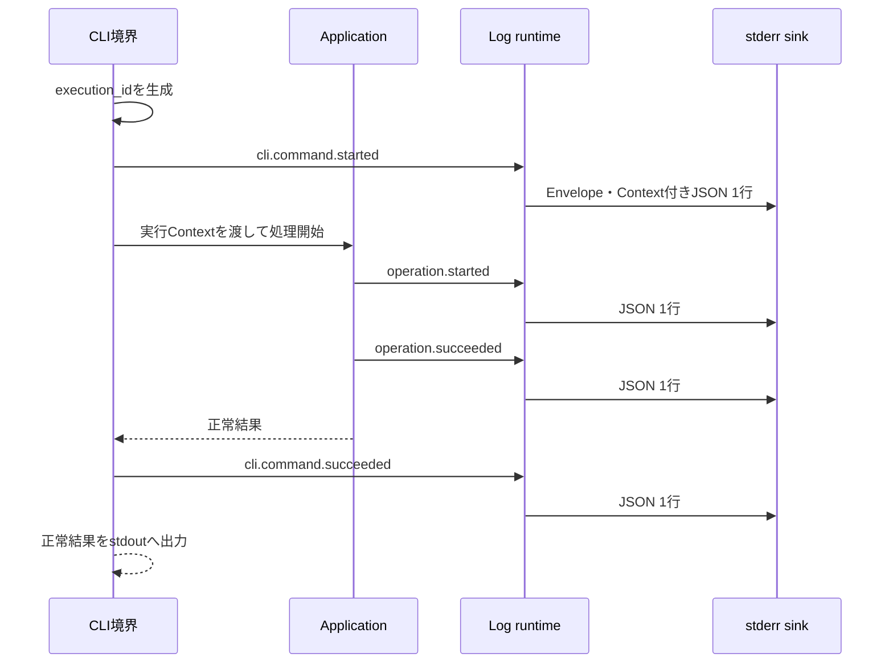
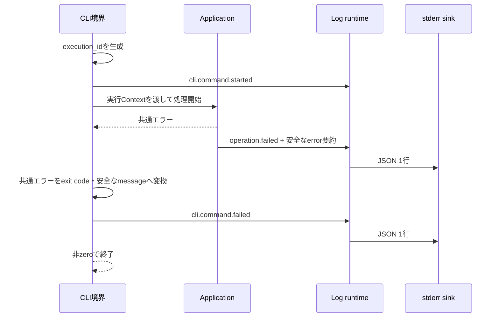

# エラー・ログ設計


> [!abstract] この文書の役割
> RAGScopeの共通エラー契約と構造化ログについて、v0.0で現在採用する責務、変換境界、データ構造、出力規則、不変条件を定義する。  
> 各機能は本設計を共通基盤として参照し、機能固有のエラーコード、追加context、ログeventは各機能設計と実装で具体化する。


## 1. 目的と適用範囲


### 1.1 目的


v0.0では、文書読み込み、チャンク化、Python AI Serviceとの通信、PostgreSQL処理、dense検索など、異なる処理を1つのローカル実行として制御する。


各機能が独自のエラー型、エラーコード、ログ形式、相関情報を定義すると、正常結果と失敗の扱いが分かれ、一連の実行を追跡できず、後から共通化する際に広範囲な修正が必要になる。


本設計は、後続実装が次を一貫して判断する基準を提供する。


- 失敗を正常結果と区別して運ぶ共通エラー契約
- 共通エラー、利用者向け表示、外部境界の失敗表現、ログeventの責務分離
- エラー分類、安定したエラーコード、message、内部原因、追加contextの扱い
- 構造化ログのEnvelope、実行Context、event固有Payload
- 同じローカル実行を追跡する相関情報
- stdoutとstderrの分離、JSON Lines、sinkの差し替え
- 機密情報を記録しないための規則
- 将来のHTTP、CloudWatch、tracingへ拡張する境界


### 1.2 適用範囲


本設計は、[v0.0 — 最小のdense検索を実行できる](<../../project-management/milestones/v0.0/v0.0.md>)で実装するHaskell側の共通エラー・構造化ログ基盤と、それを利用する各機能へ適用する。


v0.0では、次を扱う。


- Haskell application内部で使用する共通エラーの意味と変換境界
- CLI実行を単位とする実行Context
- Haskell application eventの共通構造
- `info`、`warn`、`error`のログlevel
- ローカル向けstderr sinkとテスト用sink
- 1 eventを1行のJSONとして出力するJSON Lines


各機能固有のエラーとeventを本書で先に網羅せず、共通契約に従って必要なものだけを追加する。


### 1.3 この設計を利用する作業


- [v0.0 共通エラーと構造化ログによる実行追跡](<../../project-management/milestones/v0.0/error-logging/v0.0 共通エラーと構造化ログによる実行追跡.md>)
- [RS-0014 共通エラーと構造化ログを設計する](<../../project-management/milestones/v0.0/error-logging/RS-0014 共通エラーと構造化ログを設計する.md>)
- [RS-0015 Haskellの共通エラー・構造化ログ基盤を実装する](<../../project-management/milestones/v0.0/error-logging/RS-0015 Haskellの共通エラー・構造化ログ基盤を実装する.md>)
- [RS-0011 固定Markdown文書の取り込みとチャンク化を設計する](<../../project-management/milestones/v0.0/document-ingestion/RS-0011 固定Markdown文書の取り込みとチャンク化を設計する.md>)
- [RS-0001 固定Markdownファイルを読み込む](<../../project-management/milestones/v0.0/document-ingestion/RS-0001 固定Markdownファイルを読み込む.md>)


RS-0015および各機能の実装で設計が具体化または変更された場合は、同じ`エラー・ログ設計.md`へ現在設計を反映する。


## 2. 関連する要求と上位設計


### 2.1 要求


本設計は、[RAGScope要求定義「3.3 信頼性と保守性」](<../RAGScope要求定義.md#3.3 信頼性と保守性>)のうち、v0.0が担当する次の範囲を具体化する。


- `REQ-NF-REL-001`：共通エラー、構造化ログ、相関情報、出力分離の主要な正常系・異常系を自動テストで確認できるようにする。
- `REQ-NF-REL-002`：外部process、model処理、database処理などの失敗を正常結果と区別し、原因を追跡できる共通エラーとして扱う。
- `REQ-NF-REL-005`：ローカル実行の処理進行と失敗を構造化ログとして出力し、同じ実行に属するeventを識別できるようにする。


`REQ-NF-REL-003`のretry / timeoutについて、本設計は共通エラー・ログとの責務境界だけを定義する。具体的なPolicy、回数、待機、timeout値、executorはoperation固有の設計を正本とする。


### 2.2 上位設計


本設計は、[システムアーキテクチャ](./システムアーキテクチャ.md)の次の方針に従う。


- [「1. 設計方針」](<./システムアーキテクチャ.md#1. 設計方針>)：共通エラーと構造化ログを横断的な実行基盤として扱い、ログの意味と出力先を分離する。
- [「3.4 共通実行基盤の責務境界」](<./システムアーキテクチャ.md#3.4 共通実行基盤の責務境界>)：失敗表現、application event、sink、retry / timeout、将来のtracingとCloudWatchの境界を分ける。
- [「4. 依存方向」](<./システムアーキテクチャ.md#4. 依存方向>)：business logicから具体的なstderr、CloudWatch、HTTP libraryなどへ直接依存しない。


また、[ADR-0001 — 共通実行基盤をv0.0で段階的に導入する](<../adr/ADR-0001 共通実行基盤をv0.0で段階的に導入する.md>)に従い、エラー・ログの契約を先に整える一方、汎用retry executorとtracingの詳細は先行実装しない。


### 2.3 関連するプロジェクト管理文書


- [v0.0 — 最小のdense検索を実行できる](<../../project-management/milestones/v0.0/v0.0.md>)
- [v0.0 共通エラーと構造化ログによる実行追跡](<../../project-management/milestones/v0.0/error-logging/v0.0 共通エラーと構造化ログによる実行追跡.md>)
- [RS-0014 共通エラーと構造化ログを設計する](<../../project-management/milestones/v0.0/error-logging/RS-0014 共通エラーと構造化ログを設計する.md>)
- [RS-0015 Haskellの共通エラー・構造化ログ基盤を実装する](<../../project-management/milestones/v0.0/error-logging/RS-0015 Haskellの共通エラー・構造化ログ基盤を実装する.md>)


## 3. 責務と境界


### 3.1 担当する責務


共通エラー・構造化ログ基盤は、次の責務を持つ。


1. 正常結果と失敗を型として区別して扱える共通境界を提供する。
2. 失敗を分類し、機械判定に使用する安定したエラーコードを保持する。
3. 利用者へ提示してよいmessageと、内部原因・追加contextを区別する。
4. business logicが意味のあるapplication eventを生成できる共通構造を提供する。
5. eventへschema version、時刻、event ID、実行Contextを付与する。
6. eventをJSON Linesへencodeし、差し替え可能なsinkへ渡す。
7. ローカル実行では正常出力をstdout、構造化ログをstderrへ分離する。
8. 文書本文、prompt、secretなどを不用意に記録しない規則を提供する。
9. 同じCLI実行に属するeventを`execution_id`で関連付ける。


### 3.2 表現と変換境界


| 表現 | 責務 | 含める情報 | 含めない情報 |
|---|---|---|---|
| 共通エラー | Haskell application内部で失敗を正常結果と区別して伝播する | category、安定したcode、安全なmessage、内部原因、error固有context | CLIの装飾、HTTP status、ログEnvelope |
| CLI利用者向けエラー | command失敗時の終了状態と提示内容を決める | exit code、安全なmessage、必要最小限の対処情報 | raw exception、secret、内部stack、HTTP schema |
| 外部境界の失敗 | HTTPなどで相手componentへ失敗の意味を伝える | 共有code、category、安全なmessage、必要な相関情報 | Haskell exception、library固有型、内部stack |
| 構造化ログevent | 処理の開始・完了・失敗などを記録する | Envelope、実行Context、event固有Payload、安全なerror要約 | 正常結果の全文、任意のraw入力、sink固有設定 |





変換規則：


- 低levelのexceptionやlibrary errorを、そのまま利用者表示や外部responseへ渡さない。
- 共通エラー自身が自動的にログを出力しない。errorの生成・伝播とeventの記録を分ける。
- 同じ失敗を伝播する各layerで重複して`failed` eventを出力しない。operationの結果を確定できる境界が、そのoperationの失敗eventを1回記録する。
- errorを別codeへ変換する場合、元errorは内部原因として保持し、利用者向けmessageへ連結しない。


### 3.3 他コンポーネントとの境界


| 境界 | 上流側の責務 | 共通基盤・下流側の責務 |
|---|---|---|
| business logic → 共通エラー | 機能固有の失敗を意味付けし、codeと安全なcontextを選ぶ | 共通構造で伝播し、外側のadapterが表示・responseへ変換できるようにする |
| business logic → Log runtime | event名、level、component、operation、event固有Payloadを渡す | schema version、時刻、event ID、実行Contextを付与する |
| Log runtime → sink | 完成した構造化eventを渡す | stderrへのJSON Lines出力、またはテスト用の保持を行う |
| Haskell → Python AI Service | operationの意味、入力、Haskell側の実行Contextを管理する | Python側は共有された失敗の意味をresponseへ変換する。正確なschemaはAPI設計・OpenAPIで定義する |


Haskell applicationのbusiness logicは、stderr、CloudWatch API、具体的なlogger library、JSON encoderへ直接依存しない。


### 3.4 対象外


- 各機能で発生する具体的なエラーコードとeventの網羅
- Python AI Service側の正確なerror型とlogger実装
- HTTP APIの正確なerror response schemaとstatus mapping
- retry回数、待機、backoff、jitter、timeout値
- operation横断の汎用retry executor
- CloudWatch log group、保持期間、metric filter、alarm
- `trace_id`、`span_id`、親子Span、処理間Linkの正確な規則
- batch、非同期job、重複実行防止に固有の相関情報
- 実験状態とerrorのPostgreSQL永続化
- 独立した共通packageへの分離


### 3.5 機械可読な定義を正本とする事項


次の正確な定義は、コード、OpenAPI、テストなどを正本とする。


- Haskellの型名、constructor、module名、effect表現
- JSON encoderの実装とfieldの正確な型
- ID生成libraryと具体的な文字列表現
- 時刻取得libraryとformatの細部
- stderr・test sinkの具体的な実装
- CLI exit codeの正確な対応表
- HTTP error response、header、statusの正確なschema
- 具体的なテストケース、fixture、golden data、テストコマンド


本設計では、実装が守る意味、責務、命名、不変条件、変換境界、出力規則を定義する。


## 4. 共通エラー設計


### 4.1 共通エラーの構成


| 項目 | 必須 | 役割 |
|---|---:|---|
| category | 必須 | 失敗の大分類。利用者表示、境界変換、観測時の判断材料とする |
| code | 必須 | 機械判定と検索に使用する安定した識別子 |
| message | 必須 | 利用者または外部境界へ提示してよい、安全で簡潔な説明 |
| cause | 任意 | 元のexceptionや下位errorなど、内部で原因を保持する情報 |
| context | 任意 | code固有の安全な識別子、件数、状態などの追加情報 |


`cause`と`context`はmessageへ自動連結しない。利用者表示と外部responseには、安全であることが確認された情報だけを含める。


### 4.2 エラーcategory


| category | 意味 | 例 |
|---|---|---|
| `input` | commandやapplicationへ渡された値が不正、未対応、または前提を満たさない | 空の質問、未対応の指定値 |
| `resource` | 必要なfileやresourceが存在しない、読めない、利用できない | file不存在、permission不足 |
| `data` | bytes、text、responseなどが期待する形式でない | 不正UTF-8、JSON decode失敗、schema不一致 |
| `dependency` | Python AI Service、model、PostgreSQLなど依存componentのoperationが失敗した | service unavailable、DB query失敗 |
| `timeout` | operationが定められた期限内に完了しなかった | HTTP timeout、model処理timeout |
| `internal` | 外部入力では説明できない不変条件違反、実装上の予期しない失敗 | 到達不能状態、未処理exception |


categoryは失敗の意味を表し、ログlevelやretry可否を表さない。


### 4.3 エラーコード


基本形式：


```text
<domain>.<reason>
```


必要な場合：


```text
<domain>.<operation>.<reason>
```


規則：


- 小文字ASCII、数字、underscoreを使用し、segmentをdotで区切る。
- domainは機能または外部境界を表し、library名やmodule名を使用しない。
- reasonは失敗の意味を表し、exception class名やHTTP statusだけを使用しない。
- codeへpath、ID、messageなどの可変値を埋め込まない。
- 外部境界、CLI、テスト、保存済みログから参照されたcodeは同じ意味のまま維持する。
- 意味が変わる場合は既存codeを再利用せず、新しいcodeを追加する。


例：


```text
document.file_not_found
document.invalid_utf8
python_ai.unavailable
postgres.query_failed
operation.timeout
internal.invariant_violation
```


各機能が採用する正確な一覧は、機能設計とコードを正本とする。


### 4.4 message、cause、context


#### message


- 利用者へ提示しても安全な内容だけを記載する。
- 原因と必要な対処を簡潔に説明する。
- secret、認証情報、raw request、DB接続文字列、document本文を含めない。
- library exceptionのmessageを無条件に転記しない。
- 機械判定にmessage文字列を使用しない。


#### cause


- 下位のexception、driver error、remote errorなどを内部で保持する。
- 利用者表示とHTTP responseへ公開しない。
- v0.0のログへraw causeやstack traceを既定で出力しない。
- 必要な診断情報はcategory、code、cause種別、allowlistされたcontextへ変換する。


#### context


- code固有の診断に必要な情報だけを持つ。
- 任意の文字列mapへ無制限に追加せず、可能な限り型付けされたerror固有contextを使用する。
- 値は安全な識別子、件数、size、statusなどを中心とする。
- pathは必要性を確認し、原則として安全なlabel、file名、相対pathなどへ縮退する。
- 該当しない項目は`null`で埋めず、出力時に省略する。


### 4.5 retry / timeoutとの境界


共通エラーには、operation横断の単純な`retryable` booleanを持たせない。


retry可否は、次の組合せでoperation固有に判断する。


- errorのcategoryとcode
- operationの副作用
- 同じ入力を再実行した場合の安全性
- 部分的な成功が発生した可能性
- retry回数、待機、deadlineなどのPolicy


同じ`dependency` categoryでも読み取りの一時的失敗はretry候補になり得る一方、重複書き込みの可能性があるoperationは自動retryできない場合がある。`timeout` categoryも自動的にretry可能とはみなさない。


## 5. 構造化ログ設計


### 5.1 eventと出力処理の分離


business logicは処理上の意味を持つapplication eventを生成する。JSON化、時刻取得、ID生成、stderr出力は外側のLog runtimeとsinkが担当する。





sinkはapplication eventの意味を変更しない。CloudWatchを追加する場合もcore logicは同じeventを生成する。


### 5.2 LogEventの3層


#### 共通Envelope


| 項目 | 必須 | 規則 |
|---|---:|---|
| `schema_version` | 必須 | v0.0は整数`1` |
| `event_id` | 必須 | 1 eventごとに生成するopaqueな一意識別子 |
| `timestamp` | 必須 | eventを記録する時点のUTC時刻 |
| `level` | 必須 | `info`、`warn`、`error`のいずれか |
| `event` | 必須 | event名。5.4の規則に従う |
| `component` | 必須 | eventを発生させた論理component |
| `operation` | 必須 | eventが属する処理 |
| `error` | 条件付き | errorを伴うeventだけに含め、該当しないeventでは省略する |


#### 実行Context


| 項目 | 必須 | 規則 |
|---|---:|---|
| `execution_id` | 必須 | CLI command開始時に1回生成し、同じ実行のすべてのeventへ引き継ぐ |


v0.0では、`trace_id`、`span_id`、`job_id`、`experiment_id`を共通Contextへ追加しない。


#### event固有Payload


- eventの意味に必要な識別子、件数、処理結果の要約、処理時間などだけを含める。
- document本文、chunk本文、prompt、Embedding vectorなどを含めない。
- 異なるeventの項目を1つの巨大なnullable recordへ集約しない。
- 該当しない項目は省略し、追加情報がない場合は空objectを使用してよい。
- 同じevent名ではPayloadの意味を安定させる。


### 5.3 JSONの概念例


```json
{
  "schema_version": 1,
  "event_id": "opaque-event-id",
  "timestamp": "2026-07-27T03:00:00Z",
  "level": "info",
  "event": "document.read.succeeded",
  "component": "document",
  "operation": "read",
  "context": {
    "execution_id": "opaque-execution-id"
  },
  "payload": {
    "byte_count": 2048
  }
}
```


```json
{
  "schema_version": 1,
  "event_id": "opaque-event-id",
  "timestamp": "2026-07-27T03:00:01Z",
  "level": "error",
  "event": "document.read.failed",
  "component": "document",
  "operation": "read",
  "context": {
    "execution_id": "opaque-execution-id"
  },
  "error": {
    "category": "resource",
    "code": "document.file_not_found",
    "message": "The configured document could not be read."
  },
  "payload": {}
}
```


正確なHaskell型、encoder、ID表現、timestamp formatの細部はコードを正本とする。


### 5.4 event名、component、operation


基本形式：


```text
<component>.<operation>.<phase>
```


v0.0の基本phase：


- `started`
- `succeeded`
- `failed`


規則：


- 小文字ASCII、数字、underscoreを使用し、segmentをdotで区切る。
- module名、class名、function名をそのままevent名にしない。
- 同じevent名の意味を別用途へ変更しない。
- event名へID、件数、status codeなどの可変値を埋め込まない。
- 処理途中の意味のあるeventが必要な場合は追加してよいが、単なるdebug用の実装手順をeventへしない。


例：


```text
cli.command.started
cli.command.succeeded
cli.command.failed
document.read.started
document.read.succeeded
document.read.failed
python_ai.embed.failed
postgres.save.succeeded
```


componentは論理的な責務を表し、必要に応じて`cli`、`document`、`python_ai`、`postgres`、`retrieval`、`logging`などを使用する。operationはcomponent内の処理を表し、小文字snake_caseで命名する。


### 5.5 ログlevel


| level | 意味 | 例 |
|---|---|---|
| `info` | 正常な処理開始、進行、完了 | command開始、文書読み込み完了 |
| `warn` | 処理を継続できるが、縮退、回復、再試行、無視した入力など注意が必要 | 将来のretry中、非致命的な省略 |
| `error` | operationまたはcommandが失敗し、期待した結果を完了できない | 文書読み込み失敗、最終的な依存component失敗 |


v0.0では`debug`を共通levelとして使用しない。


エラーcategoryとログlevelは別の概念である。categoryは何が失敗したか、levelはそのeventが現在のoperationへ与える影響を表す。同じcategoryでも回復して継続する途中eventは`warn`、最終失敗は`error`になり得る。categoryからlevelを1対1変換しない。


### 5.6 schema version


v0.0の`schema_version`は`1`とする。


次の変更ではversionを増やす。


- 既存fieldの削除またはrename
- 既存fieldの型変更
- 既存fieldまたはevent名の意味変更
- 必須・任意の互換性を壊す変更


既存consumerが未知fieldを無視でき、既存fieldとeventの意味を変えない追加は、同じversionで行ってよい。


## 6. 相関情報、時刻、ID


### 6.1 `execution_id`


1. CLI commandの最外境界で、最初のeventを作る前に1回生成する。
2. 実行Contextとして、同じcommand内のすべてのoperationへ明示的に引き継ぐ。
3. operationごとに新しい`execution_id`を生成しない。
4. errorから`execution_id`を生成または推測しない。
5. command名、時刻、利用者入力などのbusiness上の意味をIDへ埋め込まない。
6. 同じprocess内で複数commandを実行する場合は、commandごとに別IDを生成する。


### 6.2 `event_id`


- eventを完成させるLog runtimeで、eventごとに生成する。
- 同じeventを複数sinkへ渡す場合、同じ`event_id`を使用する。
- retryや再実行でeventが再度発生した場合は新しいIDを付与する。
- sequence番号、timestamp、payload hashから決定的に生成しない。


IDはopaqueな文字列として扱い、値から並び順や時刻を推測しない。具体的な生成方式はコードを正本とする。


### 6.3 時刻


- Log runtimeがeventを記録する時点でUTC時刻を付与する。
- business logicが任意のlocal time文字列を生成して渡さない。
- 所要時間が必要なeventでは、event固有Payloadへ単調時計に基づくdurationを記録してよい。
- テストではclockを差し替え、安定して検査できる境界を用意する。


## 7. 出力とsink


### 7.1 stdoutとstderr


| stream | 用途 |
|---|---|
| stdout | CLIが利用者へ返す正常結果。文書本文、検索結果などcommandの成果 |
| stderr | 構造化ログevent。1 eventを1行のJSONとして出力 |


stdoutへ構造化ログを出力せず、stderrへ正常結果を出力しない。


v0.0の既定実行では、command失敗時にplain textのエラー行をJSON Linesと同じstderrへ混在させない。CLI adapterが決定した安全なmessageと終了状態は、終端の`cli.command.failed` eventとprocess exit codeで表現する。


将来pretty error rendererを追加する場合は、JSON Linesと同じstreamへ混在させず、log sinkの選択または出力先を分ける。


### 7.2 JSON Lines


- 1 eventを1つのJSON objectとしてencodeする。
- 1 eventにつき改行1つで区切る。
- JSON object内部へ物理改行を出力しない。
- prefix、色制御文字、説明文、空行を挿入しない。
- encodeに失敗したeventを部分的なJSONとして出力しない。
- 文字列中の改行はJSON文字列としてescapeする。


### 7.3 sinkの契約


v0.0では、少なくとも次を利用できるようにする。


| sink | 用途 |
|---|---|
| stderr sink | 完成したLogEventをJSON Linesとしてstderrへ出力する |
| test sink | 完成したLogEventをmemoryへ保持し、event、level、Context、Payloadをテストから検査する |


business logicは具体的なsinkを選択しない。applicationのcomposition rootが、実行環境に応じてLog runtimeとsinkを組み立てる。同じLogEventを複数sinkへ渡す場合、EnvelopeとContextを作り直さない。


### 7.4 sink失敗


- sink自身の失敗を、同じsinkへ新しいeventとして再帰的に記録しない。
- sink失敗は正常終了として握りつぶさず、外側のapplication境界へ内部失敗として返す。
- 失敗したsinkへ追加eventを出そうとしない。
- plain text fallbackはJSON Linesとの互換性を壊すため、v0.0の既定動作として採用しない。


## 8. 記録・masking方針


### 8.1 既定で記録しない情報


- Markdown文書本文、chunk本文、reference answer
- prompt、context全文、生成回答全文
- Embedding vector、modelの大きなraw出力
- password、API key、token、secret、認証cookie、Authorization header
- DB接続文字列、secretを含む環境変数
- HTTP request / responseのraw bodyと全header
- stack trace、raw exception message
- 利用者入力の全文
- 不要な絶対file path


### 8.2 記録してよい情報


目的と安全性を確認したうえで、次のような情報を記録してよい。


- RAGScope内部の安定したID
- component、operation、event名
- 件数、byte数、token数、chunk数、順位、処理時間
- model IDとrevisionなど、secretでない実行条件
- HTTP status、DB error categoryなどの要約
- file名、相対path、安全なlabelなど、必要最小限へ縮退したresource識別情報
- allowlistされたerror context


### 8.3 maskingとallowlist


- 記録対象を先にallowlistし、未知fieldを汎用mapからそのまま出力しない。
- secretらしい文字列を後から正規表現だけでmaskする方式へ依存しない。
- 外部componentから受け取ったmessage、header、bodyは、明示的に安全と判断したfieldだけを変換する。
- contextやPayloadを追加する実装では、機密情報を含まないことをテスト観点へ含める。
- maskingに失敗する可能性がある場合は、値を一部残すよりfield自体を省略する。


## 9. HaskellとPython AI Serviceの失敗契約


HaskellとPython AI Serviceは、失敗について少なくとも次の意味を共有する。


- 機械判定に使用する安定したerror code
- error category
- 外部へ提示してよい安全なmessage
- どのoperationで失敗したか
- 同じHaskell実行へ関連付けるための相関情報


境界規則：


- Pythonのexception class、stack trace、library固有messageをHaskellへそのまま公開しない。
- Python側は、予期した失敗を共有error表現へ変換する。
- Haskell側は、共有codeを認識できる場合は意味を保って共通エラーへ変換する。
- responseをdecodeできない、codeを認識できない、接続自体に失敗した場合は、Haskell側の境界errorとして分類する。
- Haskell側の`execution_id`はCLI実行の相関情報として保持する。HTTPでの具体的なheader、body field、request IDはAPI設計・OpenAPIで決定する。
- HTTP statusとerror category・codeの正確なmappingはAPI設計を正本とする。


v0.0では、HaskellがPythonへrequestを送る前後のeventを同じ`execution_id`で記録できればよい。process間の正確なSpan親子関係は定義しない。


## 10. 主要な処理フロー


### 10.1 正常終了





### 10.2 失敗終了





operationの失敗eventとcommandの失敗eventは責務が異なるため両方を記録してよい。同じoperation errorを複数layerが同じevent名で重複記録しない。


## 11. 契約と不変条件


1. 正常結果と共通エラーを同じ値として曖昧に扱わない。
2. すべての共通エラーはcategory、code、安全なmessageを持つ。
3. 利用者表示と外部responseへraw causeを公開しない。
4. error codeの機械判定をmessageに依存させない。
5. 共通エラーは自身でログを出力しない。
6. すべてのLogEventはschema version、event ID、UTC timestamp、level、event名、component、operation、execution ID、Payloadを持つ。
7. 同じCLI実行に属するeventは同じ`execution_id`を持つ。
8. 異なるeventは異なる`event_id`を持つ。
9. 該当しないoptional fieldは`null`ではなく省略する。
10. event固有Payloadを巨大なnullable recordへ集約しない。
11. stdoutへログを出力せず、stderrへ正常結果を出力しない。
12. stderr sinkは1 eventを1行のJSONとして出力する。
13. business logicは具体的なsink、stderr、CloudWatch、JSON libraryへ直接依存しない。
14. document本文、prompt、secret、認証情報を既定でログへ出力しない。
15. retry可否を共通エラーの単純なbooleanだけで決定しない。
16. sink失敗を同じsinkへ再帰的に記録しない。


## 12. テスト観点


具体的なテストケースとコマンドはテストコードを正本とする。設計上、少なくとも次を確認する。


### 共通エラー


- 各categoryを共通エラーとして表現できる。
- code、message、cause、contextの責務が分かれ、raw causeが利用者表示へ混入しない。
- error固有contextの該当しないfieldが出力されない。
- codeからCLI表示と終了状態へ変換できる。
- error自身の生成だけではログが出力されない。


### 構造化ログ


- 必須fieldを持つLogEventを生成できる。
- `schema_version`が`1`である。
- timestampがUTCとしてencodeされる。
- 同じ実行のeventが同じ`execution_id`を持つ。
- eventごとに異なる`event_id`を持つ。
- event名、component、operation、levelが規則に従う。
- errorを伴わないeventでは`error` fieldが省略される。
- 不要fieldが`null`として出力されない。
- 1 eventが改行を含まない1つのJSON行になる。
- 複数eventがJSON Linesとして行単位でdecodeできる。


### 出力とsink


- 正常結果がstdoutへ、構造化ログがstderrへ出力される。
- stderrへplain textや色制御文字が混入しない。
- test sinkからeventを順序付きで検査できる。
- sinkを差し替えてもbusiness logicを変更する必要がない。
- sink失敗が再帰的なログ出力を起こさない。


### 情報保護


- document本文、chunk本文、prompt、secret、Authorization header、DB接続文字列が出力されない。
- 外部exceptionのraw messageが既定のerror logへ出力されない。
- allowlistされていないcontext fieldが出力されない。
- pathを記録する場合、安全な形式へ縮退される。


### 安定した検査


- clockとID生成を差し替え、timestampと生成IDを安定して検査できる。
- golden testを使用する場合、実行ごとに変わる値を固定または正規化できる。
- JSON fieldの順序へ意味を持たせない。


## 13. 将来設計との境界


### v0.1.5


- application eventをCloudWatchで収集・検索する経路を追加する。
- log group、保持期間、権限、metric filter、料金対策をAWS設計で決定する。
- core logicからCloudWatch APIへ直接依存しない。


### v0.5


- `trace_id`、`span_id`、親子関係、process間のContext伝播を決定する。
- batch、非同期job、再実行、重複防止に必要な相関情報を決定する。
- 必要性を確認したうえで`debug` levelや出力filterを検討する。


### 実験管理を導入するMilestone


- `experiment_id`、`evaluation_case_run_id`などを実行ContextまたはPayloadへ追加する境界を決定する。
- 保存する実行状態・errorと、構造化ログの責務を分ける。


### API設計を具体化するMilestone


- HaskellとPython AI Serviceが共有するerror response schemaをOpenAPIで定義する。
- HTTP status、header、request ID、error codeのmappingを決定する。


## 14. 変更時の注意


本設計を変更する場合は、少なくとも次を確認する。


- [RAGScope要求定義「3.3 信頼性と保守性」](<../RAGScope要求定義.md#3.3 信頼性と保守性>)
- [システムアーキテクチャ「3.4 共通実行基盤の責務境界」](<./システムアーキテクチャ.md#3.4 共通実行基盤の責務境界>)
- [ADR-0001 — 共通実行基盤をv0.0で段階的に導入する](<../adr/ADR-0001 共通実行基盤をv0.0で段階的に導入する.md>)
- 本設計を参照する各機能設計
- Haskellの共通エラー型、event型、encoder、sink、CLI adapter
- Python AI Serviceのerror responseとOpenAPI
- JSON Linesを読むtest、script、CloudWatch収集設定


error code、event名、JSON fieldの意味、schema versionは、保存済みログや外部境界から参照される可能性がある。変更時は互換性と影響範囲を確認し、意味を変える場合は既存識別子を黙って再利用しない。