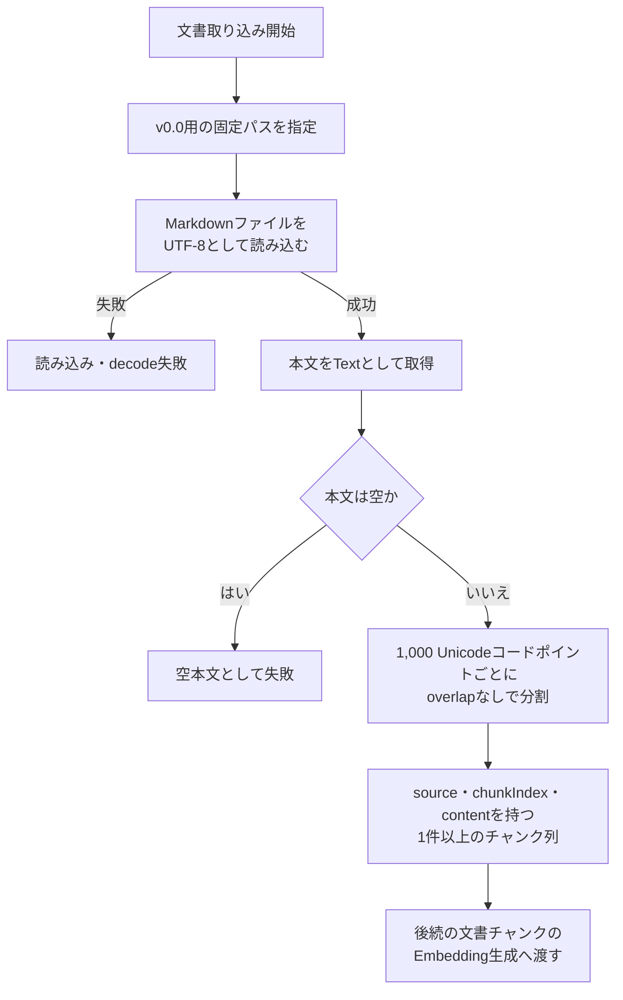

# 文書処理設計

> [!abstract] この文書の役割
> 固定Markdown文書の読み込みからチャンク生成までについて、現在採用する機能設計を定義する。  
> v0.0で実装する責務、処理フロー、入出力、固定ルール、不変条件、エラー・境界条件を、基本設計と詳細設計として同じ文書で扱う。

## 1. 目的と適用範囲

### 1.1 目的

v0.0では、RAGScopeアプリケーションが固定されたUTF-8 Markdownファイル1件を読み込み、その本文を固定ルールで複数の文書チャンクへ分割し、後続の文書チャンクのEmbedding生成処理へ渡せる状態にする。

本設計は、文書読み込みとチャンク化を別々の実装Ticketで進めても、次の事項を一貫して判断できる基準を提供する。

- 文書処理が担当する責務と、後続機能へ引き渡す境界
- 読み込んだMarkdown本文の扱い
- チャンクの概念上の構造と固定分割ルール
- 正常結果として後続へ渡してよい状態
- エラー、境界条件、不変条件
- 設計書とコード・テストの正本の分担

### 1.2 適用範囲

本設計は、[v0.0 — 最小のdense検索を実行できる](<../../project-management/milestones/v0.0/v0.0.md>)で実装する、次の処理へ適用する。

```text
固定パスのUTF-8 Markdownファイル1件
→ 本文をTextとして読み込む
→ 空本文でないことを確認する
→ 1,000 Unicodeコードポイントごとに分割する
→ 元文書と順序を識別できるチャンク列を返す
```

v0.0の目的は、文書取り込みからdense検索までの最小経路を動作させることである。検索品質に最適な分割方式を確立することではないため、入力文書、実行時の入力パス、チャンクサイズ、overlapを固定する。

### 1.3 この設計を利用する作業

本設計は、次のEpicとTicketで使用する。

- [v0.0 固定Markdown文書の取り込みとチャンク化](<../../project-management/milestones/v0.0/document-ingestion/v0.0 固定Markdown文書の取り込みとチャンク化.md>)
- [RS-0011 固定Markdown文書の取り込みとチャンク化を設計する](<../../project-management/milestones/v0.0/document-ingestion/RS-0011 固定Markdown文書の取り込みとチャンク化を設計する.md>)
- [RS-0001 固定Markdownファイルを読み込む](<../../project-management/milestones/v0.0/document-ingestion/RS-0001 固定Markdownファイルを読み込む.md>)
- [RS-0002 固定ルールでMarkdown文書をチャンク化する](<../../project-management/milestones/v0.0/document-ingestion/RS-0002 固定ルールでMarkdown文書をチャンク化する.md>)

RS-0011で初期設計を作成し、RS-0001とRS-0002の実装によって設計が具体化または変更された場合は、同じ`文書処理設計.md`へ現在設計を反映する。

## 2. 関連する要求と上位設計

### 2.1 要求

本設計は、[RAGScope要求定義「2.1 文書の取り込みと追跡」](<../RAGScope要求定義.md#2.1 文書の取り込みと追跡>)のうち、v0.0が担当する次の範囲を具体化する。

- `REQ-DOC-001`：固定パスのMarkdown文書1件を読み込み、後続処理で利用できる本文として取り込む。
- `REQ-DOC-002`：取り込んだMarkdown本文を、固定ルールで複数の文書チャンクへ分割する。

また、[RAGScope要求定義「3.3 信頼性と保守性」](<../RAGScope要求定義.md#3.3 信頼性と保守性>)の`REQ-NF-REL-001`に対し、文書読み込みとチャンク化の主要な正常系・異常系・境界値を自動テストで確認できる設計とする。

`REQ-DOC-001`が要求するMarkdown / TXTのうち、v0.0で扱う形式はMarkdownだけとする。TXT対応は本設計の対象外である。

### 2.2 上位設計

本設計は、[システムアーキテクチャ](./システムアーキテクチャ.md)の次の方針に従う。

- [「3.1 RAGScopeアプリケーションの責務境界」](<./システムアーキテクチャ.md#3.1 RAGScopeアプリケーションの責務境界>)：RAGScopeアプリケーションが文書の取り込みから検索準備までの処理順序とデータ整合性を管理する。
- [「6. 文書取り込みの全体フロー」](<./システムアーキテクチャ.md#6. 文書取り込みの全体フロー>)：文書の取り込み、分割、文書チャンクのEmbedding生成、保存を段階的な処理として扱う。

システムアーキテクチャは、将来の正規化、保存、offset、version管理を含む全体像を定義する。本設計は、その全体像を置き換えるものではなく、v0.0で先行して実装する最小範囲を定義する。

### 2.3 関連するプロジェクト管理文書

- [v0.0 — 最小のdense検索を実行できる](<../../project-management/milestones/v0.0/v0.0.md>)
- [v0.0 固定Markdown文書の取り込みとチャンク化](<../../project-management/milestones/v0.0/document-ingestion/v0.0 固定Markdown文書の取り込みとチャンク化.md>)
- [RS-0011 固定Markdown文書の取り込みとチャンク化を設計する](<../../project-management/milestones/v0.0/document-ingestion/RS-0011 固定Markdown文書の取り込みとチャンク化を設計する.md>)
- [RS-0001 固定Markdownファイルを読み込む](<../../project-management/milestones/v0.0/document-ingestion/RS-0001 固定Markdownファイルを読み込む.md>)
- [RS-0002 固定ルールでMarkdown文書をチャンク化する](<../../project-management/milestones/v0.0/document-ingestion/RS-0002 固定ルールでMarkdown文書をチャンク化する.md>)

## 3. 責務と境界

### 3.1 担当する責務

文書処理を制御するRAGScopeアプリケーションは、次の責務を持つ。

1. RAGScopeアプリケーションが指定するv0.0用の固定パスを、文書読み込み処理へ渡す。
2. UTF-8 Markdownファイル1件を読み込み、ファイル全体の本文を`Text`として取得する。
3. 読み込んだ本文が空でないことを確認する。
4. 本文を1,000 Unicodeコードポイントごとの固定ルールで分割する。
5. 各チャンクに、元文書を識別する情報、文書内での順序、本文を概念上持たせる。
6. 正常に生成された1件以上のチャンク列を、後続の文書チャンクのEmbedding生成処理から利用できる値として返す。
7. 読み込み失敗、不正なUTF-8、空本文を正常結果と区別し、後続処理へ渡さない。
8. 文書読み込みとチャンク化を個別にテストできる境界へ分離する。

### 3.2 他の機能・コンポーネントとの境界

| 境界 | 上流側の責務 | 下流側の責務 |
|---|---|---|
| RAGScopeアプリケーション → 文書読み込み | v0.0用の固定パスを選択して渡す | 渡されたパスからMarkdown本文を取得する |
| 文書読み込み → 本文検証・チャンク化 | UTF-8としてdecodeした本文を追加変換せず返す | 空本文を拒否し、正常な本文を固定ルールで分割する |
| チャンク化 → 文書チャンクのEmbedding生成 | 順序付けされた正常なチャンク列を返す | モデルとTokenizerを使用して各文書チャンクのEmbeddingを生成する |
| 文書処理 → PostgreSQL | v0.0では直接保存しない | 後続Epicで文書、文書チャンクとそのEmbeddingを永続化する |

文書処理は、Embedding modelの選択、AI推論サービスとの通信、PostgreSQL schema、dense検索を扱わない。

### 3.3 対象外

v0.0の本設計では、次を扱わない。

- 複数ファイルまたはディレクトリ単位の取り込み
- TXT、PDF、画像など、Markdown以外の文書形式
- CLI引数、設定ファイル、データベースによる入力パスの変更
- 改行コードやUnicodeの正規化
- 前後空白の削除
- Frontmatter、見出し、段落、code blockなどのMarkdown構造解析
- Markdown記法の除去または変換
- 意味的な境界を考慮した分割
- Tokenizerを使用したトークン数ベースの分割
- チャンク間のoverlap
- 可変チャンクサイズと複数条件の比較
- 元文書内の厳密な`start_offset`・`end_offset`
- 文書、文書集合、チャンク条件、チャンク集合のversion管理
- 正規化済み本文、文書チャンクとそのEmbeddingの永続化
- 文書チャンクのEmbedding生成APIと通信形式
- dense検索
- 検索品質の評価

### 3.4 機械可読な定義を正本とする事項

次の正確な定義は、コード、設定、テストなどを正本とする。

- Haskellの型名、関数名、module名
- 使用するlibraryと具体的なAPI
- エラー型とconstructor名
- 固定パスの正確な文字列と設定場所
- 元文書を識別する値の正確な型と表現
- 文字列分割の具体的な実装
- 具体的なテストケース、fixture、テストコマンド

本設計では、実装が守る責務、概念、処理フロー、契約、不変条件、エラー・境界条件を定義し、コードの正確な構造を逐語的に複製しない。

## 4. 基本設計

### 4.1 主要な概念

#### 元文書の識別情報

v0.0で処理する固定Markdown文書を、後続処理で区別するための最小限の情報を表す。

永続的な文書ID体系、文書version、文書集合は導入しない。正確な表現はコードを正本とする。

#### 読み込み済み本文

UTF-8 Markdownファイル全体をdecodeした`Text`を表す。

読み込み済み本文には、見出し、Markdown記法、Frontmatter、空行、改行、前後空白を含む。文書処理はこれらを解析または変換しない。

#### 文書チャンク

入力本文の連続した一部分を表し、概念上、次の情報を持つ。

```text
- source
  - 元文書を識別する情報
- chunkIndex
  - 0始まりの文書内順序
- content
  - 入力本文の連続した一部分
```

これは概念モデルであり、正確な型名とフィールド名ではない。

#### 文書処理結果

文書処理結果は、次のいずれかを明確に区別する。

```text
成功
- 1件以上の文書チャンク

失敗
- ファイル読み込み失敗
- UTF-8 decode失敗
- 空本文
```

空のチャンク列を正常な検索対象として扱わない。

### 4.2 入出力

#### 入力

文書処理全体の入力は、v0.0で使用する固定Markdownファイルを指すパスである。

実行時のパスはRAGScopeアプリケーション側の固定値とする。一方、文書読み込み処理はテスト可能な境界として分離し、呼び出し元からパスを受け取れる構造にしてよい。

#### 成功出力

成功時は、次を満たす文書チャンク列を返す。

- 1件以上である
- `chunkIndex`順に並んでいる
- すべて同じ元文書を指す
- 各チャンクの本文が1,000 Unicodeコードポイント以下である
- 全チャンク本文を順に連結すると入力本文と一致する

#### 失敗出力

失敗時は、呼び出し元が正常結果と区別し、少なくとも失敗段階を判断できる結果を返す。

部分的に読み込んだ本文や、途中まで生成したチャンクを成功結果として返さない。

### 4.3 主要な処理フロー



読み込み、decode、空本文判定のいずれかで失敗した場合は、チャンクを後続の文書チャンクのEmbedding生成処理へ渡さない。

### 4.4 エラー処理の基本方針

- ファイルI/Oの失敗とUTF-8 decodeの失敗を、正常な本文取得と区別する。
- ファイルが存在していても、本文が空なら有効な検索対象とはみなさない。
- 失敗を空の`Text`や空のチャンク列へ変換して正常処理を続けない。
- 文書処理が失敗した場合、文書チャンクのEmbedding生成を呼び出さない。
- エラーを標準出力へ表示するだけで処理済みとはせず、呼び出し元が失敗として扱える値を返す。
- 正確なエラー型、メッセージ、例外の捕捉方法はコードを正本とする。

## 5. 詳細設計

### 5.1 処理規則

#### 5.1.1 文書読み込み

- 対象はUTF-8 Markdownファイル1件とする。
- RAGScopeアプリケーション実行時は、v0.0用の固定パスを使用する。
- 読み込み処理は固定パスを内部へ埋め込まず、パスを受け取り本文を返すテスト可能な境界として分離してよい。
- ファイル全体をUTF-8としてdecodeし、`Text`として呼び出し元へ返す。
- 複数ファイル、directory走査、glob、再帰探索は行わない。

UTF-8としてdecodeした本文には、文書処理による次の変換を行わない。

- Unicode正規化
- 改行コードの統一
- Markdown記法の除去
- Frontmatter、見出し、段落、code blockの解析
- 前後空白の削除
- 空行の削除
- 文字列の置換

本文の同一性は、元ファイルのバイト列ではなく、UTF-8としてdecodeした`Text`に対して定義する。

#### 5.1.2 空本文の検証

ファイルの読み込みとUTF-8 decodeに成功しても、本文が空なら文書処理全体を失敗とする。

- 空本文から0件のチャンクを正常結果として生成しない。
- 空本文を後続の文書チャンクのEmbedding生成処理へ渡さない。
- 空白、空行、Markdown記号だけを含む本文は、コードポイントが存在するため空本文とはみなさない。
- 前後空白の削除やMarkdown解析を行わないため、「意味上は空」という判定は行わない。

この方針により、文書処理の正常結果は常に1件以上のチャンクを持つ。

#### 5.1.3 チャンク化

Markdown本文を、先頭から1,000 Unicodeコードポイントごとに分割する。

- `chunkIndex`は0から始める。
- `chunkIndex`は欠番のない連続した整数とする。
- 各チャンクは入力本文中の連続した範囲を保持する。
- チャンク間にoverlapを設けない。
- 最後のチャンクだけが1,000 Unicodeコードポイント未満になり得る。
- 空でない本文からは、必ず1件以上のチャンクを生成する。
- Markdownの構文上または意味上の境界は考慮しない。
- チャンク化は、ファイルI/Oや文書チャンクのEmbedding生成から分離した副作用のない処理とする。

ここでいうUnicodeコードポイントは、UTF-8のバイト数でも、利用者が見た1文字を表すgrapheme clusterでもない。結合文字や複数コードポイントからなる絵文字の途中がチャンク境界になることを、v0.0では許容する。

入力本文のUnicodeコードポイント数を$$n$$、固定チャンクサイズを$$s = 1000$$とする。空でない本文に対するチャンク数$$m$$は、次のとおりとする。

$$
m = \left\lceil \frac{n}{s} \right\rceil
$$

0始まりの$$i$$番目のチャンク本文$$C_i$$は、入力本文$$T$$の次の半開区間とする。

$$
C_i
=
T
\left[
is :
\min\left((i+1)s,\ n\right)
\right]
\qquad
0 \le i < m
$$

この式は概念上の仕様であり、具体的なHaskell実装はコードを正本とする。

### 5.2 エラーと境界条件

| 状態 | 文書処理の結果 | 後続処理 |
|---|---|---|
| ファイルが存在しない | 読み込み失敗 | 進めない |
| ファイルを開けない | 読み込み失敗 | 進めない |
| 読み込み途中でI/O errorが発生した | 読み込み失敗 | 進めない |
| UTF-8としてdecodeできない | 入力形式の失敗 | 進めない |
| 本文が空 | 空本文として失敗 | 進めない |
| 本文が1コードポイント | 長さ1のチャンク1件 | 進める |
| 本文が1,000コードポイント | 長さ1,000のチャンク1件 | 進める |
| 本文が1,001コードポイント | 長さ1,000と1のチャンク2件 | 進める |
| 本文が空白・空行・Markdown記号だけ | 文字を保持してチャンク化 | 進める |

文書処理は部分成功を返さない。読み込みまたはdecodeに失敗した入力から得られた部分的な本文や、失敗前に生成できた一部の値を、正常なチャンク列として扱わない。

### 5.3 契約と不変条件

空でない入力本文$$T$$から正常に生成されたチャンク列$$C_0, C_1, \ldots, C_{m-1}$$は、次をすべて満たす。

#### 1件以上のチャンク

$$
m \ge 1
$$

#### 連続したindex

$$
\mathrm{chunkIndex}(C_i) = i
\qquad
0 \le i < m
$$

#### チャンク長

$$
1 \le |C_i| \le 1000
$$

最後以外のチャンクは、必ず1,000 Unicodeコードポイントとする。

$$
|C_i| = 1000
\qquad
0 \le i < m - 1
$$

#### 本文の完全な復元

$$
T
=
C_0 \mathbin{+\!\!+}
C_1 \mathbin{+\!\!+}
\cdots
\mathbin{+\!\!+}
C_{m-1}
$$

ここで$$+\!\!+$$は、`chunkIndex`順の文字列連結を表す。

この不変条件により、入力本文のコードポイントについて、欠落、重複、置換、並べ替えがないことを保証する。

#### 元文書の対応

すべてのチャンクは、入力となった文書と同じ元文書の識別情報を持つ。

#### 決定性

同じ元文書の識別情報と同じ本文を入力した場合、同じ順序・同じ本文のチャンク列を生成する。

### 5.4 他コンポーネントへの受け渡し

文書処理は、正常に生成したチャンク列を、後続の文書チャンクのEmbedding生成処理から利用できる値として返す。

各チャンクは、少なくとも次の概念を保持する。

```text
- 元文書を識別するsource
- 文書内の順序を表すchunkIndex
- Embedding入力となるcontent
```

チャンク本文には、文書チャンクのEmbedding生成のための見出し、prefix、正規化結果などを追加しない。v0.0では、分割によって得たチャンク本文そのものを渡す。

次は、文書チャンクのEmbedding生成と保存を扱うEpicで定義する。

- AI推論サービスへ送るrequest / response
- batch処理
- 文書チャンクとそのEmbeddingの対応付け
- 通信失敗、timeout、retry
- Embedding modelとTokenizer
- PostgreSQLへの保存形式

## 6. テスト観点

### 6.1 文書読み込み

少なくとも次を自動テストで確認する。

- 見出し、複数段落、Markdown記法、空行、改行を含むUTF-8 Markdownを読み込める
- UTF-8としてdecodeした読み込み前後の本文が一致する
- 読み込んだ本文を呼び出し元へ返せる
- 存在しないファイルを正常終了と区別できる
- UTF-8として扱えない入力を正常終了と区別できる
- 読み込み結果が空の場合、後続処理へ進まない

### 6.2 チャンク化

少なくとも次の境界を確認する。

| 入力 | 期待する結果 |
|---|---|
| 1コードポイント | 1件、長さ1 |
| 1,000コードポイント未満 | 1件 |
| ちょうど1,000コードポイント | 1件、長さ1,000 |
| 1,001コードポイント | 2件、長さ1,000と1 |
| 2,000コードポイント | 2件、各長さ1,000 |
| 空本文 | 失敗し、チャンクを生成しない |
| 改行・Markdown記法を含む本文 | 内容を保持したまま分割する |
| 結合文字や絵文字を含む本文 | バイト数ではなくコードポイント数として扱う |

### 6.3 契約と不変条件

空でない任意の本文について、少なくとも次を確認する。

- チャンクは1件以上である
- `chunkIndex`は0から始まる連続値である
- 各チャンクは1,000 Unicodeコードポイント以下である
- 最後以外のチャンクは1,000 Unicodeコードポイントである
- `chunkIndex`順に連結すると入力本文と完全に一致する
- すべてのチャンクが同じ元文書の識別情報を持つ
- 同じ入力に対して同じチャンク列を生成する

具体的なexample-based testやproperty-based testの選択、テストlibrary、fixture、テストコマンドはテストコードとプロジェクト設定を正本とする。

## 7. 将来設計との境界

システムアーキテクチャでは、将来的に文書の正規化、正規化済み本文の保存、条件に基づく分割、元文書内の位置保存を行う。

v0.0はその最小段階として、次だけを実現する。

```text
固定Markdownファイル
→ 本文を追加変換せずTextとして読み込む
→ 固定1,000 Unicodeコードポイントで分割する
→ 元文書と順序を識別できるチャンク列を返す
```

次の内容は、後続Milestoneで要求と設計を具体化する。

- 正規化規則と`normalization_version`
- 正規化済み本文の保存
- `start_offset`・`end_offset`
- 文書versionと文書集合
- `ChunkingConfig`と`ChunkSet`
- 可変チャンク条件と比較実験
- Markdown構造またはTokenizerを利用した分割
- 複数文書とTXT形式の取り込み
- 文書更新時の検索用データ再生成

v0.0の固定ルールを、将来の検索品質に最適な方式または恒久的なデータモデルとして扱わない。

## 8. 変更時の注意

- 実装によって本設計の変更が必要になった場合は、該当Ticketで理由と影響範囲を確認し、同じ`文書処理設計.md`へ現在設計を反映する。
- 正確な型、関数、module、schema、テストケースを設計書へ逐語的に複製せず、コードや専用形式との正本の分担を維持する。
- チャンク本文の変換を追加する場合は、本文の完全復元という不変条件への影響を確認する。
- チャンクサイズ、overlap、正規化、offset、version管理を追加する場合は、v0.0の局所変更として暗黙に導入せず、対象Milestone、要求、システムアーキテクチャ、関連設計への影響を確認する。
- 文書処理から文書チャンクのEmbedding生成へ渡す情報を変更する場合は、文書チャンクのEmbedding生成・保存側の設計と実装への影響を確認する。
