---
aliases:
  - RAGScope設計書
tags:
  - rag
note_type: design
---
# RAGScope — RAG検索・評価アプリ 設計書

> 本資料は、RAGScope固有の目的、スコープ、アーキテクチャ、評価方針、データ構造、開発ロードマップを定義する。一般的なAI・LLM・RAGの知識は[[ai-llm-rag-notes]]で管理する。

## 1. 目的

一般的なAI・LLM案件への参画につながる成果物を作る。

単なる「LLM APIを呼ぶチャット」ではなく、RAGの検索、reranking、回答生成、評価、実験管理まで扱い、**評価結果を根拠に設計判断を説明できること**を中心に置く。

基本方針：

- モデル研究や事前学習は行わず、既存のopen-weight model（公開されている学習済みモデル）を自分の環境で動かし、推論・評価まで行う
- アプリケーションの中核と全体制御はHaskell、AIモデルとAIライブラリはPythonで扱う
- 外部APIは主役にせず、後から比較対象として追加する
- AWSは学習対象に含めるが、RAG本体とは段階を分ける
- 各バージョンの成功条件を満たすまで、新機能をむやみに追加しない

### 1.1 名称と命名規則

本プロジェクトおよび本アプリケーションの名称は、**RAGScope**とする。

RAGの検索結果、回答、評価結果を詳しく観察し、比較・追跡できるアプリケーションであることを表している。

|用途|名称|
|---|---|
|プロジェクト名|`RAGScope`|
|アプリケーション名|`RAGScope`|
|GitHubリポジトリ名|`rag-scope`|
|CLIコマンド|`ragscope`|
|環境変数の接頭辞|`RAGSCOPE_`|

人が読む名称には`RAGScope`を使い、リポジトリ名などの識別子には用途に応じて`rag-scope`、`ragscope`、`RAGSCOPE_`を使う。

Haskell APIやPython AI Serviceなど、内部コンポーネントの名称は、実装時に必要となった段階でこの規則に沿って決定する。

### 1.2 全体像

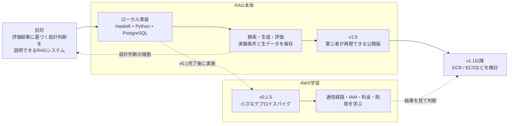

まずローカル環境でRAG本体を完成させる。AWSへのデプロイは別の学習課題として小規模に試し、その結果をもとに将来のAWS対応を判断する。

## 2. 関連知識と用語の境界

> [!info] 一般知識は別ノートで管理
> AI・LLM・RAG・情報検索に関する一般的な用語や概念は、[[ai-llm-rag-notes|AI・LLM・RAG基礎ノート]]にまとめる。  
> 本設計書には、**RAGScopeで採用する方式、制約、データ構造、命名、実装上の判断**だけを記載する。

### 2.1 記載先の判断基準

| 内容 | 記載先 |
|---|---|
| RAG、Embedding、reranking、tokenなどの一般的な意味 | [[ai-llm-rag-notes]] |
| 一般的な検索・生成・評価の仕組み | [[ai-llm-rag-notes]] |
| RAGScopeがどの方式を採用するか | 本設計書 |
| RAGScopeのEntity、Config、stage、API、CLI | 本設計書 |
| バージョンごとの対象・対象外・成功条件 | 本設計書 |
| 実験で判明した結果や設計変更の理由 | 本設計書またはADR |

> [!tip] 判断に迷った場合
> 「RAGScopeが存在しなくても成立する説明」は基礎ノートへ、  
> 「RAGScopeではどうするかを決める説明」は本設計書へ置く。

### 2.2 RAGScope内での用語の使い分け

- 質問に関係するチャンクを取得する処理を`retrieval`と呼ぶ。
- `全文検索`と`dense検索`は独立した検索方式とし、その結果を統合する処理を`hybrid検索`と呼ぶ。
- 検索候補を別のモデルや基準で再評価して並べ替える処理を`reranking`と呼ぶ。
- 検索・reranking後の候補から、実際に回答生成モデルへ渡すチャンクを選択したものを`context`と呼ぶ。
- 検索結果と`context`は同一とは限らないため、別のstageとして保存・評価する。
- `RetrievalStageRun.stage`には、`full_text`、`dense`、`hybrid`、`rerank`、`context`を保存する。
- `open-weight model`は重みの公開状態、`self-hosted model`は実行環境の管理形態を表すものとして区別する。

一般的な意味や関連概念は、[[ai-llm-rag-notes#用語の使い分け|基礎ノートの「用語の使い分け」]]を参照する。

## 3. 到達目標とスコープ

### 3.1 v1.0の到達目標

v1.0では、次の状態を目指す。

- 数十〜数百件のMarkdown / TXT形式の技術文書を取り込み、チャンク分割、Embedding生成、保存、検索まで実行できる
    
- 同じ評価データを使って、PostgreSQL全文検索をbaselineとし、dense検索、hybrid検索、reranking適用後の結果を比較できる
    
- 自分の環境で動かすself-hosted modelを使い、検索した文書をcontextとして回答と引用を生成できる
    
- チャンク分割、検索、reranking、回答生成、評価の条件をConfigとして保存し、条件の異なる実験結果を比較できる
    
- 1問ごとに、各検索stageの結果、実際に使用したcontext、prompt、回答、引用、評価結果、処理時間、エラーを追跡できる
    
- 保存済みの検索結果、回答、引用などの生データから、検索や回答生成を再実行せずに評価指標を再集計できる
    
- 使用したコード、データ、Config、モデル、実行環境を記録し、同じ条件による比較可能な実験を再実行できる
    
- Haskell API / CLI、PostgreSQL、Python AI Serviceが連携し、主要な正常系・異常系のテスト、ログ、エラー処理、設定管理が実装されている
    
- 第三者がREADMEに従ってローカル環境を構築し、sample dataの取込みから実験レポートの生成まで実行できる
    

ここでいう再現性は、生成された文章が毎回完全に一致することではなく、同じ条件と実行環境を復元し、同じ手順で比較可能な結果を得られることを意味する。

実際に検証した文書数、データ量、チャンク数、Embedding数、処理時間などは、対象コーパスとモデルを決定した後、実験レポートへ記録する。

### 3.2 AWS学習の到達目標

v0.1後に小さなデプロイスパイクを行い、CloudFormationでEC2、RDS、S3、IAM、Session Manager、Secrets Manager、CloudWatchを作成・接続・削除する。EC2から各サービスへの通信経路を説明できることを成功条件とし、GPUは常時稼働させず実験ジョブとして扱う。

このスパイクはRAG本体から独立した検証工程とし、RAG本体の完成条件には含めない。v1.0後に、検証結果を踏まえてECR / ECSなどを使うAWS版へ進むか判断する。

### 3.3 初期対象

| 項目 | 方針 |
|---|---|
| 文書 | Markdown / TXTの技術文書 |
| 言語 | 最初は英語。日本語は第2コーパス |
| 規模 | 数十〜数百文書 |
| 分野 | ライセンスが明確な1つの技術分野 |
| 英語を先に使う理由 | PostgreSQL全文検索をbaselineとして作りやすい |

### 3.4 対象外・主張しないこと

初期版からv1.0までは、PDF / OCR / 画像、複雑なレイアウト解析、大量データ、multi-hop評価、マルチテナント、本格的なWeb UI・認証・ストリーミング、エージェント、Kubernetes、分散推論、高可用構成、vLLM、HNSW / IVFFlatを扱わない。

また、本アプリだけで次を実現したとはみなさない。

- 本番環境での高可用性や大規模トラフィック対応
- 複数ノードの分散推論や完成されたLLMOps基盤
- 商用クラウド環境の長期運用
- 特定企業の実務要件の充足

## 4. アーキテクチャ

### 4.1 ローカル構成

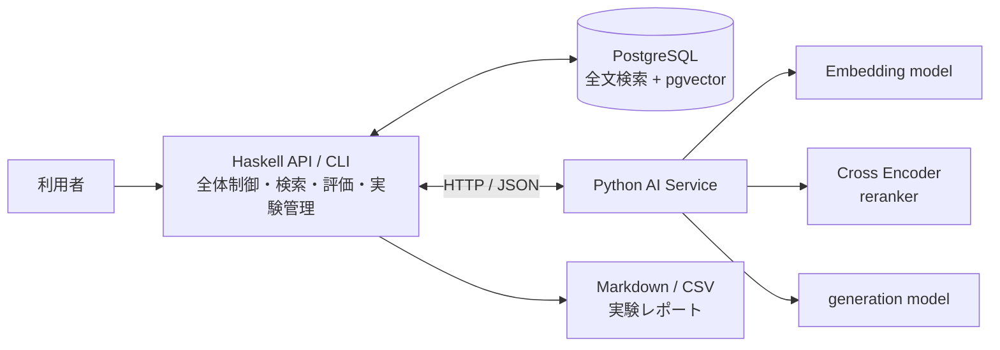

| 担当 | 責務 |
|---|---|
| Haskell | REST API / CLI、文書・チャンク・評価データ・実験結果の管理、チャンク分割、DB接続、全文・dense・hybrid検索、順位統合、RAGフロー、プロンプト構築、基本指標、レポート、ログ、timeout / retry、テスト、設定管理 |
| Python | Hugging FaceモデルとTokenizerのロード、Embedding、Cross Encoder reranking、回答生成、バッチ推論、推論パラメータ、Ragas等の回答評価、tokenizer-awareなトークン数、`model_ttft`・生成トークン数・生成時間の計測 |

Haskellを司令塔とし、PythonをAI推論専用サービスとして分離する。

### 4.2 HaskellとPythonの通信

最初はHTTP＋JSONを使う。

```text
POST /embeddings    POST /rerank       POST /generate
POST /token-count   GET  /models       GET  /health       GET /ready
```

v0.1.5では`/rerank`と`/generate`は使わない。各APIでは、リクエスト / レスポンス、バッチ上限、timeout、エラーコード、リトライ可能性、モデル未ロード時の挙動、モデル名・revision、Python側の処理時間を定義する。

### 4.3 1回の質問の処理フロー

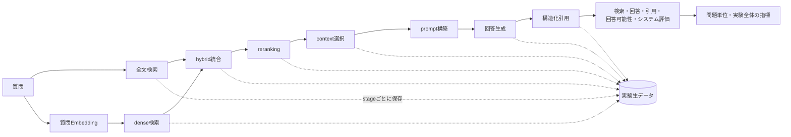

全文、dense、hybrid、reranking、contextの各結果と、回答が引用したsource、評価上回答を裏付けるsourceを分けて保存する。

## 5. 文書・チャンク・評価データ

### 5.1 文書・評価データ・質問処理の流れ

RAGScopeでは、文書の取り込み、評価データの作成、質問の実行を別の処理として扱う。

#### 文書取り込み時

```text
Markdown / TXT文書
→ LF・NFCで正規化
→ normalized_contentを保存
→ ChunkingConfigに従ってHaskellでチャンク分割
→ 各Chunkの元文書上のoffsetを保存
→ Python AI ServiceでEmbeddingを生成
→ PostgreSQL / pgvectorへ保存
```

文書の正規化、チャンク分割、Embedding生成は、原則として質問のたびには行わず、文書またはチャンク条件を登録・更新したときに行う。

#### 評価データ作成時

```text
質問とreference answerを作成
→ 元文書内のevidence textを指定
→ normalized_content内の一致位置からoffsetを計算
→ EvidenceSpanとして保存
```

`EvidenceSpan`は、検索されたChunkが質問の正解根拠をどの程度含むかを評価するために使用する。

#### 質問・実験実行時

```text
質問
→ 質問Embeddingを生成
→ 保存済みのChunkを全文検索・dense検索
→ 必要に応じてhybrid統合・reranking
→ 回答生成に使うcontextを選択
→ promptを構築
→ generation modelで回答と引用を生成
→ 検索・回答・引用を評価
```

v0.0では文書のチャンク化、Embedding生成・保存、dense検索までを実装する。回答生成はv0.2、hybrid検索とrerankingはv0.3で追加する。

### 5.2 正規化とoffset

offsetは、**正規化後の本文に対するUnicodeコードポイント位置**とする。

- 改行コードはLF、Unicode正規化はNFC
- offsetは半開区間`[start_offset, end_offset)`
- 正規化済み本文を保存し、`normalized_content_hash`はそのUTF-8バイト列から計算する
- 正規化規則を変えた場合は`document_version`を更新する
- 結合文字や絵文字を含むoffsetテストを用意する

```text
EvidenceSpan
- document_id
- document_version
- start_offset
- end_offset
```

### 5.3 `Chunk.content`の不変条件

$$
\mathrm{Chunk.content}
=
\mathrm{normalized\_content}
[\mathrm{start\_offset}:\mathrm{end\_offset}]
$$

- Markdown記法は削除せず、LF統一とNFC以外の破壊的変換はしない
- `section_title`はMarkdown見出しから抽出する補助メタデータとし、`Chunk.content`へ付加しない
- Embedding用の見出し等は、元の`Chunk.content`を変えず`EmbeddingSpec`から組み立てる

```text
embedding_input = section_title + "\n\n" + chunk_content
```

これにより、元文書、offset、evidence span、Chunkの対応を維持する。

#### 5.3.1 元文書・Chunk・Evidence・Embeddingの対応

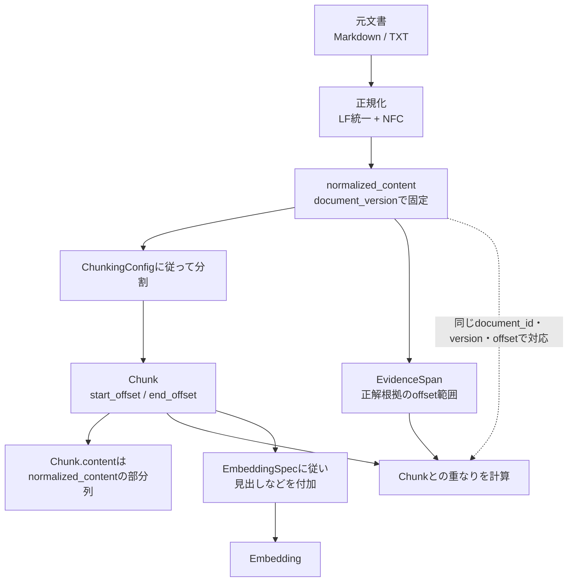

`Chunk.content`自体は元文書との対応を壊さず、Embedding用の入力だけを別途組み立てる。これにより、検索精度を工夫しながらevidence spanによる評価可能性を維持する。

### 5.4 評価データ

v0.1では、answerableな質問は**1つの連続したevidence spanだけ**を持つ。

- 複数箇所をすべて読まないと答えられない質問は除外する
- 同じ答えが複数箇所にある場合は、代表となる1箇所だけを正解にする
- no-answer質問はevidence spanを持たない
- multi-hopは後から`EvidenceSet`で拡張する

```text
EvaluationCase
- evaluation_case_id
- version
- split: dev | test
- question
- reference_answer
- answerability: answerable | no-answer
- evidence_span
- tags: easy | terminology
```

普段の調整は`dev`で行い、`test`は一区切りついたときだけ実行する。最初は5〜10問で仕組みを確認し、その後30〜50問へ増やす。

### 5.5 評価データ作成CLI

offsetは手作業で数えない。

```text
ragscope dataset add-case \
  --document document-001 \
  --question "..." \
  --reference-answer "..." \
  --evidence-text "原文からコピーした証拠部分"
```

CLIは元文書と`evidence-text`を同じ規則で正規化し、一致位置からoffsetを計算する。複数箇所に一致した場合はエラーまたは選択にする。

### 5.6 evidence spanとチャンクの対応

関連チャンクは、1文字でも重なれば正解とはせず、evidence spanに対する被覆率と実験条件で決める。

```text
- evidence_overlap_policy
- evidence_overlap_threshold
```

上位`k`件のチャンクが覆う範囲の和集合を`R_k`、証拠範囲を`E`とする。

$$
\mathrm{EvidenceCoverage@k}
=
\frac{|E \cap R_k|}{|E|}
$$

$$
\mathrm{EvidenceDensity@k}
=
\frac{|E \cap R_k|}{|R_k|}
$$

範囲は`(document_id, document_version, offset)`で識別する。

- 同一文書内の重複範囲は和集合にし、二重計上しない
- 異なる文書の同じoffsetは別の位置として扱う
- Evidenceとの共通部分は、同じ文書・versionだけで発生する
- Densityの分母には、他文書から取得した文字数も含める
- CoverageとDensityは同じ`k`で必ずセットにして見る
- retrieval結果と実際のcontextは分けて計算する
- 異なる`ChunkSet`間では、この2指標を主指標にする
- `EvidenceCoverage@k`: 必要な証拠をどれだけ回収したか
- `EvidenceDensity@k`: 取得した文章のうち、どれだけが実際の証拠だったか

## 6. 評価

| 種類 | 指標・確認事項 |
|---|---|
| 検索（answerableのみ） | 必須：`Hit@k`、`MRR`、`EvidenceCoverage@k`、`EvidenceDensity@k`。追加：`Recall@k`、`Precision@k` |
| reranker | 前後の`MRR`・Coverage・Density、追加レイテンシ、候補件数による変化 |
| 回答 | `faithfulness`、正確性、関連性、引用の正確性 |
| 回答可能性 | answerable / no-answer正解率、no-answer precision / recall / F1、誤回答率、誤拒否率 |
| システム | 検索・reranking・生成時間、`model_ttft`、`tokens/sec`、メモリ、成功率、timeout率、外部API料金、self-hosted実行資源、AWS料金 |

`Recall@k`と`Precision@k`は`ChunkSet`ごとに関連チャンク集合自体が変わるため、異なるチャンク条件間の主指標にはしない。`nDCG@k`は段階的な関連度ラベルを導入した後で追加する。no-answerは通常の検索評価へ混ぜない。

### 6.1 no-answer判定

```text
- no_answer_policy
- no_answer_threshold
- answerability_model
- answerability_model_revision
```

最初は、検索スコア閾値＋プロンプトによる拒否から始める。

### 6.2 引用形式

LLMへ渡す各チャンクにsource IDを付け、回答と引用一覧を構造化されたJSONとして返させる。

```text
[SOURCE-1]
チャンク本文...

[SOURCE-2]
チャンク本文...
```

```json
{
  "answer": "...",
  "citations": ["SOURCE-1", "SOURCE-2"]
}
```

存在しないsourceの引用、sourceによる裏付け、必要な主張への引用有無を評価する。

## 7. 実験設定・実行・再現性

### 7.1 Config

`ExperimentConfig`は次を参照する。

```text
ExperimentConfig
- experiment_config_id
- dataset_version_id
- chunk_set_id
- embedding_spec_id
- embedding_runtime_config_id
- retrieval_config_id
- reranker_config_id
- generation_config_id
- evaluation_config_id
```

- `corpus_version_id`は`chunk_set_id`から導出する
- v0.1で未使用の`reranker_config_id`と`generation_config_id`はnullableとし、ダミーConfigは作らない

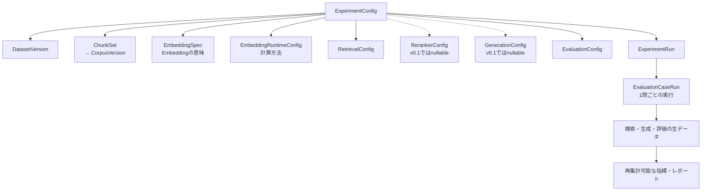

| Config | フィールド |
|---|---|
| `EmbeddingSpec` | `embedding_spec_id`、`model_id`、`model_revision`、`tokenizer_id`、`tokenizer_revision`、`query_prefix`、`document_prefix`、`pooling`、`max_length`、`truncation`、`normalized`、`canonical_json`、`spec_hash` |
| `EmbeddingRuntimeConfig` | `embedding_runtime_config_id`、`batch_size`、`device`、`dtype`、`canonical_json`、`config_hash` |
| `RetrievalConfig` | `retrieval_config_id`、`distance_metric`、`full_text_search_config`、`full_text_candidate_k`、`dense_candidate_k`、`hybrid_fusion_method`、`hybrid_fusion_parameters`、`fusion_output_k`、`canonical_json`、`config_hash` |
| `RerankerConfig` | `reranker_config_id`、`model_id`、`model_revision`、`tokenizer_id`、`tokenizer_revision`、`reranker_candidate_k`、`reranker_output_k`、`batch_size`、`canonical_json`、`config_hash` |
| `GenerationConfig` | `generation_config_id`、`model_id`、`model_revision`、`tokenizer_id`、`tokenizer_revision`、`prompt_template_version`、`temperature`、`seed`、`do_sample`、`top_p`、`max_new_tokens`、`stop_sequences`、`context_chunk_count`、`max_context_tokens`、`context_ordering`、`canonical_json`、`config_hash` |
| `EvaluationConfig` | `evaluation_config_id`、`evidence_overlap_policy`、`evidence_overlap_threshold`、`no_answer_policy`、`no_answer_threshold`、`answerability_model`、`answerability_model_revision`、`metric_versions`、`canonical_json`、`config_hash` |

`EmbeddingSpec`は生成されるEmbeddingの意味を決め、`EmbeddingRuntimeConfig`は計算方法を表す。`batch_size`だけを変えても別Embeddingとして保存しない。

### 7.2 canonical JSONとhash

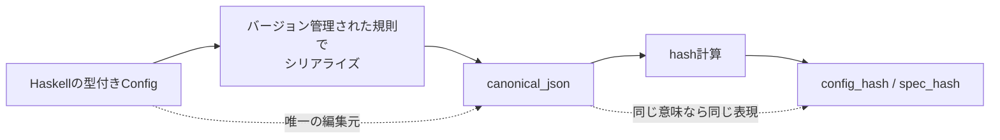

`canonical_json`を手入力せず、個別フィールド・JSON・hashを別々に更新しない。canonical化規則自体もバージョン管理する。

### 7.3 実行データ

| レコード | フィールド |
|---|---|
| `ExperimentRun` | `experiment_run_id`、`experiment_config_id`、`code_commit`、`code_dirty`、`execution_environment`、`status`、`started_at`、`finished_at`、`aggregate_metrics`、`error` |
| `EvaluationCaseRun` | `evaluation_case_run_id`、`experiment_run_id`、`evaluation_case_id`、`evaluation_case_version`、`status`、`started_at`、`finished_at`、`error` |
| `RetrievalStageRun` | `retrieval_stage_run_id`、`evaluation_case_run_id`、`stage`（`full_text` / `dense` / `hybrid` / `rerank` / `context`）、`status`、`candidate_count`、`started_at`、`finished_at`、`processing_time`、`error` |
| `RetrievalHit` | `retrieval_stage_run_id`、`chunk_id`、`rank`、`score` |
| `GenerationResult` | `evaluation_case_run_id`、`rendered_prompt`、`prompt_hash`、`answer`、`citations`、`input_token_count`、`output_token_count`、`model_ttft`、`generation_time`、`status`、`error` |
| `MetricResult` | `evaluation_case_run_id`、`metric_name`、`metric_version`、`metric_value`、`evaluator_config` |

検索時間はhitではなくstage単位で保存する。scoreがないstageではnullableとし、尺度が異なるstage間でscoreを直接比較しない。同じ`chunk_id`の順位・scoreをstage間で追跡するため、`source_rank`や`source_score`は持たない。

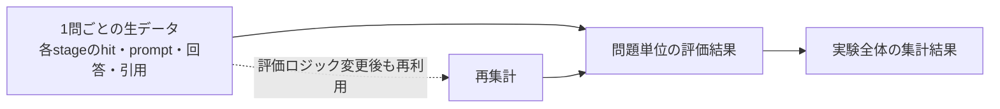

評価ロジックを変更しても、生データから再集計できるようにする。

### 7.4 再現性

再現性とは出力の完全一致ではなく、**同じ条件と実行環境を復元し、同じ手順で比較可能な結果を得ること**とする。

`execution_environment`には最低限、container image digest、OS、CPU / GPU、memory、Python・PyTorch・Transformersのバージョン、quantization、dtype、deviceを記録する。

## 8. データ構造

| Entity | フィールド |
|---|---|
| `Document` | `document_id`、`document_version`、`title`、`source`、`source_content_hash`、`normalization_version`、`normalized_content`、`normalized_content_hash`、`language`、`created_at` |
| `CorpusVersion` | `corpus_version_id`、`document_versions`、`content_hash`、`created_at` |
| `DatasetVersion` | `dataset_version_id`、`evaluation_case_versions`、`content_hash`、`created_at` |
| `ChunkingConfig` | `chunking_config_id`、`strategy`、`parameters`、`implementation_version`、`canonical_json`、`config_hash` |
| `ChunkSet` | `chunk_set_id`、`corpus_version_id`、`chunking_config_id`、`created_at` |
| `Chunk` | `chunk_id`、`chunk_set_id`、`document_id`、`document_version`、`section_title`、`content`、`start_offset`、`end_offset`、`chunk_index`、`content_hash` |
| `Embedding` | `chunk_id`、`embedding_spec_id`、`dimension`、`embedding`、`content_hash`、`created_at` |

`Chunk`は`content == normalized_content[start_offset:end_offset]`を満たす。`Embedding`の一意制約は`(chunk_id, embedding_spec_id)`とする。同じSpecのEmbeddingはruntime条件を変えても重複保存せず、runtime条件は`ExperimentConfig`と`execution_environment`へ記録する。`distance_metric`はEmbeddingではなく`RetrievalConfig`に置く。

### 8.1 主要Entityの関係

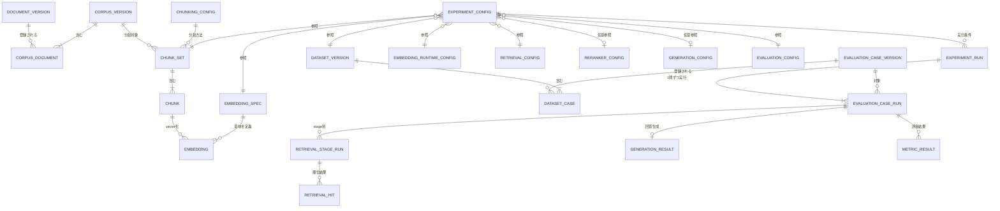

この図は全フィールドを列挙するものではなく、バージョン・設定・実行結果がどの単位で結び付くかを示す。`CorpusVersion`と文書バージョン、`DatasetVersion`と評価問題バージョンは、中間Entityを介した多対多として扱う。

## 9. AWSデプロイスパイク（v0.1.5）

### 9.1 範囲と構成

EmbeddingだけをAWSへ載せる。reranker、generation model、ALB、ECS、Auto Scaling、GPU、公開Web UIは使わない。

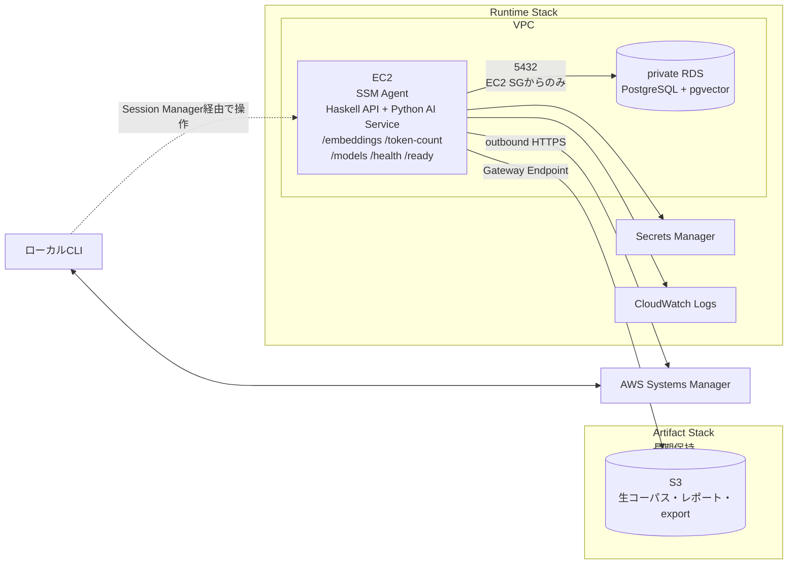

### 9.2 ネットワークとセキュリティ

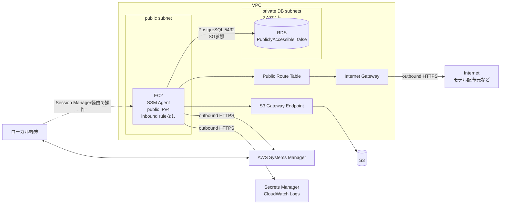

通信経路は用途別に分ける。点線は利用者から見た論理上の操作経路、実線はEC2から必要となる実際の通信方向を示す。管理操作はSession Manager、DB接続はSecurity Group間の5432、S3はGateway Endpoint、その他のAWSサービスとモデル配布元はoutbound HTTPSを使う。

- public subnetに置くだけでは外部へ出られないため、route、Internet Gateway、public IPv4を用意する
- EC2はpublic subnet＋public IPv4だが、SSHポートとinbound ruleは設けずSession Managerで操作する
- EC2のoutbound HTTPSでSystems Manager、Secrets Manager、CloudWatch Logs、モデル配布元へ接続する
- RDSは`PubliclyAccessible=false`、DB subnet groupは2つ以上のAZにまたがらせる
- PostgreSQL 5432はEC2 Security Groupからだけ許可する
- S3はGateway Endpointを使い、Internet Gatewayを経由させない
- 将来EC2をprivate subnetへ移す場合は、各サービスのInterface Endpointを検討する

成功条件は、インバウンドポートとRDS外部公開なしで動作し、EC2からS3、RDS、Systems Manager、Secrets Manager、CloudWatch Logsへの経路を説明できること。

### 9.3 Secrets、Stack、削除方針

- RDS master passwordはSecrets Managerで管理する
- EC2 IAM roleには対象secretを読む権限だけを与える
- secretをuser data、Git、平文設定へ置かない
- Artifact Stackは長期保持し、生文書・レポート・DB exportを保存する
- Runtime Stackは実験後に削除する
- CloudFormationにRDS `DeletionPolicy`、final snapshot方針、Logs `RetentionInDays`を明記する
- 削除前に必要な結果をArtifact Stackへexportする

### 9.4 料金対策

特にGPU EC2、RDS、ALB、NAT Gateway、EBS、CloudWatch Logs、RDS snapshotへ注意する。

```text
Artifact Stack作成 → Runtime Stack作成 → 実験
→ 結果をexport → Runtime Stack削除
```

GPUは実験時だけ起動し、Budget / Cost Anomaly Detection、ログ保持期間、READMEの削除手順、NAT Gatewayの必要性、残存snapshotを確認する。

## 10. 開発ロードマップ

### 10.1 初期の固定方針

- ライセンスが明確な英語の公式技術文書を使う
- 評価データは5〜10問でCLIを検証後、30〜50問へ増やし、dev / testへ分ける
- v0.1では1問につき1つの連続evidence spanとする
- Embedding modelは1つに固定する
- generation modelはM2 16GBで無理なく動く小型モデルを1つに固定する
- 各役割につき1モデルだけをロードする
- v0.1は同期処理とし、一括処理のジョブ化は後に回す
- v1.0まではAPI＋CLI、結果はMarkdown / CSVで出力する
- AWSはv0.1後にEC2直接配置で試し、ECSは必要性を実感してから検討する

### 10.2 バージョン別計画

| バージョン | 内容 |
|---|---|
| v0.0 | 固定文書を固定ルールでchunk化し、PythonでEmbedding、pgvectorへ保存、Haskell CLIからexact searchして上位chunkを表示 |
| v0.1 | 評価データ、正規化・offset、バージョン管理、Config、実験・hit保存、dense＋PostgreSQL全文検索、検索指標、Markdown / CSVレポート |
| v0.1.5 | EC2へHaskell executable＋Python venvを直接配置し、`systemd`、CloudFormation、Session Manager、RDS、S3、Secrets、CloudWatchを検証。料金・障害点・削除まで記録 |
| v0.2 | self-hosted回答生成、`GenerationConfig`、promptバージョン、context保存、`GenerationResult`、構造化引用、no-answer |
| v0.3 | Cross Encoder reranker、hybrid search、精度・速度比較 |
| v0.4 | reference answer、faithfulness、回答正確性、引用・回答可能性評価、Ragas、必要ならLLM-as-a-Judge |
| v0.5 | Embedding cache、structured logging、tracing、timeout / retry、batch、非同期job、p50 / p95、fake AI service、Python障害時の挙動 |
| v1.0 | README、構成図、API仕様、ADR、sample data、比較表、レポート、再現手順、制約と既知の問題、モデル・データセットのライセンス、CIを備えたローカル公開版 |
| v1.1 | v0.1.5とv1.0の結果を見て、EC2上のcontainer、ECR、ECS / Fargateへ進むか判断 |

基本的な検索指標はHaskellで実装し、Ragasは補助として使う。v1.0の完成形は、UIではなくAPI＋CLI＋読みやすい実験レポートとする。

CLI例：

```text
ragscope dataset add-case ...
ragscope experiment run config-a
ragscope experiment compare run-001 run-002
ragscope search "..."
ragscope report run-001 --format markdown
```

v1.1は`EC2直接実行 → EC2上でcontainer実行 → ECR → ECS / Fargate`の順に検討する。追加候補はALB、CloudWatch metrics / alarms、Parameter Store、GPU実験ジョブ、AWS Batch、AWS料金レポート。v1.1でも高可用性や大規模運用を実現したとは主張しない。

### 10.3 v0.1の実装順と成功条件

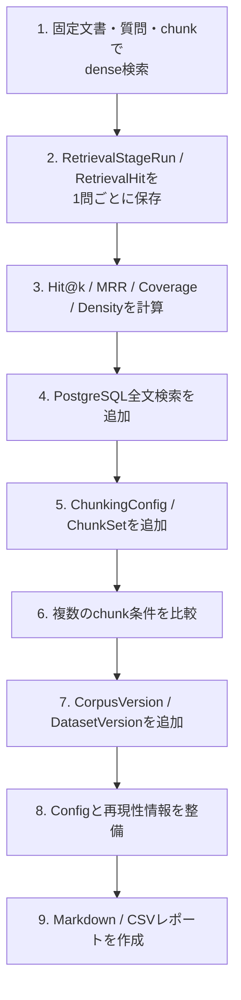

成功条件：

- 同じ評価データで複数のchunk条件を比較できる
- 失敗した質問を1問単位で追跡できる
- 生データから評価指標を再集計できる
- baselineとdense検索の差を数字で説明できる

## 11. 設計判断と検証結果の記録

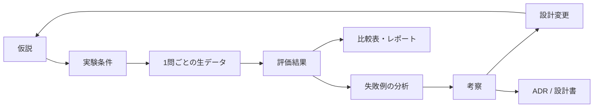

実装結果だけでなく、**評価結果に基づいて設計を改善した過程**を記録する。

AWS検証では、デプロイ結果に加えて、ローカル環境との差、通信経路、IAM、削除方針、料金、障害点、改善案を記録する。

## 12. v0.0 実装内容

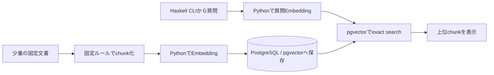

v0.0では、固定文書のチャンク化、Embedding生成、pgvectorへの保存、Haskell CLIからのexact searchまでを実装する。未決定事項はv0.0またはv0.1で必要になった時点で決定し、実装で判明した矛盾や変更理由はADRまたは本設計書へ反映する。各バージョンの成功条件を満たすまで、新しい機能は原則として追加しない。

## 13. 未決定事項

- 最初の文書コーパス
- 評価用質問の具体的な作成方針
- 最初のEmbedding model
- 最初のgeneration model
- `evidence_overlap_threshold`の初期値
- v1.1でECS / Fargateまで進むか
