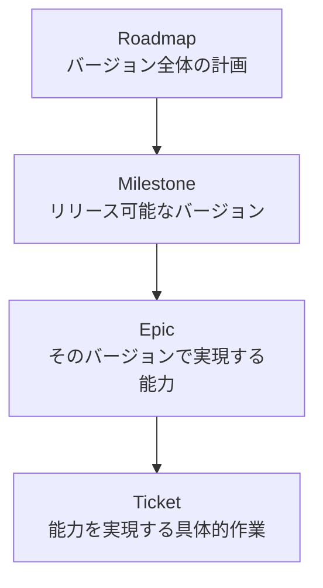
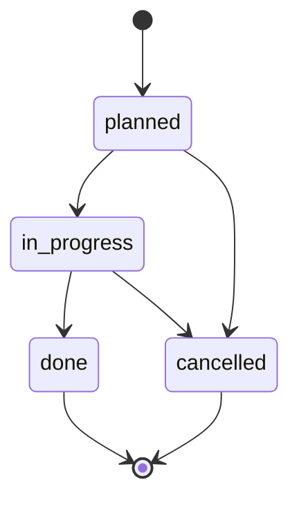

# RAGScopeプロジェクト管理規約

> [!abstract] この文書の役割
> RAGScopeの開発作業を、Obsidian上で**Roadmap → Milestone → Epic → Ticket**の構造として管理する。  
> 小さく動作するバージョンへ分割し、作業の目的・完了条件・結果を追跡できる状態を保つ。

## 1. 適用範囲と関連規約

本規約は、`project-management/`配下のRoadmap、Milestone、Epic、Ticketへ適用する。

- 文書の配置・責務・参照関係は[RAGScope文書管理規約](./RAGScope文書管理規約.md)に従う。
- Frontmatterは[Obsidianメタデータ規約](./Obsidianメタデータ規約.md)に従う。
- Milestone・Epic・Ticketの作成、Ticketへの着手、Pull Request、リリースなどの具体的な操作は[RAGScope開発運用ガイド](./docs/RAGScope開発運用ガイド.md)に従う。
- 規約間または規約と実装の矛盾を発見した場合は、影響範囲を確認し、解消または明示してから作業を進める。

## 2. 基本原則

### 2.1 小さく動作するバージョンへ分ける

Milestoneは、次を満たす単位にする。

- 到達点が1つのまとまりとして説明できる。
- 実際に実行または検証できる。
- 次のMilestoneが未完成でも、そのバージョン単独で動作する。
- Git tagを付けられる状態である。

単なる内部作業の途中や、無関係な複数の目的をまとめたものをMilestoneにしない。

### 2.2 着手するMilestoneだけを具体化する

- Roadmapには、将来のバージョンの到達点を高い粒度で記載してよい。
- Epic・Ticketへ具体化するのは、次に着手すると決定したMilestoneに限る。
- 後続MilestoneのEpic・Ticketを先行して作成しない。
- 後続Milestoneの機能を、現在取り組んでいるMilestoneのTicketへ混ぜない。

### 2.3 独立したBacklogを作らない

RAGScopeでは、独立したBacklog管理を採用しない。

発見した事項は、次の基準で扱う。

| 内容 | 記録先・対応 |
|---|---|
| 現在設計に関係する未決定事項 | 該当設計書の明示的な「未決定事項」節 |
| 現在バージョンの既知の制約 | Milestoneの`リリース結果`または関係するTicketの`結果` |
| 将来の大きな方向性 | Roadmapへ簡潔に記載 |
| 実施すると決定した具体的な作業 | Ticket化 |
| 実施時期も必要性も未確定な思いつき | 原則として記録しない |

設計書を未整理な改善案の置き場にせず、実施時期も必要性も未確定な項目を大量に蓄積しない。

## 3. 管理構造



| 親 | 子 | 関係 |
|---|---|---|
| Roadmap | Milestone | 1対多 |
| Milestone | Epic | 1対1以上 |
| Epic | Ticket | 1対1以上 |

- 1つのEpicは、必ず1つのMilestoneに所属する。
- 1つのTicketは、必ず1つのEpicと1つのMilestoneに所属する。
- Epicを複数のMilestoneで使い回さない。
- 小規模なMilestoneでは、Milestone・Epic・Ticketに同じ説明を繰り返さず、**到達点・能力・変更結果**の差だけを書く。

### 3.1 Roadmap

Roadmapは、RAGScopeがどのようなバージョンを経て発展するかを示す。

- 各バージョンの到達点を1〜3文で記載する。
- 詳細な作業一覧や未整理のアイデアを置かない。
- 具体化済みのMilestoneノートへの入口とする。Milestoneを具体化した場合は、同じ変更内でRoadmapから相対リンクする。
- 作業中のMilestone名や状態を、正本とは別に手作業で記載しない。

現在取り組んでいるMilestoneは、`status: in_progress`のMilestoneノートと、Frontmatterから生成するBases・検索結果によって確認する。Roadmapは現在状態の正本または手作業の進捗一覧として使用しない。

### 3.2 Milestone

Milestoneは、Gitのバージョンと対応するリリース単位である。

```text
v0.0
v0.1
v0.2
```

Milestone名や目標は、作業内容ではなく完了後の状態で表現する。

適切：

```text
固定Markdown文書を読み込み、本文を表示するCLIを実行できる
```

不適切：

```text
文書読み込みを実装する
```

### 3.3 Epic

Epicは、そのMilestoneで利用者またはシステムが獲得する、まとまりのある能力である。

適切：

```text
固定Markdown文書を読み込める
質問に近いチャンクを検索できる
実験結果をMarkdownで出力できる
```

不適切：

```text
Haskell
Python
PostgreSQL
その他
```

- 技術分類や雑務の箱としてEpicを作らない。
- 1つのMilestoneに能力が1つだけなら、Epicも1つでよい。
- Epicには、能力として確認できる完了条件を設ける。

### 3.4 Ticket

Ticketは、Epicの能力を実現するための、1つの確認可能な変更結果である。

適切：

```text
固定パスのMarkdownファイルを読み込み、本文をTextとして取得できる
```

大きすぎる：

```text
RAG検索を完成させる
```

細かすぎる：

```text
Main.hsを作る
importを追加する
```

細かな実装手順は、Ticket内のチェックリストまたは実装メモへ記載する。形式を整えることだけを目的としたTicketや、実装手順だけを表すTicketを作らない。

## 4. フォルダ構成と命名

```text
project-management/
├── ロードマップ.md
└── milestones/
    └── v0.0/
        ├── v0.0.md
        └── document-ingestion/
            ├── v0.0 固定Markdown文書の取り込み.md
            └── RS-0001 固定Markdownファイルを読み込む.md

docs/
└── RAGScope開発運用ガイド.md

templates/
├── Milestoneテンプレート.md
├── Epicテンプレート.md
└── Ticketテンプレート.md

.github/
└── pull_request_template.md
```

### 4.1 配置

- Milestoneは`project-management/milestones/<version>/`へ置く。
- Milestoneノートは`<version>.md`とする。
- Epicごとに、Milestoneフォルダ直下へ英語・kebab-caseのフォルダを作る。
- EpicノートとTicketノートは、所属Epicフォルダへ置く。
- Obsidianで使用するMilestone・Epic・Ticketのテンプレートは、リポジトリ直下の`templates/`へ置く。
- Pull Requestテンプレートは`.github/pull_request_template.md`へ置く。

### 4.2 ファイル名

- 人が管理・閲覧するMarkdownノートには、内容を直接理解できる日本語名を使用する。
- Milestoneはバージョン番号をファイル名とする。
- Epicは`<version> <日本語タイトル>.md`とし、Vault内で一意にする。
- Ticketは`<Ticket ID> <日本語タイトル>.md`とする。
- 構造を表すフォルダ、コード、設定ファイル、機械生成物には英語名を使用する。
- 外部ツールが認識するファイル名は、そのツールの規約に従う。

### 4.3 Ticket ID

- Ticket IDは`RS-0001`形式の一意な連番とする。
- 作成前に既存の最大IDを確認する。
- 一度作成したTicketノートは原則として削除しない。
- 不要になったTicketは、理由を記録して`cancelled`にする。
- 完了、中止、移動後もIDを変更せず、過去に使用したIDを再利用しない。

### 4.4 Ticketの移動

- `planned`のTicketだけ、別のEpicまたはMilestoneへ移動できる。
- 移動時は、フォルダ、Frontmatter、関連リンクを同じ変更内で更新する。
- `in_progress`、`done`、`cancelled`のTicketは原則として移動しない。
- 着手後の作業を別Epic・Milestoneへ引き継ぐ場合は、元Ticketへ結果または中止理由を記録し、新しいTicketを作成する。

## 5. 所属とFrontmatter

所属は、フォルダ階層とFrontmatterの両方へ記録する。

- フォルダ階層：配置上の正本
- `milestone`・`epic`：Bases・検索・一覧表示のための索引

不一致の場合は、フォルダ階層を正としてFrontmatterを修正する。

親ノートに子一覧をメタデータとして持たせない。

```yaml
# 使用しない
epics:
  - ...
tickets:
  - ...
```

Frontmatterのプロパティ、型、許容値は[Obsidianメタデータ規約](./Obsidianメタデータ規約.md)を正本とする。新規のMilestone・Epic・Ticketは、第7章で定めるテンプレートを使用して作成する。

## 6. 状態管理

Milestone、Epic、Ticketで使用する状態値と意味は、[Obsidianメタデータ規約](./Obsidianメタデータ規約.md)を正本とする。本規約では、状態遷移と親子状態の整合だけを定める。



- `done`は、作業したという記録ではなく、完了条件を確認した状態とする。
- `done`と`cancelled`は終了状態とし、原則として再開しない。追加変更が必要な場合は、新しいTicket、Epic、またはMilestoneを作成する。
- `cancelled`へ変更する場合は、理由を本文へ記録する。

### 6.1 親子状態の整合

- Ticketを`in_progress`にする場合、所属EpicとMilestoneも`in_progress`にする。所属EpicまたはMilestoneがすでに`in_progress`の場合は、そのファイルを再更新しない。
- Epicを`done`にする場合、所属Ticketがすべて`done`または理由を記録した`cancelled`であり、Epicの完了条件を満たしていなければならない。
- Milestoneを`done`にする場合、所属Epicがすべて`done`または理由を記録した`cancelled`であり、Milestoneの成功条件を満たしていなければならない。
- `cancelled`の子が存在する場合、その中止が親の完了条件を損なわないことを確認する。損なう場合、親を`done`にしない。
- EpicまたはMilestoneを`cancelled`にする場合は、未完了の子を`cancelled`にするか、`planned`の子を適切な所属先へ移動したうえで、理由と影響を親ノートへ記録する。

## 7. ノートの最小構成とテンプレート

見出しの説明文は日本語を基本とし、コード上の識別子や技術用語は必要に応じて原表記を使用する。具体的な作成操作は[RAGScope開発運用ガイド](./docs/RAGScope開発運用ガイド.md)を参照する。

### 7.1 Roadmap

Roadmapには、`RAGScopeロードマップ`をH1として置き、バージョンごとの到達点と、具体化済みMilestoneへの相対リンクを記載する。作業中のMilestoneを示す「現在」欄や詳細なTicketは記載しない。

### 7.2 Milestone

新規Milestoneは[Milestoneテンプレート](./templates/Milestoneテンプレート.md)を使用して作成する。

- `目標`、`成功条件`、`リリース結果`は必須とする。
- Epic一覧は、Milestoneノートへ埋め込んだBasesから`note_type`と`milestone`を使って導出する。
- Epicへのリンク一覧を手作業で記載・更新しない。
- Ticket一覧も手作業では記載せず、フォルダ表示、検索、必要に応じて追加したBasesから確認する。

### 7.3 Epic

新規Epicは[Epicテンプレート](./templates/Epicテンプレート.md)を使用して作成する。

- `能力`、`Milestoneでの役割`、`完了条件`、`結果`を必須とする。
- `関連文書`は、作業に必要な要求、設計書、ADR、Experimentがある場合に記載する。
- Epicを関連情報の包括的なポータルとして維持することは必須としない。
- Ticket一覧は手作業で記載せず、フォルダ表示、検索、必要に応じて追加したBasesから確認する。

### 7.4 Ticket

新規Ticketは[Ticketテンプレート](./templates/Ticketテンプレート.md)を使用して作成する。

- `目的`、`完了条件`、`結果`を必須とする。
- `対象外`は、範囲の誤解が生じる場合に記載する。機能の一部だけを扱うTicketでは原則として記載する。
- `関連文書`は、作業に必要な要求、設計書、ADR、Experimentがある場合に記載する。
- `実装メモ`は不要なら省略してよい。一時的な作業メモを、現在設計の正本として使用しない。
- 新しい機能または変更によって完了後も有効な設計情報が生じる場合は、対象機能の設計書を作成または更新する。すべてのTicketに設計書を作ることは必須としない。
- 長期的に有効な要求・設計はTicketだけに残さず、要求定義または機能設計書へ反映する。


## 8. 完了条件

### 8.1 Ticket

次をすべて満たした場合だけ`done`にする。

1. Ticketの完了条件を確認した。
2. テストまたは実行により結果を確認した。
3. `結果`へ実装内容と確認方法を記録した。
4. 必要な要求・設計書・ADR・実験ノートを更新した。
5. 解消していない重大な矛盾を放置していない。
6. 実質的な変更では、関連する変更がデフォルトブランチへ反映されている。

### 8.2 Epic

次をすべて満たした場合だけ`done`にする。

1. 所属Ticketがすべて`done`または理由を記録した`cancelled`である。
2. `cancelled`のTicketが、Epicの完了条件を損なわない。
3. Epicの完了条件を能力として確認した。
4. `結果`へ実現した能力と制約を記録した。

Ticket数だけでEpic完了を判断しない。

### 8.3 Milestone

次をすべて満たした場合だけ`done`にする。

1. 所属Epicがすべて`done`または理由を記録した`cancelled`である。
2. `cancelled`のEpicが、Milestoneの成功条件を損なわない。
3. 成功条件を実際に実行して確認した。
4. リリース対象が動作する。
5. `リリース結果`へ確認方法と既知の制約を記録した。
6. 必要な文書を更新した。
7. `status: done`とリリース結果を含む変更がデフォルトブランチへ反映されている。

Epic・Ticket数だけでMilestone完了を判断しない。Git tagはMilestoneの完了条件ではなく、第9.5節のリリース処理として付与する。

## 9. Branch・Pull Request・Git tag

### 9.1 基本対応

```text
1 Ticket
→ 1 Branch
→ 1 Pull Request
```

実質的なコードまたは設計変更は、原則としてこの単位で追跡する。

### 9.2 ブランチ名

```text
feat/RS-0001-read-fixed-markdown
fix/RS-0002-handle-read-error
docs/RS-0003-update-document-design
test/RS-0004-add-loader-tests
refactor/RS-0005-separate-loader-module
```

- Ticket IDを必ず含める。
- suffixは英語・kebab-caseとする。
- 変更内容に合うprefixを選ぶ。

### 9.3 Pull Request

PRは[Pull Requestテンプレート](./.github/pull_request_template.md)を使用し、最低限、目的、主な変更、確認方法、関連Ticketを記載する。

Ticketを完了するPRには、Ticketの`status: done`と`結果`の更新を含める。マージ後、Ticketの`結果`へ記載した確認内容と実際の結果に差異がないことを確認する。

### 9.4 例外

次の軽微な変更は、独立したTicket・Branch・PRを必須としない。

- 誤字修正
- リンク切れ修正
- Frontmatterの単純な整合性修正
- コメントだけの軽微な修正

複数の実質的な変更を「軽微」としてまとめない。

### 9.5 Git tag・GitHub Release

Milestoneのリリース処理は次の順序で行う。

1. Milestoneの成功条件を確認する。
2. `リリース結果`と`status: done`を含む変更をデフォルトブランチへ反映する。
3. そのコミットへ、Milestone名と同じGit tagを付ける。
4. 必要な場合だけGitHub Releaseを作成する。

GitHub Releaseには、実現した能力、確認方法、利用方法、既知の制約を必要な範囲で記載する。

## 10. 要求・設計・ADR・Experimentとの関係

- Epic・Ticketには、今回の変更目的、作業範囲、完了条件、実施結果を記録する。
- 新しい機能または変更によって完了後も有効な設計情報が生じる場合は、機能・責務を単位として`docs/design/`の設計書を作成または更新する。
- Ticketごとに設計書を新設せず、既存の機能設計書で現在設計を自然に説明できる場合は、その設計書を更新する。
- Ticketは、作業に必要な要求、設計書、ADR、Experimentを必要な範囲で参照する。すべての関連情報をEpic・Ticketへ集約することは必須としない。
- 長期的に有効な要求・設計は、Ticketではなく要求定義または機能設計書を正本とする。
- 重要な設計判断の理由はADRへ記録する。
- 実測や比較を伴う検証はExperimentへ記録する。
- Requirements、Design、ADRは、TicketやMilestoneを読まなくても現在の内容を理解できる状態にする。
- 補助的な関連リンクは記載できるが、一時的な作業記録へ現在仕様を依存させない。

## 11. Bases・検索・一覧

Basesは、Markdownノート、Frontmatter、フォルダ階層から生成する派生表示として扱う。

- Ticket追加や状態変更のたびに、別の手作業一覧を更新しない。
- Milestoneノートでは、所属Epicを埋め込みBasesによって表示する。
- Milestone用Basesは`project-management/milestones/`配下だけを対象とし、テンプレートファイルを一覧へ含めない。
- Ticketや状態に関するその他の一覧は、具体的な利用目的が生じた場合だけ追加する。

Epicの追加、移動、改名、状態変更に伴う手作業の一覧更新は行わない。
