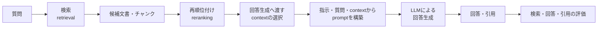

---
aliases:
  - AI・LLM・RAG基礎ノート
  - RAG基礎用語集
tags:
  - ai
  - llm
  - rag
  - information-retrieval
note_type: moc
---
# AI・LLM・RAG基礎ノート

> [!abstract] このノートの役割
> AI・LLM・RAG・情報検索に関する、**特定プロジェクトに依存しない基礎知識**を管理する。  
> RAGScopeで採用する方式、制約、データ構造、実装順序は[[ragscope-design|RAGScope設計書]]に記載する。

> [!warning] 教科書化させない
> このファイルは基礎知識への入口として使い、網羅的な教科書にはしない。
> 1つのテーマの説明が大きくなった場合は個別ノートへ分割し、このファイルには要約とリンクだけを残す。

## 記載方針

- 一般的な用語の意味、仕組み、比較、前提知識を記載する。
- 特定モデルやライブラリによって実装が異なる場合は、その差を一般論として整理する。
- RAGScope固有のEntity名、Config名、stage名、バージョン計画は記載しない。
- RAGScopeでの具体的な採用方法に触れる場合は、説明を重複させず設計書へリンクする。

> [!tip] 判断に迷った場合
> 「RAGScopeがなくても学習資料として成立する内容」はこのノートへ置く。  
> 「RAGScopeではどう実装・保存・評価するか」は[[ragscope-design]]へ置く。

## RAGと検索

| 用語 | 意味 |
|---|---|
| RAG | Retrieval-Augmented Generationの略。質問に関係する情報を検索し、その情報をLLMへ渡して回答を生成する方式 |
| retrieval | 質問に関係する文書やチャンクを検索し、回答生成に使う候補を取得する処理 |
| corpus | 検索対象となる文書の集合 |
| chunk | 検索やLLMへの入力に使うため、文書を一定の単位に分割したもの |
| baseline | 改善手法と比較するための基準となる方式 |
| 全文検索 | 単語や語句など、文字列としての一致を利用して文書を検索する方式 |
| Embedding | テキストの意味的な特徴を、数値の並びであるvectorとして表現したもの |
| vector | 複数の数値を順序付きで並べたもの。Embeddingは、テキストを表す高次元のvectorである |
| embedding model | テキストをEmbeddingへ変換するモデル |
| dense検索 | 質問と文書のEmbedding間の距離や類似度を使って検索する方式 |
| distance metric | vector同士がどの程度近いかを計算する尺度 |
| exact search | 検索対象のvectorを省略せずに比較して、近いvectorを求める検索方式 |
| HNSW / IVFFlat | 大量のvectorから近いvectorを高速に探すための近似検索index |
| hybrid検索 | 全文検索とdense検索など、複数の検索結果を組み合わせる方式 |
| fusion | 複数の検索結果や順位を、1つの順位へ統合する処理 |
| candidate | 検索やrerankingの途中段階で取得された候補チャンク |
| reranking | 最初の検索で得た候補を、別のモデルや基準で評価し直して並べ替える処理 |
| reranker | rerankingを行うモデルまたは処理 |
| Cross Encoder | 質問と候補文書を一緒にモデルへ入力し、両者の関連度を直接評価するモデル |
| context | 回答生成時にLLMへ渡す、質問に関係すると判断された文書情報 |
| pgvector | PostgreSQLでvectorを保存・検索するための拡張機能 |

## モデルと推論

| 用語 | 意味 |
|---|---|
| AI | 人間が行う認識、推論、生成などの一部をコンピュータで実現する技術の総称 |
| LLM | Large Language Modelの略。大量のテキストから言語のパターンを学習し、文章生成や質問応答などを行うモデル |
| open-weight model | 学習済みモデルの重みが公開され、利用者の環境で実行できるモデル。利用条件はモデルごとのライセンスに従う |
| self-hosted model | 外部事業者の推論APIだけに依存せず、自分で管理する環境上で動かすモデル |
| inference | 学習済みモデルへ入力を与え、Embedding、関連度、回答などの出力を得る処理 |
| tokenizer | テキストをモデルが処理するtokenへ分割し、モデル用の数値表現へ変換する仕組み |
| token | モデルがテキストを処理するときの基本単位。単語、単語の一部、記号などに分割される |
| prompt | モデルへ渡す指示、質問、contextなどを組み合わせた入力 |
| generation model | promptをもとに文章を生成するモデル |
| model revision | 同じモデル名の中で、使用する具体的なversionやcommitを識別する情報 |
| batch inference | 複数の入力をまとめてモデルへ渡して推論する方式 |
| truncation | モデルが処理できる最大token数を超えた入力を切り詰める処理 |
| pooling | tokenごとの出力をまとめ、文章全体を表す1つのEmbeddingを作る方法 |
| normalized Embedding | vectorの長さが一定になるよう正規化されたEmbedding |
| temperature | 生成時の出力のばらつきを調整するパラメータ |
| top-p | 出力候補の累積確率が指定値に達する範囲からtokenを選ぶ生成方法のパラメータ |
| seed | 乱数を使う処理の初期値 |
| model TTFT | Time To First Tokenの略。生成開始から最初のtokenが得られるまでの時間 |
| tokens/sec | 1秒あたりに生成できたtoken数 |
| vLLM | LLMの推論を高速・効率的に提供するための推論エンジン |

## 回答と評価

| 用語 | 意味 |
|---|---|
| evaluation case | システムを評価するための1件の質問、基準回答、回答可能性、根拠などをまとめたデータ |
| reference answer | 評価対象の質問に対して、基準として用意した回答 |
| evidence | 質問に対する回答を裏付ける、元文書内の根拠 |
| evidence span | 元文書内で根拠となる連続した文字範囲 |
| answerable | 検索対象の文書に、質問へ答えるための根拠が存在する状態 |
| no-answer | 検索対象の文書だけでは回答できない状態 |
| multi-hop | 複数の文書や複数箇所の情報を組み合わせなければ回答できない質問 |
| citation | 回答がどのsourceを根拠としているかを示す参照情報 |
| faithfulness | 生成された回答の内容が、与えられたcontextによって裏付けられている度合い |
| Hit@k | 上位`k`件の検索結果に少なくとも1件の正解チャンクが含まれるかを表す指標 |
| MRR | Mean Reciprocal Rankの略。最初の正解結果が何位に現れたかを逆数で評価し、質問全体で平均した指標 |
| Recall@k | 正解とみなすチャンクのうち、上位`k`件で取得できた割合 |
| Precision@k | 上位`k`件の検索結果のうち、正解とみなすチャンクの割合 |
| nDCG@k | 順位と段階的な関連度の両方を考慮する検索評価指標 |
| Ragas | RAGシステムの検索結果や生成回答を評価するためのライブラリ |
| LLM-as-a-Judge | 別のLLMを評価者として使い、回答の正確性や品質などを判定する方法 |
| LLMOps | LLMを利用するシステムの開発、評価、デプロイ、監視、運用を継続的に管理する考え方や仕組み |

## RAGの基本的な処理フロー

RAGでは、検索結果をそのままLLMへ渡すとは限らない。検索候補をrerankingし、入力長や関連性を考慮してcontextを選択してから、回答生成用のpromptを構築する。

## 用語の使い分け

### retrieval・hybrid検索・reranking・context

- `retrieval`は、質問に関係する文書やチャンクを取得する処理の総称である。
- `全文検索`と`dense検索`は、異なる仕組みを使う検索方式である。
- `hybrid検索`は、複数の検索方式の候補や順位を統合する方式である。
- `reranking`は、取得済み候補を別のモデルや基準で評価し直し、順序を変更する処理である。
- `context`は、最終的に回答生成モデルへ渡す情報であり、検索結果全体と同一とは限らない。

### open-weight model・self-hosted model

- `open-weight model`は、学習済みモデルの重みが公開されていることを表す。
- `self-hosted model`は、モデルを自分で管理する環境上で実行することを表す。
- 重みが公開されていても外部サービス上で実行する場合があり、self-hostedでも利用条件や配布形態はモデルごとに異なる。この2語は関連するが同義ではない。

### evidence・citation・faithfulness

- `evidence`は、質問への回答を裏付ける元資料上の根拠である。
- `citation`は、回答がどの情報源を参照したかを示す情報である。
- `faithfulness`は、回答内容が与えられたcontextによって裏付けられている度合いである。
- 引用先が存在するだけでは、回答中の主張が実際に裏付けられているとは限らないため、citationの形式とfaithfulnessは分けて評価する。

## 検索評価指標の読み方

| 指標 | 主に確認すること |
|---|---|
| `Hit@k` | 上位`k`件に正解が1件以上含まれるか |
| `MRR` | 最初の正解がどれだけ上位に現れるか |
| `Recall@k` | 正解集合のうち上位`k`件で回収できた割合 |
| `Precision@k` | 上位`k`件のうち正解が占める割合 |
| `nDCG@k` | 順位と段階的な関連度をどの程度両立できたか |

> [!note] 指標は単独で読まない
> たとえば、上位に正解が1件含まれることと、必要な正解を十分に回収できることは同じではない。目的に応じて複数指標を組み合わせて確認する。

RAGScopeで採用する`EvidenceCoverage@k`、`EvidenceDensity@k`と、正解根拠の範囲を使った具体的な計算方針は、[[ragscope-design#5.6 evidence spanとチャンクの対応|RAGScope設計書の「evidence spanとチャンクの対応」]]を参照する。

## 関連ノート

- [[ragscope-design|RAGScope設計書]]
