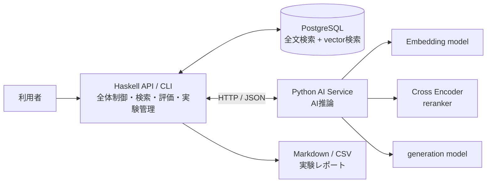
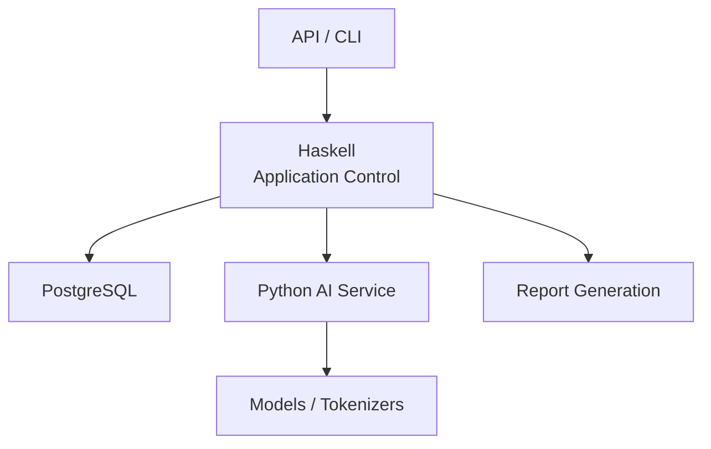
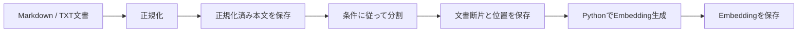
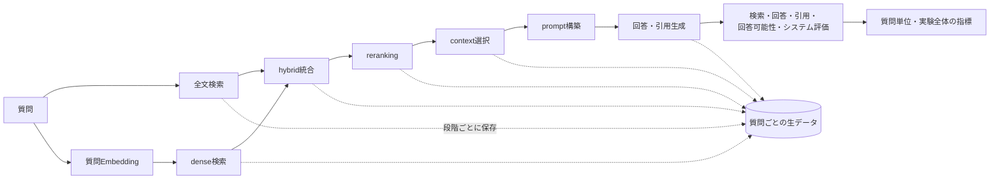
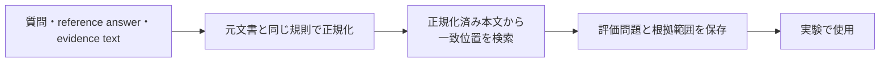
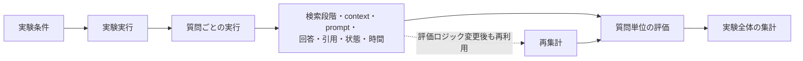

# システムアーキテクチャ

> [!abstract] この文書の役割
> RAGScopeのコンポーネント構成、責務、依存方向、通信、全体処理フロー、実行環境の基本方針を定義する。  
> 満たすべき内容は[RAGScope要求定義](../RAGScope要求定義.md)、目的と価値は[RAGScope概要](../RAGScope概要.md)、段階的な実現計画は[ロードマップ](../../project-management/ロードマップ.md)を参照する。

## 1. 設計方針

RAGScopeは、アプリケーションの全体制御とAI推論を分離する。

- Haskellをシステムの司令塔とし、文書、検索、評価、実験の流れを制御する。
- PythonをAI推論専用のサービスとし、モデルとTokenizerを利用する処理を担当する。
- PostgreSQLを、文書、検索用データ、実験条件、実行結果の永続化と検索に使用する。
- HaskellとPythonはHTTP / JSONで通信する。
- RAG本体はローカル環境で完成させる。
- AWSへの配置は、RAG本体とは独立した検証段階として扱う。

正確な型、DB schema、API schema、CLI option、テストケースは、それぞれコード、migration、OpenAPI、`--help`、テストコードを正本とする。

### 1.1 検索処理で使用する用語

RAGScopeでは、検索から回答生成へ渡す情報を段階ごとに区別する。

| 用語 | RAGScopeでの意味 |
|---|---|
| `retrieval` | 質問に関係する文書断片を取得する処理。 |
| 全文検索 | 文書中の語を検索対象として文書断片を取得する検索方式。dense検索とは独立した検索方式として扱う。 |
| dense検索 | 質問と文書断片のEmbeddingを比較し、vector上の近さに基づいて文書断片を取得する検索方式。全文検索とは独立した検索方式として扱う。 |
| hybrid検索 | 全文検索とdense検索の結果を統合する処理。 |
| `reranking` | 検索候補を別のモデルまたは基準で再評価し、並べ替える処理。 |
| `context` | 検索または`reranking`後の候補から選択し、実際に回答生成モデルへ渡す文書断片。 |
| `stage` | 全文検索、dense検索、hybrid検索、`reranking`、`context`選択など、結果を個別に保存・評価する処理段階。 |

検索結果と`context`は同一とは限らない。全文検索、dense検索、hybrid検索、`reranking`、`context`選択を別の`stage`として扱い、段階ごとの候補、順位、score、状態、処理時間を区別して保存・評価する。

正確なstage識別子と保存形式は、データモデルと検索を実装するMilestoneで定義し、コード、migrationなどの機械可読な定義を正本とする。

## 2. 全体構成



利用者はHaskell API / CLIを通じてRAGScopeを操作する。HaskellはPostgreSQLとPython AI Serviceを組み合わせ、文書取り込み、検索、回答生成、評価、実験管理、レポート生成を実行する。

Python AI Serviceは、アプリケーション全体の状態や実験進行を管理しない。AIモデルを利用する計算に責務を限定する。

## 3. コンポーネントの責務

| コンポーネント | 主な責務 |
|---|---|
| Haskell API / CLI | 利用者向けAPI・CLI、処理全体の制御、文書と評価データの管理、文書分割、検索、順位統合、context選択、prompt構築、基本評価指標、実験管理、レポート生成、設定、ログ、timeout / retry、テスト |
| Python AI Service | モデルとTokenizerのロード、Embedding生成、reranking、回答生成、token数計測、モデル固有の推論パラメータ、AIライブラリを利用する回答評価、AI推論の処理時間計測 |
| PostgreSQL | 正規化済み文書、文書断片、Embedding、評価データ、実験条件、検索結果、回答、引用、評価結果、実行状態の永続化、全文検索、vector検索 |
| Markdown / CSVレポート | 実験条件、集計値、質問ごとの結果、比較結果、失敗例を人が確認できる形で出力する |

### 3.1 Haskellの責務境界

Haskellは、RAGScopeの処理順序とデータの整合性を管理する。

- 文書の取り込みから検索準備までを制御する。
- 質問ごとの検索段階と回答生成段階を制御する。
- 実験条件と実行結果を結び付ける。
- 検索結果とcontextを区別して保存する。
- 保存済みの生データから評価指標を集計する。
- Python AI Serviceの失敗、timeout、再試行可能性を扱う。

AIモデル固有のロード方法や推論実装はHaskellへ持ち込まない。

### 3.2 Pythonの責務境界

Python AI Serviceは、AIモデルとAIライブラリに依存する処理を提供する。

- 文書または質問のEmbeddingを生成する。
- 検索候補をCross Encoderで再評価する。
- promptとcontextから回答と引用を生成する。
- 使用するTokenizerに基づいてtoken数を計測する。
- モデルの識別情報と利用可能状態を返す。
- モデル処理の時間、生成token数などを返す。

Python AI Serviceは、文書、実験、評価問題の永続化や、複数段階のRAGフロー全体を管理しない。

### 3.3 PostgreSQLの責務境界

PostgreSQLは、比較と追跡に必要なデータを永続化する。

- 元文書と正規化済み本文
- 文書バージョンと文書集合
- 文書断片と元文書内の位置
- Embedding
- 評価問題と正解根拠
- 実験条件
- 実験と質問ごとの実行状態
- 検索段階ごとの順位結果
- context、prompt、回答、引用
- 評価結果と処理時間

正確なテーブル、カラム、制約はmigrationを正本とし、本書ではデータの責務と関係だけを扱う。

## 4. 依存方向



依存関係は次の方向とする。

- API / CLIは、Haskellのアプリケーション処理を呼び出す。
- Haskellは、PostgreSQLとPython AI Serviceを利用する。
- Python AI Serviceは、モデルとTokenizerを利用する。
- PostgreSQLやPython AI ServiceからHaskellの処理を起動しない。
- Python AI ServiceからPostgreSQLへ直接アクセスしない。
- レポートは、保存された実験結果をHaskellが読み出して生成する。

この方向を保つことで、AIモデルの変更と、RAGScope全体の制御・データ管理を分離する。

## 5. HaskellとPythonの通信

HaskellとPython AI Serviceの通信にはHTTP / JSONを使用する。

想定するAPIの分類は次のとおりである。

```text
POST /embeddings
POST /rerank
POST /generate
POST /token-count
GET  /models
GET  /health
GET  /ready
```

- `/embeddings`は文書と質問のEmbedding生成に使用する。
- `/rerank`は検索候補の再評価に使用する。
- `/generate`は回答と引用の生成に使用する。
- `/token-count`はTokenizerに基づくtoken数の確認に使用する。
- `/models`は使用中のモデル、revision、能力を確認する。
- `/health`はプロセスの生存確認に使用する。
- `/ready`は必要なモデルがロードされ、処理可能かを確認する。

各APIの正確なrequest / response、バッチ上限、timeout、エラーコード、再試行可能性、モデル未ロード時の挙動は、APIを実装するMilestoneで定義する。正確なschemaはOpenAPI等の機械可読な定義を正本とする。

## 6. 文書取り込みの全体フロー



1. Markdown / TXT文書を読み込む。
2. 改行とUnicodeを定められた規則で正規化する。
3. 正規化済み本文と、その内容を識別する情報を保存する。
4. 文書分割条件に従って文書断片を生成する。
5. 各文書断片について、元文書、文書バージョン、元文書内の位置を保存する。
6. Python AI ServiceでEmbeddingを生成する。
7. 文書断片とEmbeddingを対応付けて保存する。

正規化、offset、文書断片の不変条件、Embedding入力の組み立ては、実装に必要となった段階で文書処理の機能別設計として定義する。

## 7. 質問と実験の全体フロー



1. 質問を受け取る。
2. 全文検索とdense検索を実行する。
3. 必要なMilestoneでは、両結果をhybrid検索として統合する。
4. 必要なMilestoneでは、候補をrerankingする。
5. 回答生成へ渡すcontextを選択する。
6. promptを構築し、Python AI Serviceで回答と引用を生成する。
7. 検索、回答、引用、回答可能性、処理時間を評価する。
8. 各処理段階の結果と状態を質問単位で保存する。
9. 質問単位の結果から実験全体の評価値を集計する。

全文検索、dense検索、hybrid検索、reranking、contextは別の段階として扱い、順位やscoreの尺度が異なる段階を直接比較しない。

## 8. 評価データ作成の全体フロー



評価問題の正解根拠は、元文書の位置として管理する。利用者はoffsetを手作業で数えず、元文書からコピーした`evidence text`を指定する。

同じ文字列が複数箇所に存在する場合は、曖昧なまま登録せず、エラーまたは利用者による選択として扱う。

## 9. 保存と再集計



実験では、集計値だけでなく、評価に必要な生データを保存する。評価ロジックを変更した場合は、検索や回答生成を再実行せず、保存済みの生データから指標を再計算できる構成とする。

文書、設定、実行結果の具体的なEntityと制約は、データモデルを実装する段階で機能別設計とmigrationへ定義する。

## 10. 配置・実行環境

### 10.1 ローカル構成

RAG本体は、ローカル環境で次の要素を連携させて実行する。

- Haskell API / CLI
- PostgreSQL
- Python AI Service
- self-hosted model
- Markdown / CSVレポート

v1.0では、第三者がREADMEに従ってローカル環境を構築し、sample dataの取り込みから実験レポートの生成まで実行できる状態を目指す。

### 10.2 AWS検証との境界

AWSへの配置は、RAG本体の現在アーキテクチャではなく、独立したデプロイスパイクとして扱う。

スパイクでは、小さな範囲をAWSへ配置し、次を実際に確認する。

- Infrastructure as Codeによる作成と削除
- 管理操作の経路
- アプリケーションとデータベース間の通信
- IAMとsecretの扱い
- ログの保存
- 成果物の退避
- 実験後に残るリソースと料金

この検証結果を見ずに、ECS / FargateなどをRAG本体の採用構成として固定しない。実施時期と到達点は[ロードマップ](../../project-management/ロードマップ.md)を正本とする。

## 11. 機能別設計への分割

次の内容は、現在のMilestoneで実装または変更する必要が生じた時点で、機能別設計として作成または既存文書から分割する。

| 設計対象 | 主な内容 |
|---|---|
| 文書処理設計 | 正規化、offset、文書分割、元文書との対応、Embedding入力 |
| データモデル設計 | Entityの関係、不変条件、nullable条件、永続化単位 |
| 検索設計 | 全文検索、dense検索、hybrid統合、reranking、context選択 |
| 評価設計 | 評価データ、根拠範囲、検索・回答・引用・回答可能性の指標 |
| API設計 | Haskell APIとPython AI Serviceの契約、エラー、timeout、batch |

内容が必要になる前に、これらの文書や空フォルダを作成しない。

## 12. 未決定事項

次の内容は、対応するMilestoneまたは機能別設計で必要になった時点で決定する。

- 最初の文書コーパス
- 最初のEmbedding model
- 最初のgeneration model
- APIごとの正確なrequest / response
- 文書処理、検索、評価に使用する具体的な初期値
