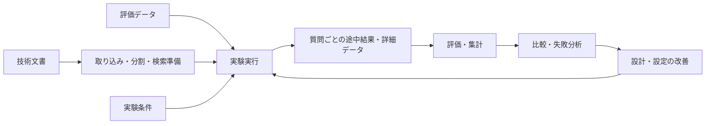

# RAGScope概要

> [!abstract] この文書の役割
> RAGScopeが解決する問題、提供する価値、想定する利用方法、主な能力、対象範囲の概要を示す。  
> 詳細かつ検証可能な内容は[RAGScope要求定義](./RAGScope要求定義.md)、システム構成は[システムアーキテクチャ](./design/システムアーキテクチャ.md)、開発段階は[ロードマップ](./project-management/ロードマップ.md)を正本とする。

## 1. RAGScopeとは

RAGScopeは、RAGシステムの検索結果、回答、引用、評価結果を観察し、条件の異なる実験を比較・追跡するためのアプリケーションである。

単に文書を検索してLLMへ渡すだけではなく、検索から回答生成、評価までの過程と結果を記録し、**評価結果を根拠として設計判断を説明できること**を中心に置く。

名称の「Scope」は、RAGの内部で何が取得され、どの情報が回答に使われ、どのような結果になったかを詳しく見るための道具であることを表している。

### 1.1 名称と識別子

プロジェクトとアプリケーションの名称、および外部から利用する基本的な識別子を次のとおりとする。

| 用途 | 名称・識別子 |
|---|---|
| プロジェクト名 | `RAGScope` |
| アプリケーション名 | `RAGScope` |
| GitHubリポジトリ名 | `rag-scope` |
| CLIコマンド | `ragscope` |
| 環境変数の接頭辞 | `RAGSCOPE_` |

人が読む名称には`RAGScope`を使用し、リポジトリ名、CLIコマンド、環境変数には用途に応じた識別子を使用する。内部コンポーネントの識別子は、実装時に必要となった段階で、この命名と矛盾しない形で決定する。

## 2. 解決する問題

RAGシステムでは、回答だけを見ても、結果が良かった理由や失敗した原因を判断しにくい。

たとえば、次の要因は回答品質へ個別に影響する。

- 文書の分割方法
- 検索方式と検索条件
- 検索結果の並べ替え
- 回答生成へ渡した文脈
- 回答生成条件
- 評価方法

これらの条件と途中結果が記録されていない場合、異なる方式を公平に比較できず、改善が実測ではなく印象に依存しやすい。

RAGScopeは、質問ごとの検索結果、実際に使用した文脈、回答、引用、評価結果、処理時間、エラーを追跡し、設計変更と評価結果の関係を確認できる状態を目指す。

## 3. 提供する価値

### 3.1 検索から回答までを追跡できる

質問に対して取得された文書チャンクと、実際に回答生成へ使われた文脈を区別して保存する。回答だけでなく、その回答へ至る過程を確認できる。

### 3.2 条件の異なる実験を比較できる

文書の分割、検索、並べ替え、回答生成、評価の条件を実験単位で管理し、同じ評価データに対する結果を比較できる。

### 3.3 失敗を質問単位で分析できる

実験全体の集計値だけでなく、1問ごとの検索結果、回答、引用、評価、エラーを確認できる。どの質問で、どの段階が失敗したかを追跡できる。

### 3.4 評価結果から設計を改善できる

検索精度、回答品質、引用、回答可能性、処理時間などを評価し、変更前後の差を根拠として設計を見直せる。

### 3.5 比較可能な実験を再実行できる

使用したコード、データ、設定、モデル、実行環境を記録し、同じ条件を復元して比較可能な実験を再実行できる。

## 4. 想定する利用方法

RAGScopeは、次の流れで使用する。

1. 技術文書を取り込み、検索可能な単位へ分割する。
2. 文書チャンクの検索に必要な情報を生成し、保存する。
3. 質問と正解根拠を含む評価データを用意する。
4. 検索、回答生成、評価の条件を指定して実験を実行する。
5. 質問ごとの途中結果と、実験全体の評価結果を確認する。
6. 条件の異なる実験を比較し、失敗例を分析する。
7. 分析結果に基づいて設計または設定を変更し、再度検証する。

## 5. 主な能力

RAGScopeは、段階的に次の能力を備える。

- Markdown / TXT形式の技術文書を取り込み、全文検索と意味的な検索に利用できる。
- 検索候補を統合・再評価し、回答生成へ渡す文脈を選択できる。
- 利用者が管理する環境で動くモデルを使い、回答と引用を生成できる。
- 検索、回答、引用、回答可能性、処理時間を評価し、質問ごとの詳細な実行結果から指標を再集計できる。
- 条件の異なる実験を比較し、APIまたはCLIから実行して、Markdown / CSV形式のレポートを出力できる。

詳細は[RAGScope要求定義](./RAGScope要求定義.md)を参照する。

## 6. 対象範囲の概要

初期の対象は、ライセンスが明確な1つの技術分野に属する、数十〜数百件のMarkdown / TXT形式の文書とする。

最初は英語文書を対象とし、日本語文書は第2の文書集合（コーパス）として扱う。RAGScopeの中核機能はローカル環境で構築し、外部のLLM APIへ依存せず、利用者が管理する環境で動く学習済みモデルを中心に検証する。

完成形は大規模なWebサービスではなく、API、CLI、実験データ、読みやすいレポートによって検索と評価の過程を確認でき、ローカル環境で再現可能に実行するとともに、AWSへ再現可能な手順で配置して代表的な処理を検証できるシステムとする。

## 7. 対象外・主張しないことの概要

初期版からv1.0までは、次を対象外とする。

- PDF、OCR、画像、複雑なレイアウトなどの文書解析
- 大量データ、大規模トラフィック、本格的なWeb UI、認証、マルチテナントへの対応
- 複数箇所の根拠を統合する評価（multi-hop評価）、エージェント機能、ストリーミング
- Kubernetes、複数ノードの分散推論、高可用構成
- 本番環境としての長期的なクラウド運用

また、RAGScopeだけによって、本番環境の高可用性、大規模な分散推論、完成されたLLMOps基盤、特定企業の実務要件を実現したとは主張しない。

詳細は[RAGScope要求定義](./RAGScope要求定義.md)を参照する。

## 8. 関連文書

- [RAGScope要求定義](./RAGScope要求定義.md)
- [システムアーキテクチャ](./design/システムアーキテクチャ.md)
- [RAGScopeロードマップ](./project-management/ロードマップ.md)
