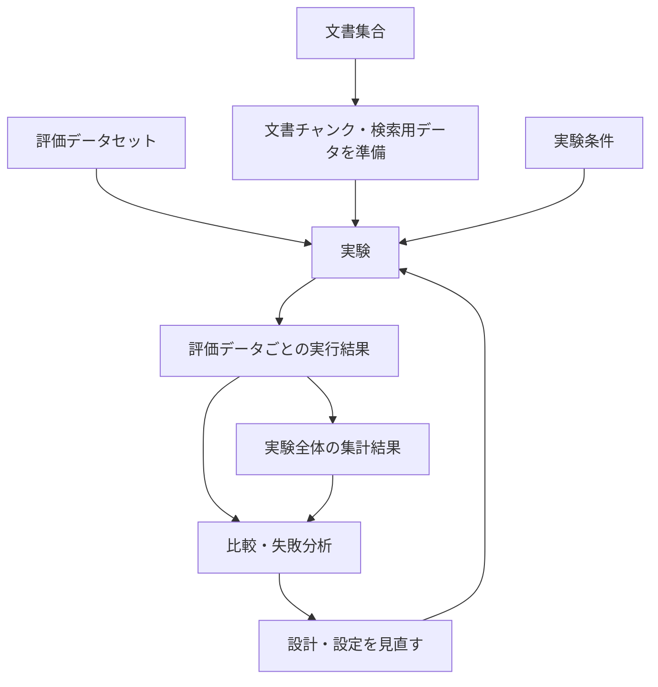

# RAGScope概要

> [!abstract] この文書の役割
> RAGScopeが解決する問題、提供する価値と主な能力、想定する利用方法、対象範囲と対象外の概要を示す。  
> 正式用語と概念間の基本関係は[RAGScope用語集](./RAGScope用語集.md)、詳細かつ検証可能な要求は[RAGScope要求定義](./RAGScope要求定義.md)、技術選定と実現方法は[システムアーキテクチャ](./design/システムアーキテクチャ.md)、開発段階は[ロードマップ](./project-management/ロードマップ.md)を正本とする。

## 1. RAGScopeとは

RAGScopeは、RAGシステムで質問から検索、回答生成、評価までに何が起きたかを記録し、条件の異なる実験を比較・追跡するためのアプリケーションである。

文書集合と評価データセットを使って実験を行い、各評価データについて、検索結果、回答生成用文書チャンク、回答、引用、評価データごとの評価結果を追跡する。さらに、実験全体の集計結果を確認し、実験条件の違いによって結果がどう変わったかを比較できる。

RAGScopeの中心的な目的は、最終的な回答だけで良し悪しを判断するのではなく、どの条件と途中結果が結果に影響したかを確認し、設計判断を実験結果で説明できるようにすることである。

## 2. 解決する問題

RAGシステムでは、最終的な回答だけを見ても、結果が良かった理由や失敗した原因を判断しにくい。

たとえば、次の違いは回答の結果に影響する。

- 文書の分割条件
- 検索方式と検索条件
- `reranking`
- 回答生成用文書チャンクの選び方
- 回答生成条件
- 評価方法

期待した回答が得られなかった場合でも、関係する文書チャンクを検索できなかったのか、検索結果には含まれていたが回答生成用文書チャンクとして選ばれなかったのか、適切な文書チャンクを渡しても回答生成で失敗したのかで、見直すべき箇所は異なる。

これらの条件と途中結果が記録されていなければ、異なる方式を同じ基準で比較しにくく、改善が実験結果ではなく印象に依存しやすい。RAGScopeは、条件、途中結果、最終的な結果を対応付けて追跡し、どこで差や失敗が生じたかを確認できる状態にする。

## 3. 提供する価値

RAGScopeは、主に次の能力を提供する。

- 技術文書を取り込み、文書集合として扱い、文書チャンクと検索用データを準備できる。
- 全文検索やdense検索などで文書チャンクを検索し、検索結果を確認できる。
- 検索結果から回答生成用文書チャンクを選び、回答と引用を生成できる。
- 評価データセットを使って実験を行い、評価データごとの実行結果と実験全体の集計結果を記録できる。
- 条件の異なる実験を比較し、結果の差と失敗例を分析できる。
- 保存した実験結果や比較結果を、実験レポートとして確認できる。

これらの能力により、次の価値を提供する。

### 3.1 検索から回答までを追跡できる

質問に対する検索結果と、そこから選ばれて実際に回答生成へ渡された回答生成用文書チャンクを区別して追跡する。回答と引用だけでなく、その回答へ至る過程を確認できる。

### 3.2 条件の異なる実験を比較できる

文書分割、検索、`reranking`、回答生成、評価などの実験条件を変えた複数の実験を、同じ評価データに対して比較できる。どの条件変更が結果の差につながったかを確認できる。

### 3.3 失敗を評価データ単位で分析できる

実験全体の集計結果だけでなく、評価データごとの実行結果を確認できる。検索結果、回答生成用文書チャンク、回答、引用、評価データごとの評価結果、処理時間、状態、エラーをたどり、どの段階で問題が生じたかを分析できる。

### 3.4 実験結果を根拠に設計を見直せる

検索や回答生成の結果を評価し、実験条件を変更する前後の差を確認できる。設計や設定を変更する理由を、実験結果と対応付けて説明できる。

### 3.5 比較可能な実験を再実行できる

使用したデータ、実験条件、モデル、実行環境などを記録し、同じ条件と手順で比較可能な実験を再実行できる。

## 4. 想定する利用方法

RAGScopeは、次の流れで使用する。

1. 技術文書を取り込み、文書チャンクへ分割し、検索用データを準備する。
2. 実験と評価に使う評価データセットを用意する。
3. 文書分割、検索、回答生成、評価などの実験条件を指定して実験を行う。
4. 評価データごとの実行結果を確認し、検索結果、回答生成用文書チャンク、回答、引用、評価データごとの評価結果を追跡する。
5. 実験全体の集計結果を確認する。
6. 条件の異なる実験を比較し、評価データごとの差や失敗例を分析する。
7. 分析結果に基づいて設計や設定を見直し、必要な条件で再び実験する。

## 5. 対象範囲と対象外

RAGScopeは、技術文書を対象としたRAGについて、検索、回答生成、評価を繰り返し実験し、設計や設定の違いを比較する用途を主な対象とする。

一方、大規模な本番Webサービスとしての運用、複雑な文書解析、高可用な分散推論基盤の構築などは主な対象としない。
