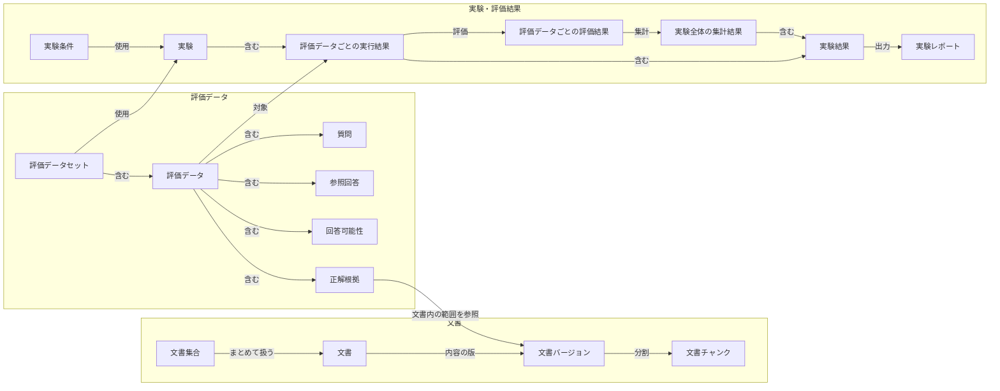
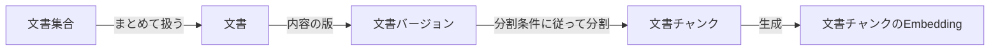
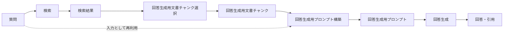
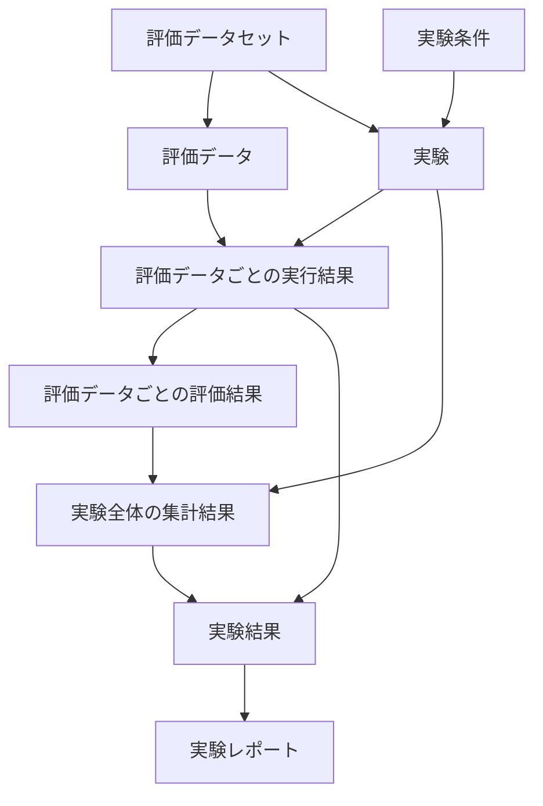

# RAGScope用語集

> [!abstract] この文書の役割
> RAGScopeの概要、要求、設計で共通して使う正式用語の名称と意味、概念間の基本的な関係を定義する。  
> RAGScope固有の正式用語はこの文書を正本とし、各文書では同じ用語を別の意味で再定義しない。

この文書では、RAGScope固有の概念と、一般に使われる用語でも、RAGScopeで指す範囲や他の概念との境界を明確にする必要があるものを扱う。

DBのテーブル・カラム・制約、APIやJSONの正確な項目、コード上の型や識別子などは定義しない。これらはデータモデル設計、migration、OpenAPI、JSON Schema、コード、テストなど、それぞれの正本で定義する。

## 全体像

### 用語一覧

**システム**

RAGScopeを構成するコンポーネントと、利用者向けインターフェースに関する用語をまとめる。

| 正式用語 | 概要 |
|---|---|
| [RAGScopeアプリケーション](#ragscopeアプリケーション) | 文書、検索、回答生成、評価、実験の流れを制御するコンポーネント |
| [AI推論サービス](#ai推論サービス) | モデルやTokenizerに依存する計算を担当するコンポーネント |
| [RAGScope API](#ragscope-api) | RAGScopeアプリケーションを外部から利用するAPIインターフェース |
| [RAGScope CLI](#ragscope-cli) | RAGScopeアプリケーションをコマンドラインから利用するインターフェース |

**文書**

RAGScopeが取り込み、検索対象として扱う文書と、その加工・検索準備に関する用語をまとめる。

| 正式用語 | 概要 |
|---|---|
| [文書集合](#文書集合) | 検索や実験の対象としてまとめて扱う文書の集まり |
| [文書](#文書) | RAGScopeへ取り込む1件の技術文書 |
| [文書バージョン](#文書バージョン) | 文書の特定の内容を持つ版 |
| [分割条件](#分割条件) | 文書バージョンを文書チャンクへ分割するときの条件 |
| [文書チャンク](#文書チャンク) | 文書バージョンを分割した、検索や回答生成などで使用する単位 |
| [文書チャンクのEmbedding](#文書チャンクのembedding) | 文書チャンクから生成し、dense検索で使用するEmbedding |
| [検索用データ](#検索用データ) | 文書チャンクを各検索方式で検索するための情報の総称 |

**評価データ**

RAGScopeで検索や回答を評価するために、あらかじめ用意するデータに関する用語をまとめる。

| 正式用語 | 概要 |
|---|---|
| [評価データセット](#評価データセット) | 実験と評価に使用する評価データの集まり |
| [評価データ](#評価データ) | 1件の質問と、その評価に必要な情報をまとめたもの |
| [質問](#質問) | 検索、回答生成、評価の対象となる問い |
| [参照回答](#参照回答) | 生成した回答を評価するときの基準となる回答 |
| [回答可能性](#回答可能性) | 対象文書から質問へ回答できるかどうかを表す情報 |
| [正解根拠](#正解根拠) | 質問へ正しく回答する根拠として保持する文書内の範囲 |

**検索・回答生成**

質問から関係する文書チャンクを探し、その結果を使って回答と引用を生成するまでの用語をまとめる。

| 正式用語 | 概要 |
|---|---|
| [検索](#検索) | 質問に関係する文書チャンクを取得する処理の総称 |
| [全文検索](#全文検索) | 文書中の語に基づいて文書チャンクを取得する検索 |
| [質問Embedding](#質問embedding) | 質問から生成し、dense検索で使用するEmbedding |
| [dense検索](#dense検索) | 質問と文書チャンクのEmbeddingの近さに基づく検索 |
| [hybrid検索](#hybrid検索) | 全文検索とdense検索で得た候補を統合する処理 |
| [`reranking`](#reranking) | 検索候補を別の基準やモデルで再評価して並べ替える処理 |
| [検索結果](#検索結果) | 検索の各段階で得られた順位付きの文書チャンク |
| [回答生成用文書チャンク選択](#回答生成用文書チャンク選択) | 検索結果から回答生成へ実際に渡す文書チャンクを選ぶ処理 |
| [回答生成用文書チャンク](#回答生成用文書チャンク) | 文書チャンクのうち、検索結果から選ばれ、回答生成へ実際に渡すもの |
| [回答生成用プロンプト構築](#回答生成用プロンプト構築) | 質問、文書チャンク、回答生成条件からモデルへの入力を組み立てる処理 |
| [回答生成用プロンプト](#回答生成用プロンプト) | 回答生成モデルへ渡す入力 |
| [回答生成](#回答生成) | 回答生成用プロンプトから回答と引用を得る処理 |
| [回答](#回答) | 質問に対して回答生成モデルが生成した内容 |
| [引用](#引用) | 生成した回答が根拠として示す文書側の情報への参照 |

**実験・評価結果**

条件を指定してRAGを実行し、評価データごとの結果と実験全体の結果を保存・比較するための用語をまとめる。

| 正式用語 | 概要 |
|---|---|
| [実験](#実験) | 条件を指定してRAGを実行し、結果を保存・比較する単位 |
| [実験条件](#実験条件) | 1つの実験で使用する文書分割、検索、回答生成、評価などの条件 |
| [評価データごとの実行結果](#評価データごとの実行結果) | 1件の評価データを実験内で処理して得た詳細な結果 |
| [評価データごとの評価結果](#評価データごとの評価結果) | 1件の評価データについて得た評価指標や判定 |
| [実験全体の集計結果](#実験全体の集計結果) | 評価データごとの評価結果を実験単位で集計した結果 |
| [実験結果](#実験結果) | 1つの実験について保存した結果の総称 |
| [実験レポート](#実験レポート) | 保存済みの実験結果や比較結果を人が確認できる形へ出力した成果物 |

### 主要概念の関係

この図は、RAGScopeのコンポーネント構成や通信経路ではなく、この用語集で定義する主要な概念どうしの関係を示す。システムの構成と責務は[システムアーキテクチャ](./design/システムアーキテクチャ.md)を正本とする。



文書集合と文書の多重度、各概念のID、保存単位、テーブル構造、参照制約はデータモデル設計で定義する。検索から回答生成までの処理関係は「4. 検索と回答生成」で示す。

## 1. システム

### RAGScopeアプリケーション

文書、検索、回答生成、評価、実験の流れを制御するRAGScopeのコンポーネント。

RAGScope APIとRAGScope CLIを利用者向けのインターフェースとして提供し、AI推論サービスやデータベースを利用して処理全体を進める。

### AI推論サービス

モデルやTokenizerに依存する計算を提供するRAGScopeのコンポーネント。

文書チャンクのEmbeddingと質問Embeddingの生成、`reranking`、回答生成など、モデルに依存する処理を担当する。RAGScope全体の処理順序や永続化は管理しない。

### RAGScope API

RAGScopeアプリケーションを利用者や外部ツールから利用するためのAPIインターフェース。

独立したコンポーネントではない。

### RAGScope CLI

RAGScopeアプリケーションをコマンドラインから利用するためのインターフェース。

独立したコンポーネントではない。

> [!important] コンポーネントとデータベース
> RAGScopeでは、RAGScopeアプリケーションとAI推論サービスをコンポーネントとして扱う。PostgreSQLはRAGScopeが永続化と検索に利用するデータベースであり、コンポーネントには含めない。

## 2. 文書

### 文書集合

検索や実験の対象として、まとめて扱う文書の集まり。

文書集合と文書の所属関係や保存方法は、データモデル設計で定義する。

### 文書

RAGScopeへ取り込む1件の技術文書を表す概念。

文書の内容が更新された場合も同じ文書として扱えるよう、具体的な内容は文書バージョンとして区別する。

### 文書バージョン

ある文書について、特定の内容を持つ版。

文書の更新前後を区別し、文書チャンクや正解根拠がどの内容を参照しているかを追跡するために使用する。

### 分割条件

文書バージョンを文書チャンクへ分割するときに使用する条件。

チャンクサイズ、重複範囲など、正確な条件項目は文書処理設計とデータモデル設計で定義する。

### 文書チャンク

文書バージョンを分割条件に従って分割した単位。

検索や回答生成に使用し、文書チャンクからはdense検索に使用する文書チャンクのEmbeddingを生成する。元の文書バージョンと、その文書内の位置へ追跡できる状態で扱う。

### 文書チャンクのEmbedding

文書チャンクから生成するEmbedding。

dense検索で質問Embeddingと比較する。

### 検索用データ

文書チャンクを検索できるようにするため、文書チャンクから生成または保持する情報の総称。

文書チャンクのEmbeddingは検索用データの1つである。全文検索で使用する情報を含め、具体的な種類と保存形式は検索設計とデータモデル設計で定義する。

### 文書に関する基本的な関係



この図は概念間の関係を示す。文書集合と文書の多重度、各概念のID、DB上の保存構造はデータモデル設計で定義する。

## 3. 評価データ

### 評価データセット

実験と評価に使用する評価データの集まり。

評価データは開発用の`dev`とテスト用の`test`に分けて管理する。区分の保存方法はデータモデル設計で定義する。

### 評価データ

1件の質問と、その質問を評価するための参照回答、回答可能性、正解根拠をまとめたもの。

```text
評価データ
├─ 質問
├─ 参照回答
├─ 回答可能性
└─ 正解根拠
```

### 質問

検索、回答生成、評価の対象となる問い。

実験では評価データが保持する質問を使用する。検索では関係する文書チャンクを探すために使い、回答生成では回答生成用プロンプトの入力として使う。

### 参照回答

生成した回答を評価するときの基準として、評価データが保持する回答。

### 回答可能性

対象となる文書から質問へ回答できるかどうかを表す情報。

RAGScopeでは、回答可能な`answerable`と回答不能な`no-answer`を区別して評価する。

### 正解根拠

質問へ正しく回答するための根拠として、評価データがあらかじめ保持する文書バージョン内の範囲。

回答生成によって作られる引用とは別の概念である。正確な位置表現と保存形式は評価設計とデータモデル設計で定義する。

## 4. 検索と回答生成

### 検索

質問に関係する文書チャンクを取得する処理の総称。

RAGScopeでは、全文検索、dense検索、hybrid検索、`reranking`を区別して結果を確認できるようにする。

### 全文検索

文書中の語に基づいて、質問に関係する文書チャンクを取得する検索。

### 質問Embedding

質問から生成するEmbedding。

dense検索で文書チャンクのEmbeddingと比較する。

### dense検索

質問Embeddingと文書チャンクのEmbeddingの近さに基づいて、質問に関係する文書チャンクを取得する検索。

### hybrid検索

全文検索とdense検索で得た候補を統合する処理。

### `reranking`

検索候補を別の基準またはモデルで再評価し、並べ替える処理。

### 検索結果

検索の各段階で得られた、質問に対する順位付きの文書チャンク。

検索結果と、回答生成へ実際に渡す回答生成用文書チャンクは区別する。

### 回答生成用文書チャンク選択

検索結果から、回答生成モデルへ実際に渡す文書チャンクを選ぶ処理。

### 回答生成用文書チャンク

文書チャンクのうち、検索結果から選ばれ、回答生成モデルへ実際に渡すもの。

検索で取得した候補全体ではなく、回答生成に使用した文書チャンクだけを指す。

### 回答生成用プロンプト構築

質問、回答生成用文書チャンク、回答生成条件をもとに、回答生成モデルへ渡す入力を組み立てる処理。

正確なプロンプト形式と、各情報をどの形式でモデルへ渡すかは回答生成設計とAPI設計で定義する。

### 回答生成用プロンプト

回答生成用プロンプト構築によって作る、回答生成モデルへの入力。

質問への回答方法や引用方法の指示と、回答に必要な情報をモデルへ渡すために使用する。

### 回答生成

回答生成用プロンプトを使って、回答生成モデルから回答と引用を得る処理。

### 回答

質問に対して回答生成モデルが生成した内容。

### 引用

生成した回答が、回答の根拠として示す文書側の情報への参照。

評価データがあらかじめ保持する正解根拠とは別に管理する。引用が何をどの識別子で参照するかは、回答生成設計、データモデル設計、API設計で定義する。

### 質問から回答生成までの関係



実線は主な処理の順序を示す。質問から回答生成用プロンプト構築への点線は、検索を飛ばす処理経路ではなく、最初の質問をプロンプト構築の入力として再利用することを示す。

## 5. 実験と評価結果

### 実験

評価データセットから選択した評価データと実験条件を使ってRAGの処理を行い、その途中結果と評価結果を保存・比較する単位。

条件を変えた複数の実験を、同じ評価データに対して比較できるようにする。

### 実験条件

1つの実験で使用する文書分割、検索、`reranking`、回答生成、評価などの条件。

正確な条件項目と保存形式は、各機能設計とデータモデル設計で定義する。

### 評価データごとの実行結果

1件の評価データを1つの実験の中で処理して得た詳細な結果。

各検索段階の結果、回答生成用文書チャンク、回答生成用プロンプト、回答、引用、評価データごとの評価結果、処理時間、状態、エラーなどを、その評価データと実験に関連付けて扱う。

### 評価データごとの評価結果

1件の評価データについて、検索結果、回答生成用文書チャンク、回答、引用、回答可能性などを評価して得た指標や判定。

実験全体の集計結果とは区別する。

### 実験全体の集計結果

評価データごとの評価結果を、1つの実験全体について集計した結果。

### 実験結果

1つの実験について保存した結果の総称。

評価データごとの実行結果と、実験全体の集計結果を含む。

### 実験レポート

保存済みの実験結果や実験間の比較結果を、人が確認できる形へ出力した成果物。

MarkdownやCSVなどの出力形式そのものは、実験結果の保存データとは区別する。

### 実験に関する基本的な関係



この図は概念間の関係を示す。各データのID、保存単位、テーブル構造、参照制約はデータモデル設計で定義する。

## 6. 用語の使い分け

複数の意味に読める名前は正式用語として使わず、何を指すかが分かる名称を使用する。

| 使用しない、または単独では使わない名称 | 使用する名称・扱い |
|---|---|
| `評価問題` | `評価データ` |
| `コーパス` | `文書集合` |
| `context`、文脈 | `回答生成用文書チャンク` |
| `context`選択 | `回答生成用文書チャンク選択` |
| `source` | 単独の正式用語にはせず、`文書`、`引用`、`正解根拠`など実際の概念名を使う |
| プロンプト | 正式用語として対象を指す場合は`回答生成用プロンプト`を使う |
| `評価結果` | `評価データごとの評価結果`または`実験全体の集計結果`を使う |
| 質問ごとの生データ、質問ごとの詳細な実行結果、質問ごとの結果 | `評価データごとの実行結果` |
| `実行` | 名詞として単独の正式用語にはしない。実験を指す場合は`実験`、1件の評価データに対する結果を指す場合は`評価データごとの実行結果`を使う |
| Haskell側 | `RAGScopeアプリケーション` |
| Python側 | `AI推論サービス` |

`実行する`のように、通常の日本語の動詞として`実行`を使うことまでは禁止しない。

## 7. 一般技術用語

`HTTP`、`JSON`、`PostgreSQL`、`Tokenizer`など、一般に意味が確立している技術用語そのものはこの文書で再定義しない。

`Embedding`のような一般技術用語でも、RAGScopeで対象を区別する必要がある場合は、`文書チャンクのEmbedding`、`質問Embedding`のように対象を含む正式用語を使用する。

## 関連文書

- [RAGScope概要](./RAGScope概要.md)
- [RAGScope要求定義](./RAGScope要求定義.md)
- [システムアーキテクチャ](./design/システムアーキテクチャ.md)
