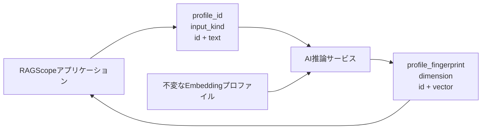

# Embedding生成設計

> [!abstract] この文書の役割
> 文書チャンクのEmbeddingと質問Embeddingを互換に生成するため、Embeddingプロファイル、AI推論サービスの入出力、RAGScopeアプリケーションとの責務境界を定義する。

## 1. Embeddingプロファイル

RAGScopeでは、Embeddingの意味を決める条件を不変なEmbeddingプロファイルとしてまとめる。

1つのプロファイルは少なくとも次を持つ。

| 項目 | 意味 |
|---|---|
| `profile_id` | プロファイルを参照する不変の識別子 |
| `model_id` | 使用する学習済みモデル |
| `model_revision` | モデルの固定revision |
| `tokenizer_id` | 使用するTokenizer |
| `tokenizer_revision` | Tokenizerの固定revision |
| `pooling` | vectorへ集約する方法 |
| `max_input_tokens` | モデルへ渡す最大token数 |
| `truncation` | 最大長を超えた入力を切り詰めるか |
| `normalize_vector` | 出力vectorを正規化するか |
| `dimension` | 出力vectorの次元数 |
| `document_prefix` | 文書チャンク入力へ付与する文字列 |
| `question_prefix` | 質問入力へ付与する文字列 |

同じ`profile_id`の内容は変更しない。いずれかの項目を変更する場合は新しい`profile_id`を作る。

RAGScopeは特定の1モデルを設計へ固定しない。dense検索または実験の条件として`profile_id`を明示的に選択する。AI推論サービスには、利用する`profile_id`が事前に設定されていなければならない。

AI推論サービスはプロファイル内容からSHA-256 fingerprintを作り、`sha256:<64桁hex>`として公開する。同じ`profile_id`に異なるfingerprintが観測された場合は設定不整合として扱い、既存の検索用データと混ぜない。

## 2. 文書と質問の互換性

文書チャンクのEmbeddingと質問Embeddingは、同じEmbeddingプロファイルIDと同じfingerprintを使用した場合だけ比較可能として扱う。

入力種別によって、プロファイルの`document_prefix`または`question_prefix`を本文の前へ付与してモデルへ入力する。それ以外のモデル、Tokenizer、pooling、切り詰め、vector正規化、次元数は同じプロファイルの規則を使用する。

## 3. AI推論サービス契約

機械可読なHTTP契約は[AI推論サービスOpenAPI](../../contracts/ai-inference.openapi.yaml)を正本とする。

Embedding生成requestは1件以上のitemを持つ。各itemには呼び出し側が決めた`id`と本文`text`を渡す。

AI推論サービスは、requestのitem IDを変更せずresponseへ返す。RAGScopeアプリケーションは件数とID集合が一致することを検証し、入力とvectorを一意に対応付ける。

`input_kind`は`document`または`question`であり、対応するprefixを選ぶために使用する。

## 4. 責務境界

**RAGScopeアプリケーション**

- どのEmbeddingプロファイルを使うか決める。
- 文書チャンクまたは質問とitem IDをrequestへ変換する。
- HTTP requestを実行し、responseの契約を検証する。
- 文書チャンクのEmbeddingを検索用データとして保存する。
- 質問Embeddingを検索処理へ渡す。
- retry、timeout、DB永続化を制御する。

**AI推論サービス**

- 指定された`profile_id`を解決する。
- Tokenizerとモデルを使ってEmbeddingを計算する。
- `profile_fingerprint`と`dimension`を含むresponseを返す。
- RAGScopeの文書、質問、検索用データを永続化しない。
- RAGScopeアプリケーションの処理順序、retry、検索を開始しない。

## 5. 入力と出力の検証

RAGScopeアプリケーションは次を検証する。

- requestしたitem数とresponseのitem数が一致する。
- requestとresponseのitem ID集合が一致し、重複がない。
- responseの`profile_id`がrequestと一致する。
- responseの`profile_fingerprint`が、同じプロファイルIDについて確認したfingerprintと一致する。
- responseの`dimension`がプロファイルの`dimension`と一致する。
- 各vectorの要素数が`dimension`と一致する。
- vectorにNaNまたは無限大が含まれない。

いずれかを満たさないresponseは契約違反として使用しない。

## 6. 失敗

次を正常なEmbedding生成と区別する。

- 未知の`profile_id`。
- 空のitems。
- 空のtext。
- truncationを許可しないプロファイルで入力が最大長を超えた。
- モデルまたはTokenizerを利用できない。
- モデル計算に失敗した。
- HTTP通信に失敗した。
- responseがOpenAPI契約または5章の検証を満たさない。

HTTP statusとerror responseの正確な外部表現はOpenAPIを正本とする。RAGScopeアプリケーションが文書チャンクEmbedding要求へ適用するretryとtimeoutは[検索用データ準備設計「5. Embedding要求のretryとtimeout」](<./domains/documents/検索用データ準備設計.md#5. Embedding要求のretryとtimeout>)を正本とする。

## 関連文書

- [RAGScope用語集](../RAGScope用語集.md)
- [システムアーキテクチャ](./システムアーキテクチャ.md)
- [検索用データ準備設計](./domains/documents/検索用データ準備設計.md)
- [検索対象設計](<./domains/retrieval-generation/検索対象設計.md>)
- [AI推論サービスOpenAPI](../../contracts/ai-inference.openapi.yaml)
