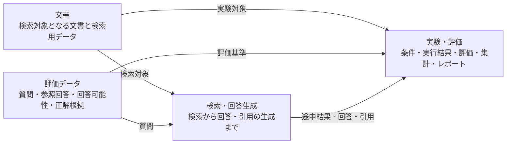

# RAGScopeドメインモデル

> [!abstract] この文書の役割
> RAGScopeの問題領域を4つのドメイン領域へ分け、各領域が扱う責務と領域間の基本関係を定義する。  
> 要求と設計を整理するときは、この文書のドメイン領域を共通の上位分類として使用する。

## 1. 全体像

RAGScopeは、次の4つのドメイン領域を扱う。

| ドメイン領域 | 中心となる責務 |
|---|---|
| 文書 | RAGで利用する文書を取り込み、版、文書チャンク、検索用データとして扱う |
| 評価データ | 検索や回答を評価するための質問、参照回答、回答可能性、正解根拠を扱う |
| 検索・回答生成 | 質問から関係する文書チャンクを検索し、回答生成用文書チャンクを選択して回答と引用を生成する |
| 実験・評価 | 条件を指定してRAGを実行し、途中結果と評価結果を保存、集計、比較、レポートする |

この4領域は、RAGScopeが何を扱うシステムなのかを整理するための問題領域の分割である。要求を分類するとき、機能設計の責務を確認するとき、新しい能力の所属先を判断するときの共通の軸として使用する。

一方、この4領域を、そのまま4つのコンポーネント、サービス、プロセス、モジュール、データベースへ対応させることは定めない。RAGScopeアプリケーション、AI推論サービス、PostgreSQLなどのシステム構成と責務は[システムアーキテクチャ](./システムアーキテクチャ.md)を正本とする。

## 2. 各ドメイン領域の責務

### 2.1 文書

文書領域は、RAGが検索と回答生成で利用する文書を、追跡可能な検索対象として準備する責務を持つ。

主に次を扱う。

- 文書集合
- 文書
- 文書バージョン
- 分割条件
- 文書チャンク
- 文書チャンクのEmbeddingを含む検索用データ

質問への検索や回答生成そのものは、この領域の責務ではない。

### 2.2 評価データ

評価データ領域は、RAGの検索や回答を何に対して評価し、何を基準とするかを表すデータを扱う責務を持つ。

主に次を扱う。

- 評価データセット
- 評価データ
- 質問
- 参照回答
- 回答可能性
- 正解根拠

評価データは評価の基準を保持するが、評価指標の計算や実験結果の集計そのものは、この領域の責務ではない。

### 2.3 検索・回答生成

検索・回答生成領域は、質問を受け取り、関係する文書チャンクを検索し、その結果から回答と引用を生成するまでを扱う責務を持つ。

主に次を扱う。

- 全文検索、dense検索、hybrid検索、`reranking`
- 検索結果
- 回答生成用文書チャンク選択
- 回答生成用文書チャンク
- 回答生成用プロンプト構築
- 回答生成
- 回答
- 引用

この領域は検索と回答生成の結果を作る。条件を変えた複数回の実行を識別して保存・比較したり、評価結果を集計したりする責務は、実験・評価領域が持つ。

### 2.4 実験・評価

実験・評価領域は、文書、評価データ、検索・回答生成を組み合わせて条件付きの実験として実行し、その結果を評価、保存、集計、比較する責務を持つ。

主に次を扱う。

- 実験
- 実験条件
- 評価データごとの実行結果
- 評価データごとの評価結果
- 実験全体の集計結果
- 実験結果
- 実験レポート

この領域は他の3領域を利用して実験を成立させるが、文書、評価データ、検索・回答生成の概念そのものを再定義しない。

## 3. ドメイン領域を横断する事項

RAGScopeには4つのドメイン領域へ自然に所属しない、複数領域を横断する事項がある。これらを第5のドメイン領域として扱わない。

代表例は次のとおりである。

- RAGScope APIとRAGScope CLIによる利用インターフェース
- エラーと構造化ログ
- 追跡可能性と再現性
- 再試行とタイムアウト
- 性能の観測
- ローカル環境やAWSへの配置

横断事項の要求は[RAGScope要求定義](../RAGScope要求定義.md)で定義し、具体的な実現方法はシステムアーキテクチャまたは対応する機能設計で定義する。

## 関連文書

- [RAGScope要求定義](../RAGScope要求定義.md)
- [RAGScope用語集](../RAGScope用語集.md)
- [システムアーキテクチャ](./システムアーキテクチャ.md)
