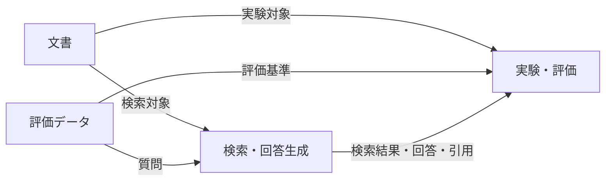

# RAGScopeドメインモデル

> [!abstract] この文書の役割
> RAGScopeが扱う問題領域を4つに分け、それぞれの責務と関係を定義する。

## 1. 全体像

| ドメイン | 中心となる責務 |
|---|---|
| 文書 | RAGで利用する文書を、追跡可能な検索対象として準備する |
| 評価データ | 検索や回答を何に対して評価し、何を基準とするかを表す |
| 検索・回答生成 | 質問から文書チャンクを検索し、回答と引用を生成する |
| 実験・評価 | 条件を指定してRAGを実行し、結果を評価・保存・集計・比較する |

```mermaid
flowchart LR
    Documents["文書"]
    EvaluationData["評価データ"]
    Retrieval["検索・回答生成"]
    Experiment["実験・評価"]

    Documents -->|"検索対象"| Retrieval
    EvaluationData -->|"質問"| Retrieval
    Documents -->|"実験対象"| Experiment
    EvaluationData -->|"評価基準"| Experiment
    Retrieval -->|"検索結果・回答・引用"| Experiment
```

4つのドメインは問題領域の分類であり、コンポーネントやmoduleの分割単位ではない。システム構成は[システムアーキテクチャ](./システムアーキテクチャ.md)で定義する。

## 2. 4つのドメイン

| ドメイン | 主な概念 | このドメインが担当しないこと |
|---|---|---|
| 文書 | 文書集合、文書、文書バージョン、正規化済み本文、分割条件、文書チャンク、検索用データ生成条件、検索用データ生成結果、検索用データ | 質問に対する検索・回答生成 |
| 評価データ | 評価データセット、評価データ、質問、参照回答、回答可能性、正解根拠 | 評価指標の計算、実験結果の集計 |
| 検索・回答生成 | 全文検索、dense検索、hybrid検索、`reranking`、検索結果、回答生成用文書チャンク、回答生成用プロンプト、回答、引用 | 条件を変えた複数実行の保存・比較・集計 |
| 実験・評価 | 実験、実験条件、評価データごとの実行結果、評価データごとの評価結果、実験全体の集計結果、実験結果、実験レポート | 文書・評価データ・検索処理そのものの所有 |

実験・評価は、文書、評価データ、検索・回答生成の3ドメインを利用して実験を成立させる。

## 3. ドメインを横断する事項

次は複数ドメインに関わるため、第5のドメインにはしない。

| 横断事項 | 主な設計先 |
|---|---|
| RAGScope API / CLI | システムアーキテクチャ、各インターフェースの契約 |
| 失敗、retry、timeout | システムアーキテクチャ、対象機能の設計 |
| Trace、Logs、Metrics | [Observability設計](./observability/README.md) |
| ローカル / AWSへの配置 | システムアーキテクチャ、配置を具体化する設計 |

## 関連文書

- [RAGScope要求定義](../RAGScope要求定義.md)
- [RAGScope用語集](../RAGScope用語集.md)
- [システムアーキテクチャ](./システムアーキテクチャ.md)
