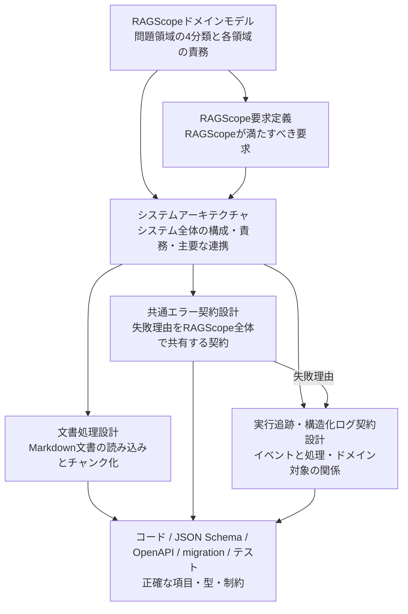

# 設計文書

RAGScopeの設計文書を、知りたい内容から参照するための索引である。

## 設計文書の一覧

| 文書 | 確認したいこと |
|---|---|
| [RAGScopeドメインモデル](./RAGScopeドメインモデル.md) | RAGScopeの問題領域をどの領域に分け、それぞれが何を担当するか |
| [RAGScope要求定義](../RAGScope要求定義.md) | RAGScopeは何をできなければならないか |
| [システムアーキテクチャ](./システムアーキテクチャ.md) | どのコンポーネントが何を担当し、どうつながるか |
| [文書処理設計](./文書処理設計.md) | Markdown文書をどう読み込み、文書チャンクへ変えるか |
| [共通エラー契約設計](./共通エラー契約設計.md) | なぜ処理が成立しなかったかを、RAGScope全体でどう共有するか |
| [実行追跡・構造化ログ契約設計](./実行追跡・構造化ログ契約設計.md) | 何が起き、それがどの処理・ドメイン対象と関係するかを、ログからどう追うか |

## 全体の関係

[RAGScopeドメインモデル](./RAGScopeドメインモデル.md)がRAGScopeの問題領域の分け方を決め、[RAGScope要求定義](../RAGScope要求定義.md)がその分類に沿って「何を満たすか」を決める。[システムアーキテクチャ](./システムアーキテクチャ.md)は、4つのドメイン領域をRAGScopeアプリケーションとAI推論サービスがそれぞれどの責務で実現し、RAGScope API / CLIやデータベースとどう連携するかを定義する。そのうえで、各機能の設計書が自分の担当範囲を詳しく説明する。

## 各文書の役割

### RAGScopeドメインモデル

> **RAGScopeの問題領域をどの領域に分け、それぞれが何を担当するか？**

RAGScopeの問題領域を「文書」「評価データ」「検索・回答生成」「実験・評価」の4領域に分け、各領域の責務と領域間の基本関係を定義する。この4領域は要求と設計を整理する共通の軸であるが、そのままコンポーネント、サービス、モジュール、DBの境界を決めるものではない。

### RAGScope要求定義

> **RAGScopeは何をできなければならないか？**

機能要件、非機能要件、制約、対象範囲、対象外を定義する。どのコンポーネントや通信方式、型、DB、ライブラリで実現するかは、ここでは決めない。

### システムアーキテクチャ

> **どのコンポーネントが何を担当し、どうつながるか？**

RAGScopeアプリケーションとAI推論サービスを処理責務を担うコンポーネントとして定義し、RAGScope API / CLI、データベースを含む全体構成、主要な処理フロー、通信と依存方向、配置時に維持する論理構成を示す。個別機能の詳しい契約は、それぞれの機能設計書が担当する。

### 文書処理設計

> **Markdown文書をどう読み込み、文書チャンクへ変えるか？**

固定Markdown文書1件を読み込み、空本文を検証し、1,000 Unicodeコードポイントごとの文書チャンクへ分割して後続処理へ渡すまでを担当する。Embedding生成、検索、保存など、その後の処理はこの文書の担当ではない。

### 共通エラー契約設計

この文書が答える問いは、

> **「処理が成立しなかった理由を、RAGScope全体でどういう意味として共有するか？」**

である。

この文書では、次を扱う。

- エラー種別
- 公開してよいメッセージ
- 公開してよい構造化詳細
- ライブラリ、OS、モデル、DBなどの失敗を、どこで共通エラーへ変換するか
- CLI / HTTP API / 構造化ログが共通エラーをどう利用するか

一方、次はこの文書では扱わない。

- HTTP status
- CLI exit codeや表示形式
- ログ重要度
- 処理の追跡方法やログのイベント
- retry / timeoutなどの実行制御
- stack traceやHaskell / Pythonの具体的な型
- JSONの具体構造

要するに、**共通エラー = 「なぜ失敗したか」**を担当する。

### 実行追跡・構造化ログ契約設計

この文書が答える問いは、

> **「RAGScopeで何が起き、それがどの処理・どのドメイン対象と関係しているかを、ログからどう追うか？」**

である。

この文書では、次を扱う。

- 構造化ログ1件が何を表すか
- 発生時刻、発生元、重要度、イベント
- ログと処理との関連付け
- RAGScopeが管理する対象へのドメイン参照
- 失敗したイベントと共通エラーの関係

一方、次はこの文書では扱わない。

- 実験結果そのものをどう永続化するか
- JSON / TSV / syslog / OTLPの具体的な列名や構造
- Haskell / Pythonの具体的な型
- retry / timeoutなどの実行制御

ここでいう「追跡」は、実験結果そのものを保存して管理することではない。**ログに記録したイベントが、どの処理・どのドメイン対象と関係しているかを追えるようにすること**を担当する。

## 設計書と機械可読な正本

設計書は、責務、意味、守るべき規則、処理の流れを説明する。

正確な項目名、型、必須条件、API Schema、DB制約、具体的なテストケースまで知りたい場合は、コード、JSON Schema、OpenAPI、migration、テストなどの機械可読な正本を参照する。設計書には、それらをそのまま複製しない。
