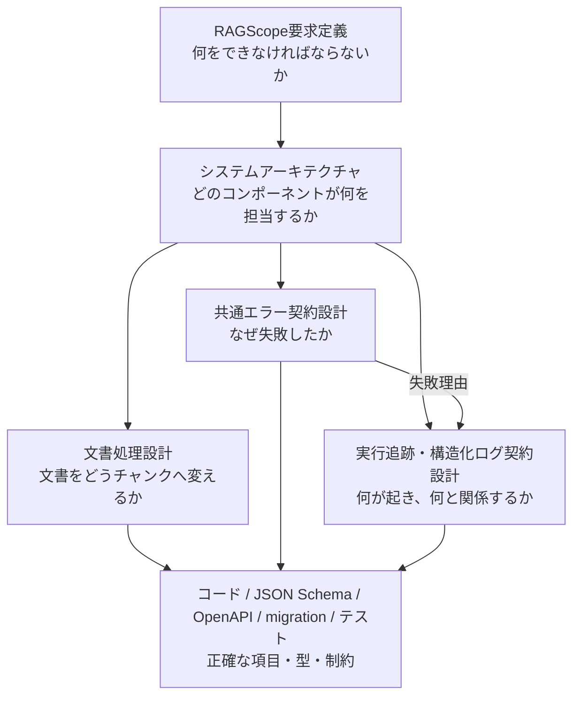

# 設計文書

RAGScopeの設計文書を、知りたい内容から参照するための索引です。

## 設計文書の一覧

| 文書 | 答える問い |
|---|---|
| [RAGScope要求定義](../RAGScope要求定義.md) | RAGScopeは何をできなければならないか |
| [システムアーキテクチャ](./システムアーキテクチャ.md) | どのコンポーネントが何を担当し、どうつながるか |
| [文書処理設計](./文書処理設計.md) | Markdown文書をどう読み込み、文書チャンクへ変えるか |
| [共通エラー契約設計](./共通エラー契約設計.md) | **なぜ処理が成立しなかったかを、RAGScope全体でどう共有するか** |
| [実行追跡・構造化ログ契約設計](./実行追跡・構造化ログ契約設計.md) | **何が起き、それがどの処理・ドメイン対象と関係するかを、ログからどう追うか** |

## 全体の関係

[RAGScope要求定義](../RAGScope要求定義.md)が「何を満たすか」を決め、[システムアーキテクチャ](./システムアーキテクチャ.md)がシステム全体の分担を決めます。そのうえで、各機能の設計書が自分の担当範囲を詳しく説明します。

## 各文書の役割

### RAGScope要求定義

> **RAGScopeは何をできなければならないか？**

機能要件、非機能要件、制約、対象範囲、対象外を定義します。どのコンポーネントや通信方式、型、DB、ライブラリで実現するかは、ここでは決めません。

### システムアーキテクチャ

> **どのコンポーネントが何を担当し、どうつながるか？**

RAGScopeアプリケーション、AI推論サービス、PostgreSQLなど、システム全体の構成と責務を定義します。個別機能の詳しい契約は、それぞれの機能設計書が担当します。

### 文書処理設計

> **Markdown文書をどう読み込み、文書チャンクへ変えるか？**

RAGScope v0.0で、固定Markdown文書1件を読み込み、空本文を検証し、1,000 Unicodeコードポイントごとの文書チャンクへ分割して後続処理へ渡すまでを担当します。Embedding生成、検索、保存など、その後の処理はこの文書の担当ではありません。

### 共通エラー契約設計

この文書が答える問いは、

> **「処理が成立しなかった理由を、RAGScope全体でどういう意味として共有するか？」**

です。

この文書では、次を扱います。

- エラー種別
- 公開してよいメッセージ
- 公開してよい構造化詳細
- ライブラリ、OS、モデル、DBなどの失敗を、どこで共通エラーへ変換するか
- CLI / HTTP API / 構造化ログが共通エラーをどう利用するか

一方、次はこの文書では扱いません。

- HTTP status
- CLI exit codeや表示形式
- ログ重要度
- `trace`やログの出来事
- retry / timeoutなどの実行制御
- stack traceやHaskell / Pythonの具体的な型
- JSONの具体構造

要するに、**共通エラー = 「なぜ失敗したか」**を担当します。

### 実行追跡・構造化ログ契約設計

この文書が答える問いは、

> **「RAGScopeで何が起き、それがどの処理・どのドメイン対象と関係しているかを、ログからどう追うか？」**

です。

この文書では、次を扱います。

- 構造化ログ1件が何を表すか
- 発生時刻、発生元、重要度、出来事
- `trace`、`activity`、`parent activity`を使った処理の因果関係
- 実験や評価問題などへのドメイン参照
- 処理の開始、進行、正常終了、失敗終了
- 失敗した出来事と共通エラーの関係

一方、次はこの文書では扱いません。

- 実験結果そのものをどう永続化するか
- JSON / TSV / syslog / OTLPの具体的な列名や構造
- Haskell / Pythonの具体的な型
- retry / timeoutなどの実行制御

ここでいう「追跡」は、実験結果そのものを保存して管理することではありません。**ログに記録した出来事が、どの処理・どのドメイン対象と関係しているかを追えるようにすること**を担当します。

## 設計書と機械可読な正本

設計書は、責務、意味、守るべき規則、処理の流れを説明します。

正確な項目名、型、必須条件、API Schema、DB制約、具体的なテストケースまで知りたい場合は、コード、JSON Schema、OpenAPI、migration、テストなどの機械可読な正本を参照します。設計書には、それらをそのまま複製しません。
