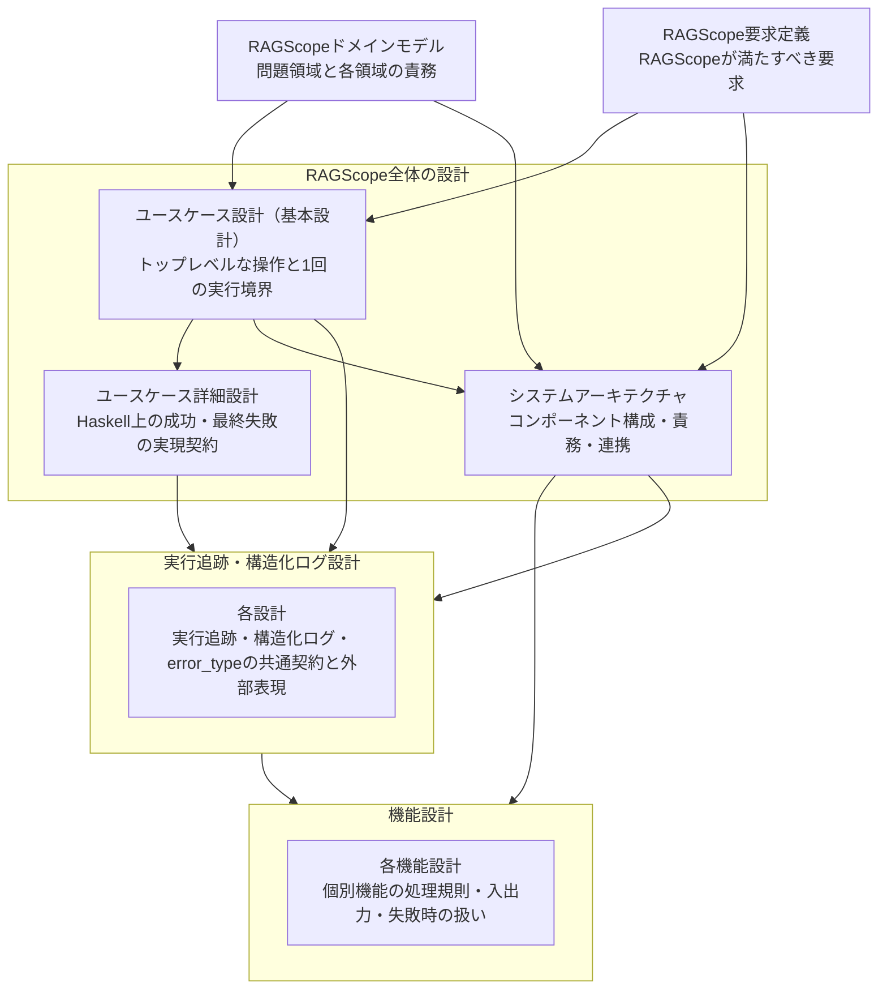

# 設計文書

RAGScopeの現在設計を、知りたい内容から参照するための索引である。

## 設計文書の一覧

| 文書・設計領域 | 確認したいこと |
|---|---|
| [RAGScopeドメインモデル](./RAGScopeドメインモデル.md) | RAGScopeの問題領域をどの領域に分け、それぞれが何を担当するか |
| [RAGScope要求定義](../RAGScope要求定義.md) | RAGScopeは何をできなければならないか |
| [ユースケース設計（基本設計）](./ユースケース設計.md) | 利用者のトップレベルな操作は何で、1回の実行はどこからどこまでか |
| [ユースケース詳細設計](./ユースケース詳細設計.md) | ユースケースの成功・最終失敗をRAGScopeアプリケーションのHaskell実装でどう表すか |
| [システムアーキテクチャ](./システムアーキテクチャ.md) | どのコンポーネントが何を担当し、どうつながるか |
| [機能設計](./features/README.md) | 個別機能はどの処理規則、入出力、失敗時の扱いで動くか |
| [実行追跡・構造化ログ設計](./logging/README.md) | 処理と出来事をどう追跡し、失敗理由を`error_type`として共有し、構造化ログへどう記録するか |

## 全体の関係

矢印は、リンクの向きではなく、後段の設計が前段の設計内容を前提にする方向を表す。

## 読み分け

利用者がRAGScopeへ何を依頼し、その1回の操作をどこまで一連の実行として扱うかは[ユースケース設計（基本設計）](./ユースケース設計.md)を確認する。その成功・最終失敗をRAGScopeアプリケーションのHaskell実装でどう表すかは[ユースケース詳細設計](./ユースケース詳細設計.md)を確認する。その処理をどのコンポーネントが担当し、AI推論サービスやデータベースとどう連携するかは[システムアーキテクチャ](./システムアーキテクチャ.md)を確認する。

個別機能の設計書は[機能設計](./features/README.md)から参照する。処理が成立しなかった理由をRAGScope全体で共有する`error_type`の契約を含む、実行追跡と構造化ログに関する設計書は[実行追跡・構造化ログ設計](./logging/README.md)から参照する。

正確な項目名、型、必須条件、API Schema、DB制約、具体的なテストケースは、コード、JSON Schema、OpenAPI、migration、テストなどの機械可読な正本を参照する。