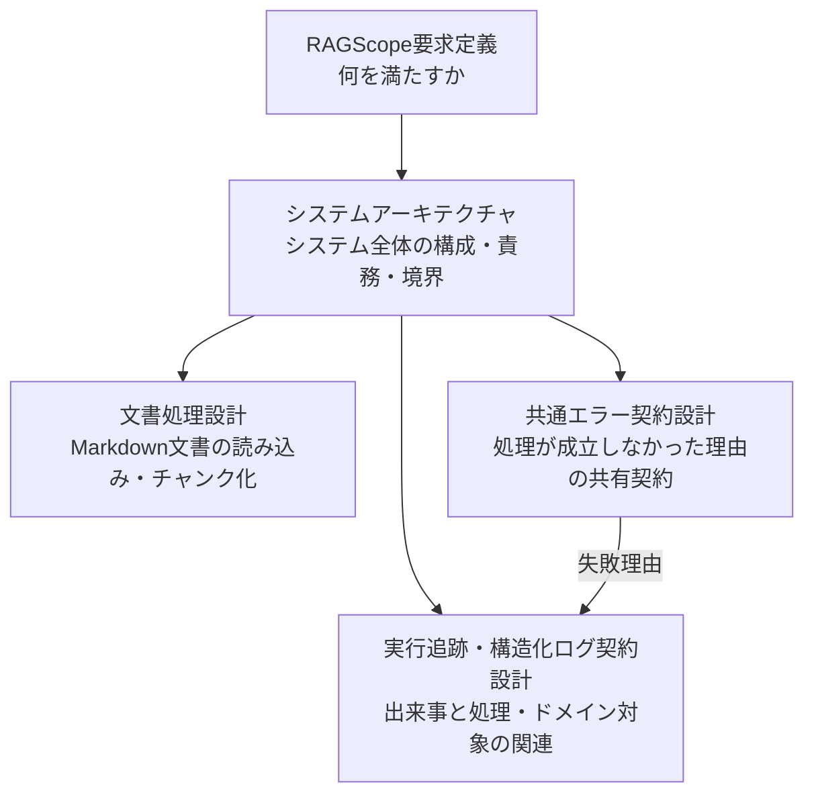

# 設計文書

RAGScopeの設計文書を、知りたい内容から参照するための索引。

## 全体像

## 知りたいことから探す

| 知りたいこと | 文書 | 主な設計範囲 |
|---|---|---|
| RAGScopeが何を満たす必要があるか | [RAGScope要求定義](../RAGScope要求定義.md) | 機能要件、非機能要件、制約、対象範囲、確認方法 |
| システム全体をどの構成と責務で実現するか | [システムアーキテクチャ](./システムアーキテクチャ.md) | コンポーネント構成、責務、依存方向、通信、主要な処理・データフロー、配置・実行環境 |
| Markdown文書をどう読み込み、文書チャンクへ変換するか | [文書処理設計](./文書処理設計.md) | v0.0の固定Markdown文書の読み込み、空本文検証、固定分割、チャンク契約、後続処理への受け渡し |
| 処理が成立しなかった理由をコンポーネントや利用境界をまたいでどう共有するか | [共通エラー契約設計](./共通エラー契約設計.md) | 共通エラーの意味、公開可能な失敗情報、内部例外・CLI・HTTP API・構造化ログとの責務境界 |
| 何が起き、どの処理やRAGScope上の対象と関係するかをログからどう追跡するか | [実行追跡・構造化ログ契約設計](./実行追跡・構造化ログ契約設計.md) | ログ1件の意味、発生元、重要度、出来事、処理の因果関係、ドメイン参照、失敗情報との関係 |

## 共通エラーと構造化ログの読み分け

[共通エラー契約設計](./共通エラー契約設計.md)は「なぜ処理が成立しなかったか」を定義する。

[実行追跡・構造化ログ契約設計](./実行追跡・構造化ログ契約設計.md)は「何が起き、それがどの処理・ドメイン対象と関係するか」を定義し、失敗を記録する場合に共通エラー契約の失敗理由を利用する。

この2文書を確認する場合は、共通エラー契約設計を先に読むと責務境界を追いやすい。