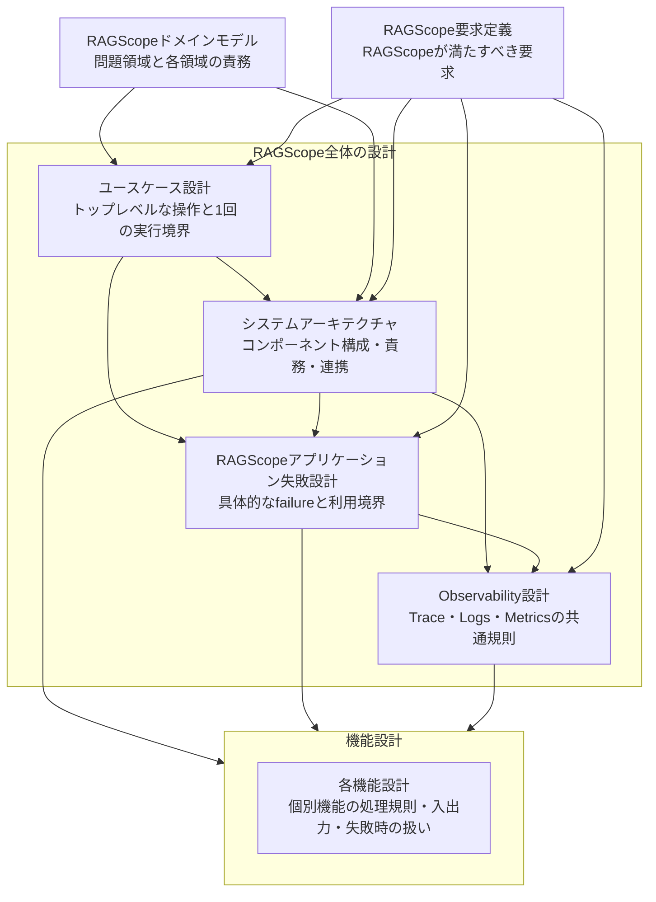

# 設計文書

RAGScopeの現在設計を、知りたい内容から参照するための索引である。

## 設計文書の一覧

| 文書・設計領域 | 確認したいこと |
|---|---|
| [RAGScopeドメインモデル](./RAGScopeドメインモデル.md) | RAGScopeの問題領域をどの領域に分け、それぞれが何を担当するか |
| [RAGScope要求定義](../RAGScope要求定義.md) | RAGScopeは何をできなければならないか |
| [ユースケース設計](./ユースケース設計.md) | 利用者のトップレベルな操作は何で、1回の実行はどこからどこまでか |
| [システムアーキテクチャ](./システムアーキテクチャ.md) | どのコンポーネントが何を担当し、どうつながるか |
| [RAGScopeアプリケーション失敗設計](./RAGScopeアプリケーション失敗設計.md) | UseCaseや内部処理の失敗をどの単位で表し、外部依存・CLI / API・実験・Telemetryとの境界をどう分けるか |
| [Observability設計](./observability/README.md) | 実行・イベント・集約値をTrace・Logs・Metricsでどう観測し、OpenTelemetryとRAGScopeの責務をどう分けるか |
| [機能設計](./features/README.md) | 個別機能はどの処理規則、入出力、失敗時の扱いで動くか |

## 全体の関係

矢印は、リンクの向きではなく、後段の設計が前段の設計内容を前提にする方向を表す。

## 読み分け

利用者がRAGScopeへ何を依頼し、その1回の操作をどこまでユースケース実行として扱うかは[ユースケース設計](./ユースケース設計.md)を確認する。その処理をどのコンポーネントが担当し、AI推論サービスやデータベースとどう連携するかは[システムアーキテクチャ](./システムアーキテクチャ.md)を確認する。

UseCaseや内部処理が返す具体的なfailure、外部library固有の失敗を変換する位置、UseCaseの最終failureとretry途中のfailureの違い、CLI / API・実験・Telemetryがfailureをどう利用するかは[RAGScopeアプリケーション失敗設計](./RAGScopeアプリケーション失敗設計.md)を確認する。

1回の外部呼び出しをどのTrace・Spanで追跡し、LogsとMetricsをどう使い分けるかは[Observability設計](./observability/README.md)を確認する。個別機能の具体的なSpan、EventRecord、属性、失敗条件は、その機能を担当する[機能設計](./features/README.md)で具体化する。

正確な項目名、型、必須条件、API Schema、DB制約、具体的なテストケースは、コード、JSON Schema、OpenAPI、migration、テストなどの機械可読な正本を参照する。
