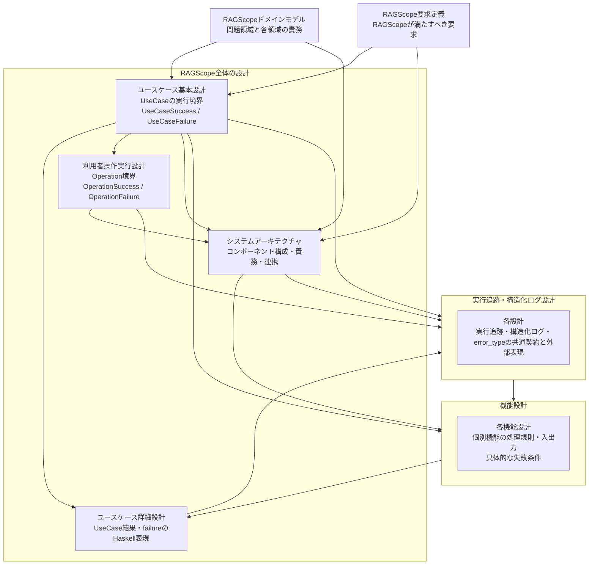

# 設計文書

RAGScopeの現在設計を、知りたい内容から参照するための索引である。

## 設計文書の一覧

| 文書・設計領域 | 確認したいこと |
|---|---|
| [RAGScopeドメインモデル](./RAGScopeドメインモデル.md) | RAGScopeの問題領域をどの領域に分け、それぞれが何を担当するか |
| [RAGScope要求定義](../RAGScope要求定義.md) | RAGScopeは何をできなければならないか |
| [ユースケース基本設計](./ユースケース基本設計.md) | 利用者の目的に対応するユースケースは何で、1回のユースケース実行を何とみなし、何を成功・失敗とするか |
| [ユースケース詳細設計](./ユースケース詳細設計.md) | ユースケースの成功・失敗と具体的なfailureを、RAGScopeアプリケーションのHaskell実装でどう表現し受け渡すか |
| [利用者操作実行設計](./利用者操作実行設計.md) | 1回のトップレベルな利用者操作はどこからどこまでで、UseCaseをどう内包し、操作全体の成功・失敗をどう判定するか |
| [システムアーキテクチャ](./システムアーキテクチャ.md) | どのコンポーネントが何を担当し、どうつながるか |
| [機能設計](./features/README.md) | 個別機能はどの処理規則で動き、具体的にどのような失敗があるか |
| [実行追跡・構造化ログ設計](./logging/README.md) | 処理と出来事をどう追跡し、失敗理由を`error_type`として共有し、構造化ログへどう記録するか |

## 全体の関係

矢印は、リンクの向きではなく、後段の設計が前段の設計内容を前提にする方向を表す。

## 読み分け

利用者がRAGScopeへ何を依頼し、その目的を実現するユースケースが**何を成立させれば`UseCaseSuccess`で、何を`UseCaseFailure`とみなすか**は[ユースケース基本設計](./ユースケース基本設計.md)を確認する。

1回のトップレベルな利用者操作について、**どの処理を操作全体へ含め、`UseCaseResult`をどう内包し、何を`OperationSuccess`・`OperationFailure`とするか**は[利用者操作実行設計](./利用者操作実行設計.md)を確認する。

ユースケースを構成する各処理で**具体的にどのような失敗があるか**は[機能設計](./features/README.md)を確認する。それらの失敗を**Haskell上でどう表現し、ユースケースの失敗としてApplicationへどう受け渡すか**は[ユースケース詳細設計](./ユースケース詳細設計.md)を確認する。

処理をどのコンポーネントが担当し、AI推論サービスやデータベースとどう連携するかは[システムアーキテクチャ](./システムアーキテクチャ.md)を確認する。処理が成立しなかった理由をRAGScope全体で共有する`error_type`の契約を含む、実行追跡と構造化ログに関する設計書は[実行追跡・構造化ログ設計](./logging/README.md)から参照する。

正確な項目名、型、必須条件、API Schema、DB制約、具体的なテストケースは、コード、JSON Schema、OpenAPI、migration、テストなどの機械可読な正本を参照する。