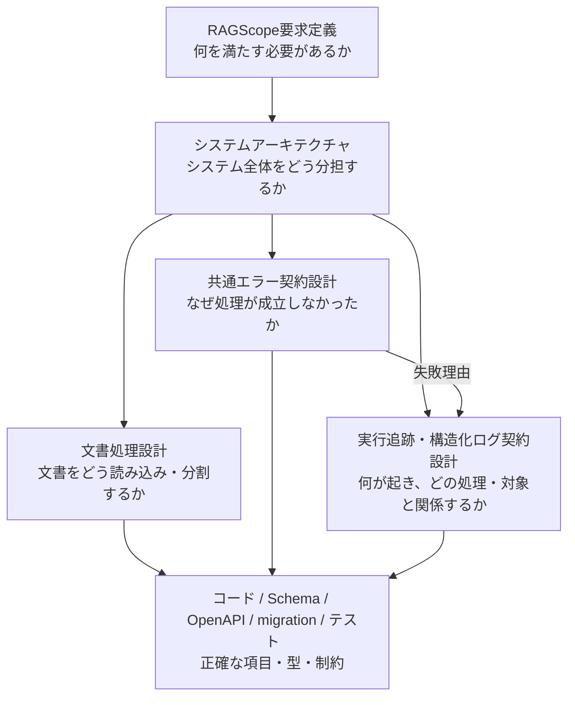

# 設計文書

RAGScopeの設計文書を、知りたい内容と責務から参照するための索引。

設計書は技術要素ごとではなく、読者が答えを得たい設計対象と中心的な問いごとに分ける。正確な項目名、型、Schema、API定義、DB制約、テストケースは、コードや専用の機械可読な定義を正本とする。

## 設計文書の分け方

[RAGScope要求定義](../RAGScope要求定義.md)はRAGScopeが満たす内容を定義し、[システムアーキテクチャ](./システムアーキテクチャ.md)はシステム全体の構成、責務、境界を定義する。機能別設計書は、その上位方針を前提として、独立した中心的な問いに答える。

## 各文書の役割

| 文書 | 中心となる問い | この文書が扱う | この文書が扱わない |
|---|---|---|---|
| [RAGScope要求定義](../RAGScope要求定義.md) | RAGScopeは何を満たす必要があるか | 機能要件、非機能要件、制約、対象範囲、確認方法 | コンポーネント、通信方式、型、DB、ライブラリなどの実現方法 |
| [システムアーキテクチャ](./システムアーキテクチャ.md) | RAGScope全体をどの構成と責務で実現するか | コンポーネント構成、責務、依存方向、通信、主要な処理・データフロー、配置・実行環境 | 個別機能の詳細契約、正確な型・Schema・API項目・DB制約 |
| [文書処理設計](./文書処理設計.md) | 文書をどう読み込み、文書チャンクへ変換するか | v0.0の固定Markdown文書の読み込み、空本文検証、固定分割、チャンク契約、文書処理固有のエラー・ログ、後続処理への受け渡し | 共通エラー・構造化ログの共通契約、Embedding生成、検索、保存などの後続機能 |
| [共通エラー契約設計](./共通エラー契約設計.md) | 処理が成立しなかった理由を、コンポーネントや利用境界をまたいでどう共有するか | エラー種別、公開可能な失敗情報、内部の失敗から共通エラーへ変換する責務境界、CLI・HTTP API・構造化ログとの責務分担 | HTTPステータス、CLI終了コード、ログ重要度、trace、再試行制御、内部例外の具体型、JSONの具体構造 |
| [実行追跡・構造化ログ契約設計](./実行追跡・構造化ログ契約設計.md) | RAGScopeで何が起き、それがどの処理・どの対象と関係するかをログからどう追跡するか | ログ1件の意味、発生元、重要度、出来事、処理の因果関係、ドメイン参照、処理結果、失敗理由との関連 | 実験結果そのものの永続データモデル、JSON・TSV・syslog・OTLPの具体構造、Haskell・Pythonの具体型、再試行制御 |

## 文書同士の関係

[システムアーキテクチャ](./システムアーキテクチャ.md)は、機能別設計書が従うシステム全体の責務境界を定める。機能別設計書は、同じコンポーネント構成や上位方針を別の意味で再定義しない。

[共通エラー契約設計](./共通エラー契約設計.md)は失敗理由の意味を定義する。[実行追跡・構造化ログ契約設計](./実行追跡・構造化ログ契約設計.md)は失敗した出来事を記録する場合にその失敗理由を利用し、どの処理・ドメイン対象で失敗したかを処理関係とドメイン参照で結び付ける。

各設計書は責務、意味、不変条件、処理フローを定義し、正確な項目名、型、必須条件、Schema、API、DB制約、テストケースは、それぞれの機械可読な正本へ委ねる。
