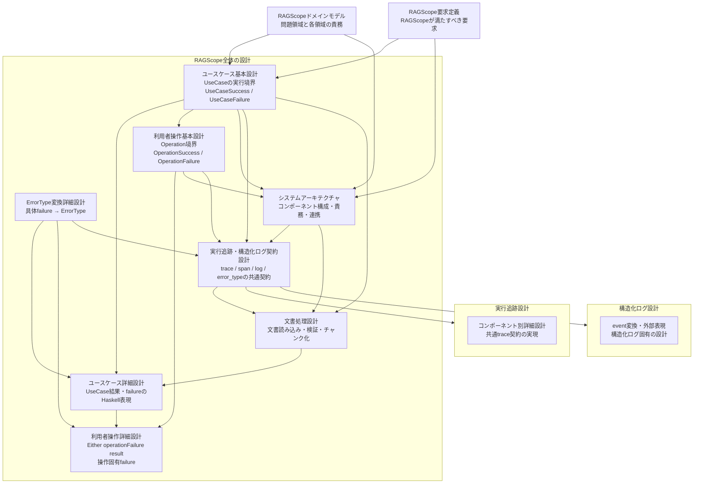

# 設計文書

RAGScopeの現在設計を、知りたい内容から参照するための索引である。

## 設計文書の一覧

| 文書・設計領域 | 確認したいこと |
|---|---|
| [RAGScopeドメインモデル](./RAGScopeドメインモデル.md) | RAGScopeの問題領域をどの領域に分け、それぞれが何を担当するか |
| [RAGScope要求定義](../RAGScope要求定義.md) | RAGScopeは何をできなければならないか |
| [ユースケース基本設計](./ユースケース基本設計.md) | 利用者の目的に対応するユースケースは何で、1回のユースケース実行を何とみなし、何を成功・失敗とするか |
| [ユースケース詳細設計](./ユースケース詳細設計.md) | ユースケースの成功・失敗と具体的なfailureを、RAGScopeアプリケーションのHaskell実装でどう表現し受け渡すか |
| [ErrorType変換詳細設計](./ErrorType変換詳細設計.md) | UseCase・利用インターフェース・Applicationなどが所有する具体的なfailureを、観測用の共通`ErrorType`へどう変換するか |
| [利用者操作基本設計](./利用者操作基本設計.md) | 1回のトップレベルな利用者操作はどこからどこまでで、UseCaseをどう内包し、操作全体の成功・失敗をどう判定するか |
| [利用者操作詳細設計](./利用者操作詳細設計.md) | 利用者操作全体をHaskellの`Either`でどう表し、UseCase前後を含む具体failureを操作固有failureとしてどう保持するか |
| [システムアーキテクチャ](./システムアーキテクチャ.md) | どのコンポーネントが何を担当し、どうつながるか |
| [文書処理設計](./文書処理設計.md) | 文書を検索可能にするUseCaseの内部で、Markdown文書をどう読み込み、検証し、文書チャンクへ変えるか |
| [実行追跡・構造化ログ契約設計](./実行追跡・構造化ログ契約設計.md) | RAGScope全体で`trace`・`span`と構造化ログをどう関連付け、コンポーネント境界を越えて何を共有するか |
| [実行追跡設計](./tracing/README.md) | 共通の実行追跡契約を各コンポーネントでどう実現するか。現在はRAGScopeアプリケーションの詳細設計を参照できる |
| [構造化ログ設計](./logging/README.md) | eventを構造化ログへ変換する境界と、JSON・SQLiteなどの外部表現をどう設計するか |

## 全体の関係

矢印は、リンクの向きではなく、後段の設計が前段の設計内容を前提にする方向を表す。

## 読み分け

利用者がRAGScopeへ何を依頼し、その目的を実現するユースケースが**何を成立させれば`UseCaseSuccess`で、何を`UseCaseFailure`とみなすか**は[ユースケース基本設計](./ユースケース基本設計.md)を確認する。具体的なresult・failureを**Haskell上でどう表現してApplicationへ受け渡すか**まで必要な場合は[ユースケース詳細設計](./ユースケース詳細設計.md)を確認する。文書読み込み・検証・チャンク化という内部処理の具体的な規則と失敗条件は[文書処理設計](./文書処理設計.md)を確認する。

1回のトップレベルな利用者操作について、**どの処理を操作全体へ含め、`UseCaseResult`をどう内包し、何を`OperationSuccess`・`OperationFailure`とするか**は[利用者操作基本設計](./利用者操作基本設計.md)を確認する。操作全体を**Haskellの`Either operationFailure result`としてどう表し、UseCase前後を含む具体failureをどう保持・受け渡すか**まで必要な場合は[利用者操作詳細設計](./利用者操作詳細設計.md)を確認する。

UseCase・利用インターフェース・Applicationなどが所有する具体的なfailureを、実行追跡や構造化ログで共有する**観測用`ErrorType`へどう変換するか**は[ErrorType変換詳細設計](./ErrorType変換詳細設計.md)を確認する。

処理をどのコンポーネントが担当し、AI推論サービスやデータベースとどう連携するかは[システムアーキテクチャ](./システムアーキテクチャ.md)を確認する。

**1回の利用者操作をどこからどこまで1つの`trace`として扱うか、RAGScopeアプリケーションとAI推論サービスの間でTrace Contextをどう引き継ぐか、`span`と構造化ログで`error_type`をどう共有するか**は[実行追跡・構造化ログ契約設計](./実行追跡・構造化ログ契約設計.md)を確認する。

その共通契約を**各コンポーネントのTracing / Observability実装でどう成立させるか**は[実行追跡設計](./tracing/README.md)、**eventをどの構造化ログへ変換し、JSON・SQLiteなどへどう投影するか**は[構造化ログ設計](./logging/README.md)から参照する。

正確な項目名、型、必須条件、API Schema、DB制約、具体的なテストケースは、コード、JSON Schema、OpenAPI、migration、テストなどの機械可読な正本を参照する。
