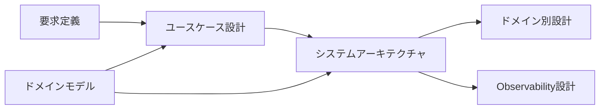

# 設計文書

RAGScopeの現在設計を、知りたい内容から確認するための入口である。

## 読み方

```mermaid
flowchart LR
    Requirements["要求定義"]
    Domain["ドメインモデル"]
    UseCase["ユースケース設計"]
    Architecture["システムアーキテクチャ"]
    DomainDesign["ドメイン別設計"]
    Observability["Observability設計"]

    Requirements --> UseCase
    Domain --> UseCase
    UseCase --> Architecture
    Domain --> Architecture
    Architecture --> DomainDesign
    Architecture --> Observability
```

| 確認したいこと | 文書 |
|---|---|
| RAGScopeをどの問題領域に分けるか | [RAGScopeドメインモデル](./RAGScopeドメインモデル.md) |
| 利用者が依頼するトップレベルな操作 | [ユースケース設計](./ユースケース設計.md) |
| コンポーネント構成、責務、依存、主要なデータフロー | [システムアーキテクチャ](./システムアーキテクチャ.md) |
| Trace、Logs、Metricsの使い分け | [Observability設計](./Observability設計.md) |

RAGScopeが満たすべき内容は[RAGScope要求定義](../RAGScope要求定義.md)、正式用語は[RAGScope用語集](../RAGScope用語集.md)を参照する。

## ドメイン別設計

| ドメイン | 現在の個別設計 |
|---|---|
| 文書 | [文書](./domains/documents/README.md) — TBD |
| 評価データ | TBD |
| 検索・回答生成 | TBD |
| 実験・評価 | TBD |

TBDの内容を要求、ドメインモデル、Milestone、Epic、Ticketなどから推測して補完しない。個別設計が必要になった時点で、その責務を持つ設計書を追加する。

正確な型、API、DB制約、設定、テストケースなど、実装で機械可読に表現できる内容はコード、Schema、migration、設定、テストを正本とする。
