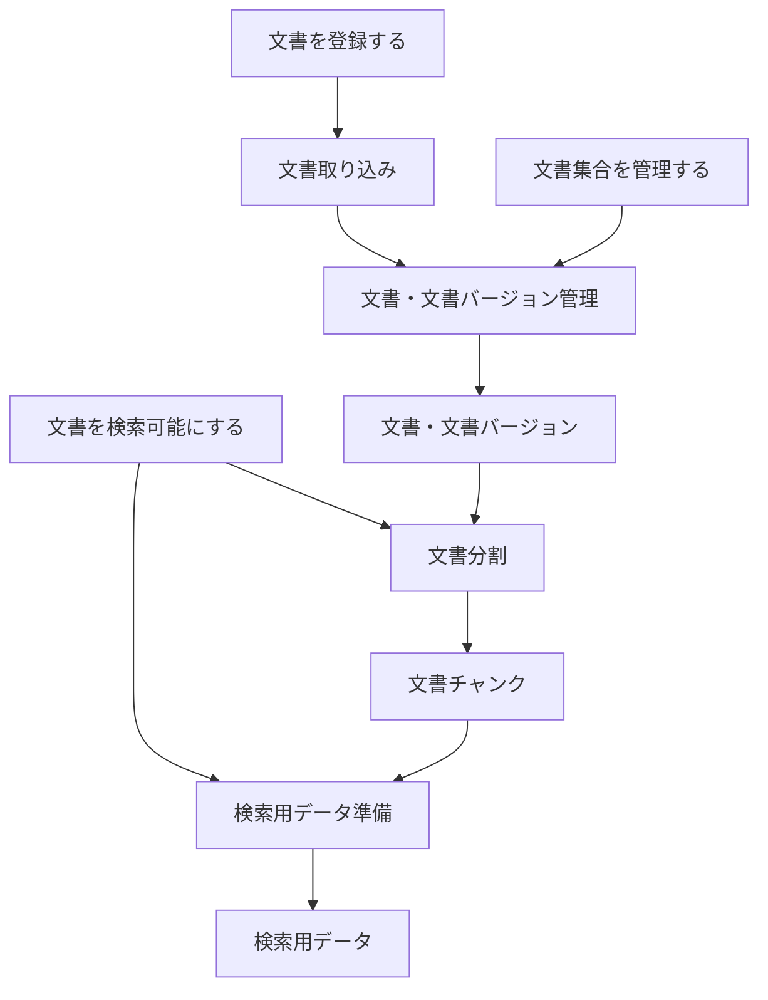

# 文書（`documents`）

このディレクトリは、[RAGScopeドメインモデル](../../RAGScopeドメインモデル.md)で定義する「文書」ドメインの機能設計の入口・索引である。

文書ドメインは、技術文書を取り込み、文書バージョンと分割条件を区別しながら文書チャンクと検索用データを準備する。質問を使った検索や回答生成そのものは、[検索・回答生成](../retrieval-generation/README.md)ドメインが扱う。

## 機能の全体像

ユースケースから機能へ渡す入力と、各機能が次の機能へ渡す結果は、次の関係で整理する。

| ユースケース | 主に利用する機能 | 主な結果 |
|---|---|---|
| [文書を登録する](../../ユースケース設計.md#2.1.1 文書を登録する) | 文書取り込み、文書・文書バージョン管理 | 正規化済みの文書バージョン |
| [文書集合を管理する](../../ユースケース設計.md#2.1.2 文書集合を管理する) | 文書・文書バージョン管理 | 文書集合と文書の所属関係 |
| [文書を検索可能にする](../../ユースケース設計.md#2.1.3 文書を検索可能にする) | 文書分割、検索用データ準備 | `ready`の検索用データ準備単位 |

## 設計書

| 設計書 | この文書が答える問い |
|---|---|
| [文書取り込み設計](./文書取り込み設計.md) | 文書をどの形式で受け取り、どの本文を文書バージョンとして保存するか |
| [文書・文書バージョン管理設計](<./文書・文書バージョン管理設計.md>) | 文書集合、文書、文書バージョンをどう識別し、更新競合をどう防ぐか |
| [文書分割設計](./文書分割設計.md) | 文書バージョンをどの規則で文書チャンクへ分割し、位置をどう保つか |
| [検索用データ準備設計](./検索用データ準備設計.md) | 検索方式ごとのデータをどう準備し、いつ検索へ渡せる状態とするか |

読む順序に迷う場合は、文書取り込み、文書・文書バージョン管理、文書分割、検索用データ準備の順に読む。文書の現在の文書バージョンを検索対象へ解決する規則は、[検索対象設計](<../retrieval-generation/検索対象設計.md>)を参照する。
