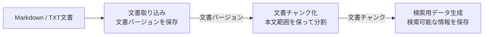

# 文書

このディレクトリは、[RAGScopeドメインモデル](../../RAGScopeドメインモデル.md)で定義する「文書」ドメインの機能設計の入口・索引である。

## 機能の流れ

## 機能設計

| 設計書 | 確認したいこと |
|---|---|
| [文書取り込み設計](./文書取り込み設計.md) | 文書をどのように文書集合・文書・文書バージョンとして識別し、後続処理へ渡すか |
| [文書チャンク化設計](./文書チャンク化設計.md) | 文書バージョンをどう分割し、元の本文範囲へ追跡できる文書チャンクを作るか |
| [検索用データ生成設計](./検索用データ生成設計.md) | 文書チャンクから検索用データをどう生成・再生成し、検索へ渡すか |

各設計書は、前段の成功結果を次段の入力として受け取る。文書ドメイン自体の責務は[RAGScopeドメインモデル](../../RAGScopeドメインモデル.md)、正式用語は[RAGScope用語集](../../../RAGScope用語集.md)を正本とする。
