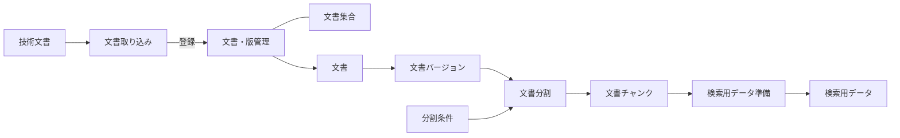

# 文書**（`documents`）**

このディレクトリは、[RAGScopeドメインモデル](../../RAGScopeドメインモデル.md)で定義する「文書」ドメインの機能設計の入口・索引である。

「文書」ドメイン自体の責務は[RAGScopeドメインモデル](../../RAGScopeドメインモデル.md)を正本とする。配下では、その責務を機能単位に一段具体化して設計する。

## 機能構成

| 設計書 | 扱う内容 |
|---|---|
| [文書取り込み設計](./文書取り込み設計.md) | 技術文書をRAGScopeへ取り込み、文書と文書バージョンとして登録する処理 |
| [文書・版管理設計](<./文書・版管理設計.md>) | 文書集合、文書、文書バージョンの識別、関係、保存、更新 |
| [文書分割設計](./文書分割設計.md) | 文書バージョンを分割条件に従って文書チャンクへ分割する処理 |
| [検索用データ準備設計](./検索用データ準備設計.md) | 文書チャンクから検索用データを生成・保持する処理 |
|
