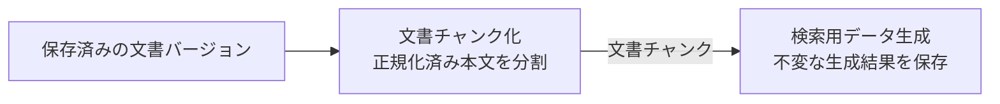

# 文書

このディレクトリは、[RAGScopeドメインモデル](../../RAGScopeドメインモデル.md)で定義する「文書」ドメインの機能設計の入口・索引である。

## 機能の流れ

## 機能設計

| 機能 | 基本設計 | 詳細設計 |
|---|---|---|
| 文書チャンク化 | [文書チャンク化基本設計](./文書チャンク化基本設計.md) — 目的、責務、概念上の入出力、検索用データ生成への受け渡し | [文書チャンク化詳細設計](./文書チャンク化詳細設計.md) — 分割、位置表現、検証、失敗時の扱い、不変条件 |
| 検索用データ生成 | [検索用データ生成基本設計](./検索用データ生成基本設計.md) — 目的、責務、概念上の入出力、検索への受け渡し | [検索用データ生成詳細設計](./検索用データ生成詳細設計.md) — 生成、検証、再生成、失敗時の扱い、不変条件 |

各機能は基本設計を前提に詳細設計を読む。基本設計は「何をする機能で、どこまで担当するか」、詳細設計は「その責務をどの規則で実現するか」を正本とし、同じ設計内容を重複して正本化しない。

文書バージョンの作成は[文書を検索可能にするユースケース設計](../../usecases/文書を検索可能にするユースケース設計.md)で扱う。各機能は、前段の成功結果を次段の入力として受け取る。文書ドメイン自体の責務は[RAGScopeドメインモデル](../../RAGScopeドメインモデル.md)、正式用語は[RAGScope用語集](../../../RAGScope用語集.md)を正本とする。
