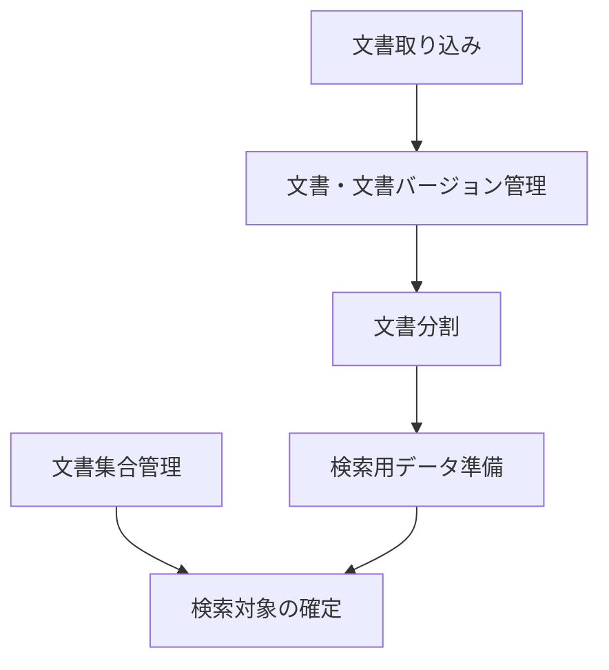

# 文書（`documents`）

> [!abstract] この文書の役割
> 文書ドメインの機能設計への入口である。文書を検索対象として扱うための責務を、機能ごとに分けて示す。

## 機能設計

| 機能 | 担当すること |
|---|---|
| [文書取り込み](./文書取り込み設計.md) | Markdown / TXTの内容を正規化後本文へ変換する |
| [文書・文書バージョン管理](<./文書・文書バージョン管理設計.md>) | 文書を識別し、内容を不変な文書バージョンとして管理する |
| [文書集合管理](./文書集合管理設計.md) | 文書集合と文書の所属関係を管理する |
| [文書分割](./文書分割設計.md) | 文書バージョンを文書チャンクへ分割する |
| [検索用データ準備](./検索用データ準備設計.md) | 文書チャンクを検索方式ごとに利用可能な状態へ準備する |

## 文書ドメインの構成

文書集合管理は文書の所属関係だけを管理し、文書内容、文書バージョン、文書チャンク、検索用データを自動的に変更しない。検索対象となる文書バージョンの確定と、準備済み検索用データの利用条件は[検索対象設計](<../retrieval-generation/検索対象設計.md>)で定義する。
