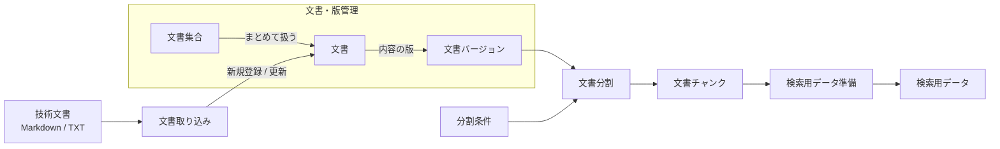

# 文書**（`documents`）**

このディレクトリは、[RAGScopeドメインモデル](../../RAGScopeドメインモデル.md)で定義する「文書」ドメインの機能設計の入口・索引である。

「文書」ドメインは、技術文書を取り込み、版と分割条件を区別しながら文書チャンクと検索用データを準備する。質問を使った検索や回答生成そのものは「検索・回答生成」ドメインで扱う。

## 機能構成

| 設計書 | 扱う内容 |
|---|---|
| [文書取り込み設計](./文書取り込み設計.md) | Markdown / TXTの技術文書を正規化し、文書と文書バージョンとして登録する |
| [文書・版管理設計](<./文書・版管理設計.md>) | 文書集合、文書、文書バージョンを識別し、版を残したまま更新する |
| [文書分割設計](./文書分割設計.md) | 文書バージョンを分割条件に従って文書チャンクへ分割し、文書内位置を保持する |
| [検索用データ準備設計](./検索用データ準備設計.md) | 文書チャンクから全文検索用データとEmbeddingを準備し、元チャンクへ追跡できる状態で保持する |
