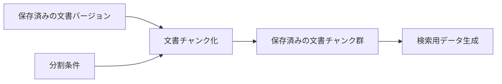

# 文書チャンク化基本設計

> [!abstract] この文書の役割
> 保存済みの文書バージョンの正規化済み本文を分割条件に従って文書チャンクへ分割し、元の文書バージョンと本文範囲へ追跡できる状態を作る機能の責務と境界を定義する。
> 具体的な分割規則、位置表現、検証、失敗時の扱い、不変条件は[文書チャンク化詳細設計](./文書チャンク化詳細設計.md)で定義する。

## 1. 目的と適用範囲

文書チャンク化は、文書バージョンと分割条件の組み合わせごとに文書チャンクを生成し、同じ文書バージョンを異なる分割条件で比較できる状態を作る。

| 扱うこと | 扱わないこと |
|---|---|
| 保存済みの文書バージョンと分割条件を使った文書チャンク生成 | 文書の読み込み、文書バージョンの作成 |
| 文書チャンクから元の正規化済み本文範囲へ追跡できる状態を作る | 文書チャンクのEmbedding生成 |
| 異なる分割条件による結果を区別する | 検索方式や回答生成用文書チャンクの選択 |
| 同じ入力から同じ分割結果を作る | 特定のTokenizerや分割アルゴリズムへの固定 |

この機能は`REQ-DOC-002`と`REQ-DOC-003`を実現し、`REQ-DOC-004`のうち分割条件を識別して異なる条件を混同せず管理する部分を担う。また、`REQ-NF-TRACE-002`で文書チャンクと正解根拠を比較するための位置情報を作る。

## 2. 責務と境界

文書チャンク化は、保存済みの文書バージョンが持つ正規化済み本文に分割条件を適用し、生成した文書チャンクを文書バージョンと分割条件へ関連付けて保存するところまでを担当する。

文書バージョンの作成、検索用データ生成、検索、回答生成は担当しない。

## 3. 概念上の入出力

| 区分 | 内容 |
|---|---|
| 入力 | 保存済みの文書バージョン、分割条件 |
| 前提 | 文書バージョンと分割条件が存在し、文書バージョンの正規化済み本文を取得できる |
| 成功結果 | 文書バージョンと分割条件へ関連付けて保存した1件以上の文書チャンク |
| 失敗結果 | 文書チャンク化を完了できないことを表す処理失敗 |
| 後続処理への入力 | 同じ文書バージョンと分割条件から生成して保存した文書チャンク群 |

文書バージョン、分割条件、文書チャンク群を機能間で識別子として渡すか、別の値として渡すかは、この基本設計では固定しない。

## 4. 主要な設計

### 4.1 分割条件ごとに結果を区別する

文書チャンクは、どの文書バージョンをどの分割条件で分割して生成したかを追跡できなければならない。異なる文書バージョンまたは分割条件から生成した文書チャンクを、同じ生成結果として混在させない。

分割条件には、分割方式に必要なチャンクサイズ、重複範囲、Tokenizer、構造境界などを持たせることができる。正確な条件項目は未決定である。

### 4.2 元の本文範囲へ追跡できるようにする

各文書チャンクは、分割元の文書バージョンと正規化済み本文内の範囲へ追跡できなければならない。文書チャンク本文と元の本文範囲の対応規則は[文書チャンク化詳細設計](./文書チャンク化詳細設計.md)で定義する。

## 5. 検索用データ生成への受け渡し

検索用データ生成へは、同じ文書バージョンと分割条件から生成され、検証と保存が完了した文書チャンク群を渡す。

文書チャンク化は、どの検索用データを作るか、どのモデルを使用するか、検索へいつ渡すかを決めない。

## 6. 詳細設計と機械可読な正本

具体的な分割フロー、位置の単位と表現、分割結果の検証、保存単位、失敗時の扱い、Observability、不変条件は[文書チャンク化詳細設計](./文書チャンク化詳細設計.md)を正本とする。

正確な型、識別子、分割条件のSchema、DBのテーブル・カラム・制約は、コード、設定Schema、migration、テストなど実装時に追加する機械可読な正本で定義する。

## 関連文書

- [RAGScope要求定義「1.1 文書」](<../../../RAGScope要求定義.md#1.1 文書>)
- [RAGScope要求定義「2.1 追跡可能性」](<../../../RAGScope要求定義.md#2.1 追跡可能性>)
- [RAGScopeドメインモデル「2.1 文書」](<../../RAGScopeドメインモデル.md#2.1 文書>)
- [文書チャンク化詳細設計](./文書チャンク化詳細設計.md)
- [検索用データ生成基本設計](./検索用データ生成基本設計.md)
