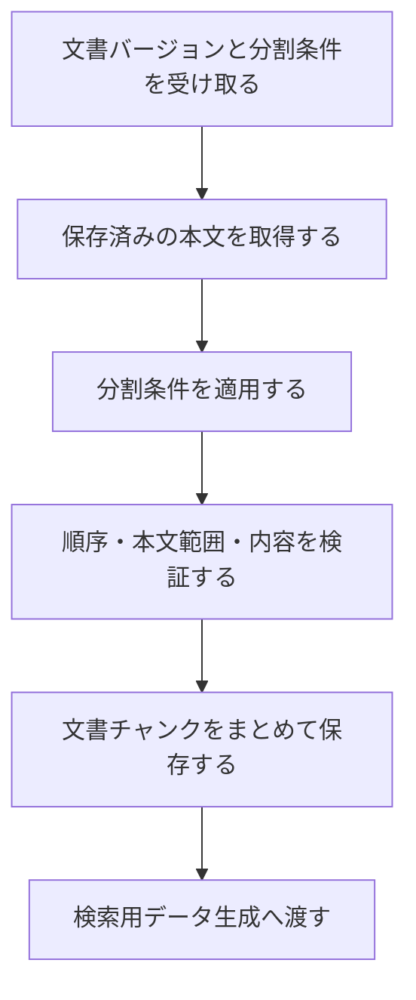

# 文書チャンク化設計

> [!abstract] この文書の役割
> 保存済みの文書バージョンを分割条件に従って文書チャンクへ分割し、各文書チャンクから元の文書バージョンと本文範囲へ追跡できる状態を作る機能を定義する。
> 生成した文書チャンクは、検索用データ生成へ渡す入力となる。

## 1. 目的と適用範囲

文書チャンク化は、同じ文書バージョンを異なる分割条件で比較できるように、文書バージョンと分割条件の組み合わせごとに文書チャンクを生成する。

| 扱うこと | 扱わないこと |
|---|---|
| 保存済みの文書バージョンと分割条件の受け取り | 文書の読み込み、文書バージョンの作成 |
| 文書チャンクの本文、順序、元の本文範囲の決定 | 文書チャンクのEmbedding生成 |
| 異なる分割条件による結果の識別 | 検索方式や回答生成用文書チャンクの選択 |
| 同じ入力から同じ分割結果を作ること | 特定のTokenizerや分割アルゴリズムへの固定 |

この機能は`REQ-DOC-002`から`REQ-DOC-004`を実現し、`REQ-NF-TRACE-002`で文書チャンクと正解根拠を比較するための位置情報を作る。

## 2. 責務と入出力

| 区分 | 内容 |
|---|---|
| 入力 | 保存済みの文書バージョンを識別する情報、分割条件を識別する情報 |
| 前提 | 文書バージョンと分割条件が存在し、文書バージョンの本文を取得できる |
| 成功結果 | 文書バージョンと分割条件へ関連付けて保存した1件以上の文書チャンク |
| 失敗結果 | 入力を取得できない、分割条件を適用できない、有効な文書チャンクを作れない、または保存できないことを表す処理失敗 |
| 後続処理への入力 | 同じ文書バージョンと分割条件から生成した文書チャンクを識別する情報 |

分割条件には、分割方式が必要とするチャンクサイズ、重複範囲、Tokenizer、構造境界などを含める。すべての方式に同じ項目を要求せず、使用する方式に必要な条件だけを持たせる。正確な条件項目は型、設定Schema、テストを正本とする。

## 3. 処理設計

### 3.1 全体フロー

同じ文書バージョンと分割条件による生成済みの結果がある場合は、その文書チャンクを再利用する。分割条件が異なる場合は、以前の結果を上書きせず、別の結果として生成する。

### 3.2 分割と位置の表現

各文書チャンクは、少なくとも次の概念を保持する。

| 概念 | 意味 |
|---|---|
| 文書バージョン | 分割元となった版 |
| 分割条件 | どの条件で生成したか |
| 順序 | 同じ文書バージョンと分割条件の中での並び |
| 開始位置・終了位置 | 文書バージョンの本文における半開区間 `[開始位置, 終了位置)` |
| 本文 | その範囲に対応する文字列 |

開始位置と終了位置の単位は、保存した文書バージョン本文のUnicodeコードポイントとする。これにより、UTF-8のバイト数や表示上の書記素数に依存せず、文書チャンクと正解根拠を同じ本文上の範囲として比較できる。

分割方式が重複範囲を許す場合、隣接する文書チャンクの範囲は重なってよい。ただし、各文書チャンクの本文は、それ自身が示す範囲を文書バージョン本文から取り出した結果と一致しなければならない。

### 3.3 分割結果の検証

保存する前に、同じ文書バージョンと分割条件から生成した文書チャンクが次を満たすことを確認する。

1. 文書チャンクは1件以上ある。
2. 順序は0から始まる欠番のない値である。
3. 各範囲は文書バージョン本文の範囲内にあり、開始位置は終了位置より小さい。
4. 順序が後の文書チャンクほど開始位置が前へ戻らない。
5. 各本文は、文書バージョン本文の対応範囲と一致する。
6. 文書バージョン本文のすべての位置は、少なくとも1件の文書チャンクに含まれる。
7. 同じ文書バージョンと分割条件からは、同じ順序・範囲・本文の文書チャンクが得られる。

Markdownの見出しなど、文書構造を分割境界の判断に使うことはできるが、文書チャンク本文へ元の範囲に存在しない接頭辞や見出しを追加しない。検索用に補助情報が必要な場合は、元の本文範囲と混同しない別の検索用データとして扱う。

### 3.4 保存の単位

同じ文書バージョンと分割条件から生成した文書チャンクは、検証が完了した結果だけを一まとまりとして利用可能にする。途中まで保存した文書チャンクや、以前の生成結果と新しい生成結果が混在した組を、後続処理へ渡さない。

## 4. 失敗時の扱い

| 失敗 | この機能の扱い | 自動再試行 |
|---|---|---|
| 文書バージョンまたは分割条件が存在しない | 入力を取得できない処理失敗を返す | 行わない |
| 分割条件が不正または本文へ適用できない | 分割条件の処理失敗を返す | 行わない |
| 不変条件を満たす文書チャンクを作れない | 分割結果の処理失敗を返す | 行わない |
| データベースへ保存できない | 保存の処理失敗を返す | 呼び出し側が一時的失敗と判断し、同じ処理を安全に繰り返せる場合だけ行う |

分割自体は同じ入力に対して同じ結果を返す処理であり、同じ条件のまま自動再試行しても結果は変わらない。部分的な文書チャンク列や空の文書チャンク列を成功結果として返さない。

具体的な失敗型は処理単位で定義し、共通方針は[RAGScopeアプリケーション失敗設計](../../RAGScopeアプリケーション失敗設計.md)に従う。

### 4.1 観測

文書チャンク化専用のRAGScope独自SpanやEventRecordは定義しない。分割の開始・成功・失敗や処理失敗の発生だけを理由にEventRecordを追加しない。

呼び出し側がこの機能を含む処理をSpanで追跡する場合、文書チャンク化の最終結果がそのSpan自身の失敗になったときだけ、具体的な処理失敗からSpan Statusと`error.type`を決める。Telemetryの記録・送信失敗によって、文書チャンク化の結果を変更しない。

## 5. 契約と受け渡し

### 5.1 不変条件

1. 文書チャンクから、分割元の文書バージョン、分割条件、文書内の範囲へ追跡できる。
2. 文書チャンク本文は、分割元の文書バージョン本文の対応範囲と一致する。
3. 異なる文書バージョンまたは分割条件から生成した文書チャンクを、同じ生成結果として混在させない。
4. 保存済みの文書チャンクを上書きして、対応する文書バージョンや分割条件の意味を変えない。

### 5.2 検索用データ生成への受け渡し

検索用データ生成へは、同じ文書バージョンと分割条件から生成され、検証と保存が完了した文書チャンクを識別する情報を渡す。文書チャンク化は、どの検索用データを作るか、どのモデルを使用するか、検索へいつ公開するかを決めない。

後続処理の規則は[検索用データ生成設計](./検索用データ生成設計.md)で定義する。

## 6. 機械可読な正本

正確な分割条件、型、識別子、DBのテーブル・カラム・制約、分割アルゴリズム、設定Schema、具体的な境界値は、実装時のコード、migration、設定、テストを正本とする。

## 関連文書

- [RAGScope要求定義「1.1 文書」](<../../../RAGScope要求定義.md#1.1 文書>)
- [RAGScope要求定義「2.1 追跡可能性」](<../../../RAGScope要求定義.md#2.1 追跡可能性>)
- [RAGScopeドメインモデル「2.1 文書」](<../../RAGScopeドメインモデル.md#2.1 文書>)
- [文書取り込み設計](./文書取り込み設計.md)
- [検索用データ生成設計](./検索用データ生成設計.md)
- [Observability設計](../../observability/README.md)
