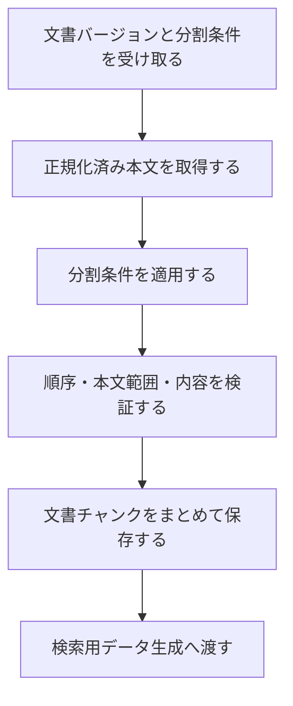

# 文書チャンク化詳細設計

> [!abstract] この文書の役割
> [文書チャンク化基本設計](./文書チャンク化基本設計.md)で定義した責務と境界を前提に、正規化済み本文の分割、位置表現、検証、保存、失敗時の扱い、不変条件を定義する。

## 1. 前提と未決定事項

分割条件には、分割方式が必要とするチャンクサイズ、重複範囲、Tokenizer、構造境界などを含める。すべての方式に同じ項目を要求せず、使用する方式に必要な条件だけを持たせる。

具体的な条件項目、分割アルゴリズム、境界値、正確な受け渡し型と識別子は現時点では未決定であり、実装時に型、設定Schema、コード、テストで定義する。

## 2. 処理フロー

同じ文書バージョンと分割条件による生成済みの結果がある場合は、その文書チャンクを再利用する。分割条件が異なる場合は、以前の結果を上書きせず、別の結果として生成する。

## 3. 分割と位置の表現

各文書チャンクは、少なくとも次の概念を保持する。

| 概念 | 意味 |
|---|---|
| 文書バージョン | 分割元となった版 |
| 分割条件 | どの条件で生成したか |
| 順序 | 同じ文書バージョンと分割条件の中での並び |
| 開始位置・終了位置 | 文書バージョンの正規化済み本文における半開区間 `[開始位置, 終了位置)` |
| 本文 | その範囲に対応する文字列 |

開始位置と終了位置の単位は、保存した正規化済み本文のUnicodeコードポイントとする。正解根拠も同じ正規化済み本文と単位を参照するため、文書チャンクと正解根拠を同じ本文上の範囲として比較できる。UTF-8のバイト数や表示上の書記素数は位置の単位に使用しない。

分割方式が重複範囲を許す場合、隣接する文書チャンクの範囲は重なってよい。ただし、各文書チャンクの本文は、それ自身が示す範囲を正規化済み本文から取り出した結果と一致しなければならない。

## 4. 分割結果の検証

保存する前に、同じ文書バージョンと分割条件から生成した文書チャンクが次を満たすことを確認する。

1. 文書チャンクは1件以上ある。
2. 同じ文書バージョンと分割条件の中で、各文書チャンクの順序を一意に区別できる。
3. 各範囲は正規化済み本文の範囲内にあり、開始位置は終了位置より小さい。
4. 順序が後の文書チャンクほど開始位置が前へ戻らない。
5. 各本文は、正規化済み本文の対応範囲と一致する。
6. 正規化済み本文のすべての位置は、少なくとも1件の文書チャンクに含まれる。
7. 同じ文書バージョンと分割条件からは、同じ順序・範囲・本文の文書チャンクが得られる。

Markdownの見出しなど、文書構造を分割境界の判断に使うことはできるが、文書チャンク本文へ元の範囲に存在しない接頭辞や見出しを追加しない。検索用に補助情報が必要な場合は、元の本文範囲と混同しない別の検索用データとして扱う。

## 5. 保存の単位

同じ文書バージョンと分割条件から生成した文書チャンクは、検証が完了した結果だけを一まとまりとして利用可能にする。途中まで保存した文書チャンクや、以前の生成結果と新しい生成結果が混在した組を、後続処理へ渡さない。

## 6. 失敗時の扱い

| 失敗 | この機能の扱い | 自動再試行 |
|---|---|---|
| 文書バージョンまたは分割条件が存在しない | 入力を取得できない処理失敗を返す | 行わない |
| 分割条件が不正または本文へ適用できない | 分割条件の処理失敗を返す | 行わない |
| 不変条件を満たす文書チャンクを作れない | 分割結果の処理失敗を返す | 行わない |
| データベースへ保存できない | 保存の処理失敗を返す | 呼び出し側が一時的失敗と判断し、同じ処理を安全に繰り返せる場合だけ行う |

分割自体は同じ入力に対して同じ結果を返す処理であり、同じ条件のまま自動再試行しても結果は変わらない。部分的な文書チャンク列や空の文書チャンク列を成功結果として返さない。

具体的な失敗型は処理単位で定義し、共通方針は[RAGScopeアプリケーション失敗設計](../../RAGScopeアプリケーション失敗設計.md)に従う。

## 7. Observability

文書チャンク化専用のRAGScope独自SpanやEventRecordは定義しない。分割の開始・成功・失敗や処理失敗の発生だけを理由にEventRecordを追加しない。

呼び出し側がこの機能を含む処理をSpanで追跡する場合、文書チャンク化の最終結果がそのSpan自身の失敗になったときだけ、具体的な処理失敗からSpan Statusと`error.type`を決める。Telemetryの記録・送信失敗によって、文書チャンク化の結果を変更しない。

## 8. 不変条件

1. 文書チャンクから、分割元の文書バージョン、分割条件、正規化済み本文内の範囲へ追跡できる。
2. 文書チャンク本文は、分割元の正規化済み本文の対応範囲と一致する。
3. 異なる文書バージョンまたは分割条件から生成した文書チャンクを、同じ生成結果として混在させない。
4. 保存済みの文書チャンクを上書きして、対応する文書バージョンや分割条件の意味を変えない。

## 9. 機械可読な正本

| 定義対象 | 現在参照できる正本 | 実装時に追加する機械可読な正本 |
|---|---|---|
| 責務と境界 | [文書チャンク化基本設計](./文書チャンク化基本設計.md) | なし |
| 位置の単位、不変条件、検証規則 | この設計書、[RAGScope用語集](../../../RAGScope用語集.md)、要求定義 | なし |
| 分割条件、分割アルゴリズム、境界値 | 未決定。この設計書の1節から4節が決定状態を示す | 設定Schema、コード、境界値テスト |
| 型、識別子、DBのテーブル・カラム・制約 | 現時点では存在しない | コード、migration、テスト |

存在しないコード、migration、設定Schemaを現在の参照先として扱わない。

## 関連文書

- [文書チャンク化基本設計](./文書チャンク化基本設計.md)
- [文書取り込み基本設計](./文書取り込み基本設計.md)
- [検索用データ生成基本設計](./検索用データ生成基本設計.md)
- [RAGScopeアプリケーション失敗設計](../../RAGScopeアプリケーション失敗設計.md)
- [Observability設計](../../observability/README.md)
