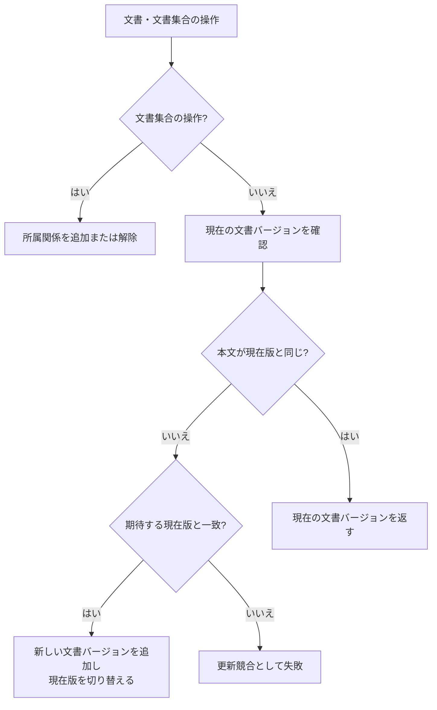

# 文書・文書バージョン管理設計

> [!abstract] この文書の役割
> 文書集合、文書、文書バージョンの関係と更新規則を定義し、異なる文書や文書バージョンを混同せず追跡できる状態を保つ。

## 1. 目的と適用範囲

この機能は、検索や実験で利用する文書を継続して識別し、内容の更新を文書バージョンとして保存する。文書集合と文書の所属関係、文書の新規登録、文書の更新、文書バージョンの現在版の解決を扱う。

本文のUTF-8デコードと正規化は[文書取り込み設計](./文書取り込み設計.md)、文書バージョンから文書チャンクを作る処理は[文書分割設計](./文書分割設計.md)の責務である。

## 2. 責務と入出力

### 2.1 責務と境界

この機能は、文書を安定した識別単位として管理し、文書の内容を不変の文書バージョンとして保存する。文書集合は文書をまとめる単位であり、所属変更によって文書本文や文書バージョンを変更しない。

文書更新では、呼び出し側が確認した期待する現在の文書バージョンを使って競合を検出する。別の更新が介在した古い要求で、現在の文書バージョンを巻き戻さないことがこの機能の重要な責務である。

### 2.2 入力・成功結果・失敗結果

| 操作 | 入力 | 成功結果 |
|---|---|---|
| 文書集合を作成する | 文書集合の情報 | 新しい文書集合を識別できる |
| 文書を追加する | 文書集合と文書 | 所属関係が存在する |
| 文書を外す | 文書集合と文書 | 指定した所属関係だけが解除される |
| 文書を登録する | 正規化後本文 | 文書と最初の文書バージョンを識別できる |
| 文書を更新する | 文書、期待する現在の文書バージョン、正規化後本文 | 現在の文書バージョンを識別できる |

識別子の形式、保存項目、外部キー、`unique`制約などの正確な定義は、コード、Schema、migrationを正本とする。

## 3. 処理設計

### 3.1 全体フロー

### 3.2 処理規則

文書と文書バージョンの関係は次のとおりである。

文書集合と文書の所属は多対多である。同じ文書を同じ文書集合へ複数回追加しても、所属関係を重複させない。

新規登録では、文書と最初の文書バージョンを同じ論理的な保存単位で作り、その文書バージョンを現在の文書バージョンとする。文書だけ、または文書バージョンだけが残る状態を正常な結果にしない。

更新では、現在の文書バージョンと入力本文を同じトランザクション内で確認し、次の順序で判定する。

1. 本文が同じ場合は、新しい文書バージョンを作らず現在の文書バージョンを返す。
2. 本文が異なり、現在の文書バージョンが期待する現在の文書バージョンと異なる場合は、更新競合として失敗する。
3. 本文が異なり、現在の文書バージョンが期待する現在の文書バージョンと一致する場合は、新しい文書バージョンを追加し、その文書バージョンへ現在の文書バージョンを切り替える。

新しい文書バージョンの追加と現在の文書バージョンの切り替えは、同じトランザクションで行う。本文が同じ場合に現在版を再利用することで、保存成功の応答を受け取れなかった更新を同じ入力で再実行できる。一方、別更新が介在した場合は競合として拒否し、古い要求による巻き戻しを防ぐ。専用のidempotency keyは導入しないため、異なる期待版を持つ要求まで同一要求として再利用する保証はしない。

過去の文書バージョンは削除しない。文書チャンク、正解根拠、検索結果、実験結果が参照していた本文を、後から追跡できるようにするためである。

文書集合から文書を外しても、文書、文書バージョン、文書チャンク、検索用データは削除しない。通常の検索では、検索開始時点の文書集合から各文書の現在の文書バージョンを解決して、具体的な文書バージョン集合を固定する。固定文書バージョン集合を使う実験では、実験側が指定した文書バージョンを現在版へ置き換えない。

## 4. 失敗時の扱い

| 失敗 | 扱い |
|---|---|
| 存在しない文書・文書集合 | 操作を失敗させ、既存データを変更しない |
| 更新競合 | 現在の文書バージョンを変更しない |
| 不変条件違反 | 操作全体を失敗させ、部分的な状態を残さない |
| 保存失敗 | 文書と文書バージョン、または所属変更を成功として公開しない |

データベース書き込みの結果が呼び出し側から不明になった場合も、更新規則に従って同じ入力を再実行できる。再実行しても、本文が異なる別更新を上書きしない。

## 5. 契約と受け渡し

### 5.1 不変条件

- 1つの文書バージョンは、ちょうど1つの文書に属する。
- 登録済みの文書には、少なくとも1つの文書バージョンがある。
- 文書には、同じ文書に属する現在の文書バージョンが1つある。
- 文書バージョンの本文は登録後に変更しない。
- 文書集合の所属変更によって文書バージョンを作成・変更しない。
- 文書更新によって過去の文書バージョン、文書チャンク、検索用データを上書きしない。

### 5.2 他機能・コンポーネントへの受け渡し

| 受け渡し先 | 渡すもの | 相手が担当すること |
|---|---|---|
| 文書取り込み | 文書と文書バージョンの登録・更新要求 | UTF-8デコード、本文の正規化、入力検証 |
| 文書分割 | 文書バージョンとその正規化後本文 | 分割条件に従う文書チャンクの生成 |
| 検索対象 | 文書集合または固定文書バージョン集合 | 検索開始時の文書バージョン集合の確定 |
| 検索用データ準備 | 文書バージョンと文書チャンク | 検索方式ごとのデータ準備と準備状態の管理 |

## 関連文書

- [RAGScope要求定義「1.1 文書」](<../../../RAGScope要求定義.md#1.1 文書>)
- [RAGScope要求定義「2.1 追跡可能性」](<../../../RAGScope要求定義.md#2.1 追跡可能性>)
- [RAGScope要求定義「2.2 再現性」](<../../../RAGScope要求定義.md#2.2 再現性>)
- [RAGScope用語集「2. 文書（documents）」](<../../../RAGScope用語集.md#2. 文書（documents）>)
- [RAGScopeドメインモデル](../../RAGScopeドメインモデル.md)
- [ユースケース設計](../../ユースケース設計.md)
- [検索対象設計](<../retrieval-generation/検索対象設計.md>)
- [文書取り込み設計](./文書取り込み設計.md)
- [文書分割設計](./文書分割設計.md)
