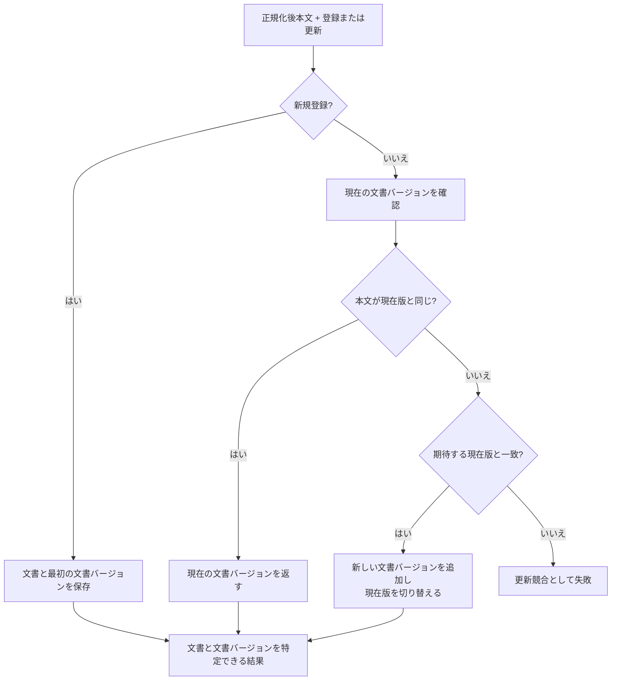

# 文書・文書バージョン管理設計

> [!abstract] この文書の役割
> 文書を安定した識別単位として管理し、内容の更新を不変な文書バージョンとして保存する規則を定義する。文書集合への所属は[文書集合管理設計](./文書集合管理設計.md)、本文の正規化は[文書取り込み設計](./文書取り込み設計.md)が担当する。

## 1. 目的と適用範囲

文書は、内容が更新されても同じ対象として追跡できる識別単位である。文書バージョンは、その文書の特定時点の本文を保持する不変の単位である。

この機能は、文書の新規登録、文書バージョンの追加、現在の文書バージョンの切り替え、更新競合の検出を扱う。文書バージョンを削除または上書きして、過去の本文を追跡できなくする処理は行わない。

## 2. 責務と入出力

### 2.1 責務と境界

この機能は、正規化後本文を受け取り、文書と文書バージョンの関係を保存する。新規登録では文書と最初の文書バージョンを作成し、更新では新しい文書バージョンを追加して現在の文書バージョンを切り替える。

更新時は、期待する現在の文書バージョンを使って競合を検出する。別の更新が先に行われた場合、古い要求で現在の文書バージョンを巻き戻さない。

この機能は、入力形式の判定、本文の正規化、文書集合の所属関係、文書チャンクの生成、検索用データの生成を担当しない。

### 2.2 入力・成功結果・失敗結果

| 操作 | 入力 | 成功結果 |
|---|---|---|
| 新規登録 | 正規化後本文 | 文書と最初の文書バージョンを識別できる結果 |
| 文書更新 | 対象文書、期待する現在の文書バージョン、正規化後本文 | 現在の文書バージョンを識別できる結果 |

本文の同一性は正規化後本文で判定する。同一本文の更新は内容の変更ではないため、新しい文書バージョンを作らず現在の文書バージョンを返す。これにより、保存結果が不明になった場合も同じ入力を安全に再実行できる。

## 3. 処理設計

### 3.1 全体フロー

### 3.2 処理規則

新規登録では、文書と最初の文書バージョンを同じ論理的な保存単位で作成し、その文書バージョンを現在の文書バージョンとする。文書だけ、または文書バージョンだけが残る状態を成功結果にしない。

更新では、現在の文書バージョンの確認、同一本文の判定、新しい文書バージョンの追加、現在版の切り替えを一貫した保存単位で行う。本文が異なり、期待する現在版と現在版が一致するときだけ、新しい文書バージョンを追加する。

文書バージョンの本文は登録後に変更しない。新しい文書バージョンを追加しても、過去の文書バージョン、文書チャンク、検索用データを上書きしない。これは、更新前の本文を後から追跡できるようにするためである。

## 4. 失敗時の扱い

| 失敗 | 判定 | 扱い |
|---|---|---|
| 対象文書なし | 更新対象の文書が存在しない | 既存データを変更しない |
| 対象版なし | 更新対象の現在の文書バージョンが存在しない | 既存データを変更しない |
| 更新競合 | 本文が異なり、期待する現在版と実際の現在版が異なる | 現在版を変更しない |
| 保存失敗 | 文書と文書バージョンを一体として保存できない | 部分的な登録を成功結果にしない |
| 不変条件違反 | 文書と版の関係を維持できない | 操作全体を失敗させる |

## 5. 契約と受け渡し

### 5.1 不変条件

- 1つの文書バージョンは、ちょうど1つの文書に属する。
- 登録済みの文書には、現在の文書バージョンを特定できる。
- 文書バージョンの本文は登録後に変更しない。
- 現在版の切り替えと新しい文書バージョンの追加は、一貫した保存結果として扱う。
- 文書更新によって過去の文書バージョン、文書チャンク、検索用データを上書きしない。
- 更新競合が発生した場合、古い要求が現在版を巻き戻さない。

### 5.2 他機能・コンポーネントへの受け渡し

| 受け渡し先 | 渡すもの | 渡してよい条件 | 相手が担当すること |
|---|---|---|---|
| 文書集合管理 | 文書の識別子 | 文書集合への所属を変更するとき | 文書集合と文書の所属関係 |
| 文書分割 | 文書バージョンと正規化後本文 | 対象版が保存済みである場合 | 分割条件に従う文書チャンクの生成 |
| 検索用データ準備 | 文書バージョンと完全な文書チャンク列 | 対象版の分割が完了した場合 | 検索方式ごとの検索用データと準備状態 |

## 関連文書

- [RAGScope要求定義「1.1 文書」](<../../../RAGScope要求定義.md#1.1 文書>)
- [RAGScope要求定義「2.1 追跡可能性」](<../../../RAGScope要求定義.md#2.1 追跡可能性>)
- [RAGScope要求定義「2.2 再現性」](<../../../RAGScope要求定義.md#2.2 再現性>)
- [RAGScope用語集「文書バージョン」](<../../../RAGScope用語集.md#文書バージョン>)
- [RAGScopeドメインモデル](../../RAGScopeドメインモデル.md)
- [システムアーキテクチャ](../../システムアーキテクチャ.md)
- [文書取り込み設計](./文書取り込み設計.md)
- [文書集合管理設計](./文書集合管理設計.md)
- [文書分割設計](./文書分割設計.md)
- [検索用データ準備設計](./検索用データ準備設計.md)
