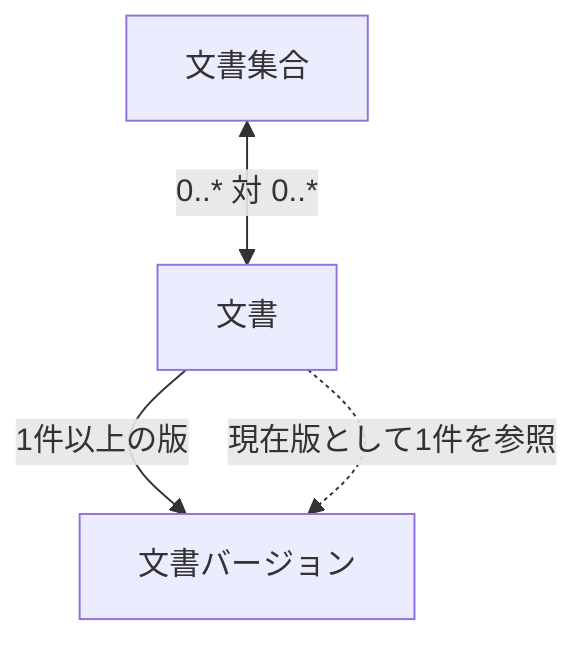

# 文書・版管理設計

> [!abstract] この文書の役割
> 文書集合、文書、文書バージョンの関係と更新規則を定義し、異なる文書や版を混同せず追跡できる状態を保つ。

## 1. 管理する概念

文書集合と文書の所属は多対多である。1つの文書は1件以上の文書バージョンを持ち、そのうち1件を現在版として参照する。

### 文書集合

検索や実験の対象として文書をまとめる単位である。文書集合への追加・削除は文書の分類を変える操作であり、文書バージョンは作らない。

### 文書

1件の技術文書を継続して識別する単位である。本文そのものを文書へ上書きせず、内容は文書バージョンとして保持する。

### 文書バージョン

ある文書の特定時点の内容を保持する不変の版である。1つの文書バージョンは必ず1つの文書に属する。

本文は[文書取り込み設計](./文書取り込み設計.md)で正規化された内容をそのまま保持し、登録後に書き換えない。

## 2. 文書集合の操作

文書集合について、次の操作を扱う。

| 操作 | 結果 |
|---|---|
| 文書集合を作成する | 新しい文書集合を識別できる |
| 文書を追加する | 指定した文書が文書集合へ所属する |
| 文書を外す | 指定した文書の所属だけを解除する |
| 文書集合を取得する | 所属する文書を識別できる |

同じ文書を同じ文書集合へ複数回追加しても所属関係を重複させない。文書を外しても、文書そのもの、文書バージョン、文書チャンク、検索用データは削除しない。

## 3. 文書の登録と更新

### 3.1 新規登録

新しい文書を登録するときは、文書と最初の文書バージョンを同じトランザクションで作る。作成した文書バージョンを、その文書の現在版とする。

文書だけ、または文書バージョンだけが残った状態を正常な結果として作らない。

### 3.2 文書更新

更新入力は、対象文書、期待する現在版、正規化後本文を持つ。

同じトランザクション内で現在版を確認し、次の順序で処理する。

1. 現在版の本文が入力本文と同じ場合は、新しい版を作らず現在版を返す。
2. 本文が異なり、現在版が期待する現在版と異なる場合は更新競合として失敗する。
3. 本文が異なり、現在版が期待する現在版と一致する場合は、新しい文書バージョンを追加し、その版へ現在版を切り替える。

新しい版の追加と現在版の切り替えは同じトランザクションで行う。以前の文書バージョンは削除しない。

この規則は、直前に成功した更新の応答だけを受け取れなかった場合の同一入力再実行を安全にする一方、別更新が介在した古い要求を競合として拒否する。要求を識別する専用のidempotency keyは導入しないため、異なる期待する現在版を持つ要求まで同一要求として再利用する保証はしない。

過去の版を残すのは、文書チャンク、正解根拠、検索結果、実験結果が参照していた文書内容を後から追跡できるようにするためである。

## 4. 識別と不変条件

文書集合、文書、文書バージョンは、それぞれ独立した識別子で参照する。識別子の具体的な形式はこの設計書では固定しない。

次の条件を常に満たす。

- 1つの文書バージョンは、ちょうど1つの文書に属する。
- 登録済みの文書には、少なくとも1つの文書バージョンが存在する。
- 文書には現在版が1つ存在し、その版は同じ文書に属する。
- 文書バージョンの本文は登録後に変更しない。
- 文書集合の所属変更によって文書バージョンを作成・変更しない。
- 文書更新によって過去の文書バージョン、そこから作られた文書チャンク、検索用データを上書きしない。

同じ文書バージョンと分割条件から作った文書チャンクを識別する規則は[文書分割設計](./文書分割設計.md)で定義する。

## 5. 文書集合と版の関係

文書集合は文書をまとめる。文書集合の所属関係に特定の文書バージョンを埋め込まない。

通常の検索では、[検索対象設計](<../retrieval-generation/検索対象設計.md>)に従い、検索開始時点の各文書の現在版を具体的な文書バージョン集合へ解決する。対象版の検索用データが未準備であっても旧版へ暗黙にフォールバックしない。

実験で再現性が必要な場合は、実験側が使用した具体的な文書バージョンを記録し、後から現在版が変わっても過去の実験が別の版を参照しないようにする。

## 6. 失敗時の扱い

存在しない文書・文書集合を指定した操作、更新競合、同じトランザクション内で不変条件を満たせなくなった操作、DBへの保存に失敗した操作は失敗とする。

更新競合では現在版を変更しない。DB書き込みの結果が呼び出し側から不明な場合も、3.2の規則に従って同じ入力を再実行できる。

正確なテーブル、外部キー、unique制約は、実装時のmigrationとSchemaを機械可読な正本とする。

## 関連文書

- [RAGScope要求定義「1.1 文書」](<../../../RAGScope要求定義.md#1.1 文書>)
- [RAGScope要求定義「2.1 追跡可能性」](<../../../RAGScope要求定義.md#2.1 追跡可能性>)
- [RAGScope要求定義「2.2 再現性」](<../../../RAGScope要求定義.md#2.2 再現性>)
- [RAGScope用語集「2. 文書（documents）」](<../../../RAGScope用語集.md#2. 文書（documents）>)
- [文書取り込み設計](./文書取り込み設計.md)
- [文書分割設計](./文書分割設計.md)
- [検索対象設計](<../retrieval-generation/検索対象設計.md>)
