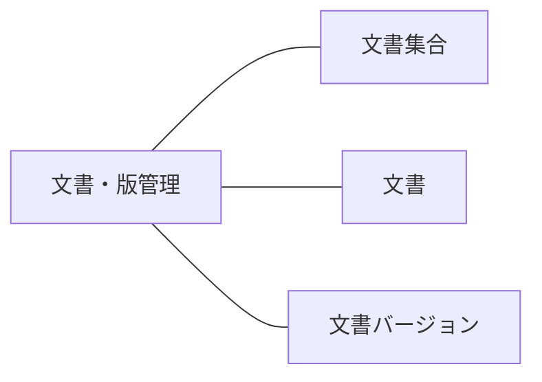

# 文書・版管理設計

文書集合、文書、文書バージョンなどを識別し、異なる文書や版を混同せず管理するための設計を扱う。

## 機能オーバービュー

```mermaid
flowchart LR
    Manage["文書・版管理"]
    Collection["文書集合"]
    Document["文書"]
    Version["文書バージョン"]

    Manage --- Collection
    Manage --- Document
    Manage --- Version
```

各概念の関係、識別、保存、更新時の扱いを具体化する。文書バージョンを文書チャンクへ分割する処理は[文書分割設計](./文書分割設計.md)で扱う。
