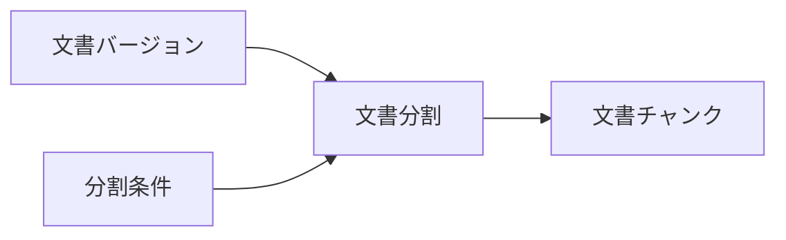

# 文書分割設計

文書バージョンを分割条件に従って文書チャンクへ分割する処理を扱う。

## 処理概要

```mermaid
flowchart LR
    Version["文書バージョン"]
    Condition["分割条件"]
    Split["文書分割"]
    Chunk["文書チャンク"]

    Version --> Split
    Condition --> Split
    Split --> Chunk
```

文書分割は、1つの文書バージョンと分割条件から文書チャンクを生成する。生成した文書チャンクは、元の文書バージョンと文書内の位置へ追跡できる状態で扱う。

文書チャンクから検索用データを準備する処理は[検索用データ準備設計](./検索用データ準備設計.md)で扱う。
