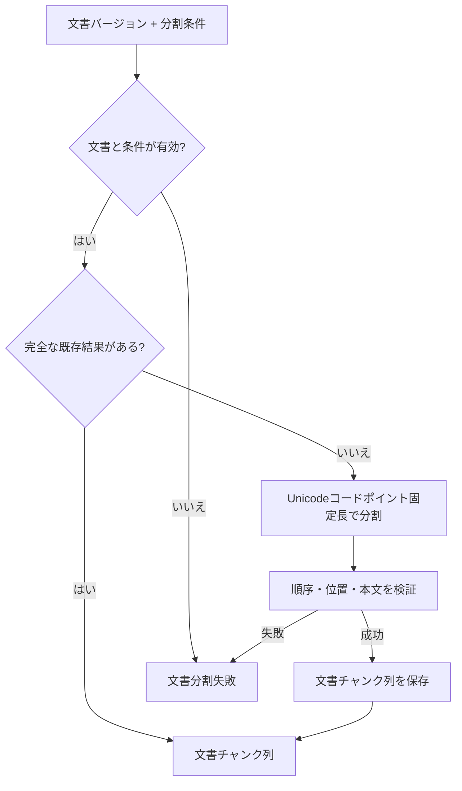

# 文書分割設計

> [!abstract] この文書の役割
> 文書バージョンを分割条件に従って文書チャンクへ分割し、各文書チャンクを元の文書バージョンと正規化後本文の位置へ追跡できるようにする。

## 1. 目的と適用範囲

文書分割は、1つの文書バージョンの本文を、指定された分割条件に従う文書チャンク列へ変換する。分割結果は、Embedding生成、全文検索用データ準備、正解根拠との位置比較で利用する。

現在の分割方式は、正規化後本文をUnicodeコードポイント数で固定長に分割する方式である。Markdownの見出し、段落、文、単語などの意味的な境界は考慮しない。

Tokenizerに依存する分割やMarkdown構造に依存する分割は、この設計の現在方式に含めない。別方式を導入する場合は、既存方式と混同しない分割方式として分割条件で識別する。

## 2. 責務と入出力

### 2.1 責務と境界

この機能は、文書バージョンと分割条件から、文書チャンクの順序、位置、本文を決定し、保存・再利用できる状態にする。文書本文の正規化は[文書取り込み設計](./文書取り込み設計.md)、文書チャンクからEmbeddingなどを作る処理は[検索用データ準備設計](./検索用データ準備設計.md)が担当する。

分割計算は同じ本文と条件から同じ結果を作る。分割結果の完全性を確認するまでは、途中まで保存された文書チャンク列を後続の検索用データ準備へ公開しない。

### 2.2 入力・成功結果・失敗結果

| 項目 | 内容 |
|---|---|
| 文書バージョン | 分割対象の正規化後本文を持つ文書バージョン |
| 分割方式 | 現在はUnicodeコードポイント固定長方式 |
| チャンクサイズ | 1以上のUnicodeコードポイント数 |
| 重複範囲 | 0以上かつチャンクサイズ未満のUnicodeコードポイント数 |

成功時は、入力した文書バージョンと分割条件に対応する文書チャンク列を取得・識別できる。正確な項目名、型、識別子、保存制約はコード、Schema、migrationを正本とする。

## 3. 処理設計

### 3.1 全体フロー

### 3.2 処理規則

本文の先頭を位置0とし、文書チャンクの範囲はUnicodeコードポイント単位の半開区間`[start, end)`で表す。チャンクサイズを`s`、重複範囲を`o`とすると、次のチャンクの開始位置は直前の開始位置へ`s - o`を加えた位置とする。終了位置が本文末尾に到達した時点で分割を終了する。

例えば本文長10、`s = 4`、`o = 1`の場合、範囲は`[0,4)`、`[3,7)`、`[6,10)`となる。

各文書チャンクは、少なくとも次の概念上の情報を持つ。

- 元の文書バージョン
- 使用した分割条件
- 0始まりで連続する文書チャンクのindex
- 正規化後本文に対する`start`と`end`
- `[start, end)`に対応する本文

固定長方式は、モデルやTokenizerに依存せず、同じ本文と条件から同じ位置のチャンクを再現する初期baselineとして採用する。検索品質上の最適解であることは、この設計では主張しない。採用理由と他方式との比較は[ADR-0012](<../../../adr/ADR-0012 初期文書分割にUnicodeコードポイント固定長方式を採用する.md>)に記録する。

同じ文書バージョンと分割条件に対応する完全な文書チャンク列が存在する場合は再利用し、重複するチャンク列を作らない。条件が変わった場合や文書バージョンが変わった場合は、既存のチャンク列を書き換えず、別の組み合わせとして生成する。

## 4. 失敗時の扱い

| 失敗 | 判定 |
|---|---|
| 対象の文書バージョンなし | 指定した文書バージョンが存在しない |
| 不正なチャンクサイズ | 1未満である |
| 不正な重複範囲 | 0未満、またはチャンクサイズ以上である |
| 本文の不変条件違反 | 文書バージョンの本文が正規化済み本文として扱えない |
| 保存失敗 | 文書チャンク列を完全に保存できない |

分割計算自体は同じ入力に対して同じ結果になるため、計算失敗に対する自動再試行は行わない。保存結果が不明な場合は同じ文書バージョンと分割条件で再実行し、完全な文書チャンク列が存在すれば再利用する。

## 5. 契約と受け渡し

### 5.1 不変条件

同じ文書バージョンと分割条件から生成した文書チャンク列は、次を満たす。

1. 文書チャンクは1件以上ある。
2. indexは0から始まる欠番のない連続値である。
3. すべての文書チャンクが同じ文書バージョンと分割条件を参照する。
4. `content`は文書バージョン本文の`[start, end)`と一致する。
5. `0 <= start < end <= 本文長`を満たす。
6. 最初の文書チャンクの`start`は0である。
7. 最後の文書チャンクの`end`は本文長と一致する。
8. 隣り合う文書チャンクの重なりは、分割条件の重複範囲と一致する。
9. 同じ文書バージョンと分割条件からは、同じ位置、順序、本文の列が得られる。

この位置情報は、文書チャンクと正解根拠を同じ文書バージョン上で比較する基準になる。

### 5.2 他機能・コンポーネントへの受け渡し

| 受け渡し先 | 渡すもの | 渡す条件 | 相手が担当すること |
|---|---|---|---|
| 検索用データ準備 | 完全な文書チャンク列、文書バージョン、分割条件 | 不変条件の検証と保存が完了した場合 | 全文検索用データ、文書チャンクのEmbeddingなどの準備 |
| 検索・回答生成 | 検索用データ準備単位から参照できる文書チャンク | 対応する検索用データ準備単位が`ready`の場合 | 検索対象の解決と順位付き検索 |
| 評価データ | 文書バージョン上の位置情報 | 正解根拠を文書と比較するとき | 正解根拠の登録・評価 |

## 関連文書

- [RAGScope要求定義「1.1 文書」](<../../../RAGScope要求定義.md#1.1 文書>)
- [RAGScope要求定義「1.2 評価データ」](<../../../RAGScope要求定義.md#1.2 評価データ>)
- [RAGScope要求定義「2.1 追跡可能性」](<../../../RAGScope要求定義.md#2.1 追跡可能性>)
- [RAGScope用語集「文書チャンク」](<../../../RAGScope用語集.md#文書チャンク>)
- [RAGScopeドメインモデル](../../RAGScopeドメインモデル.md)
- [ADR-0012](<../../../adr/ADR-0012 初期文書分割にUnicodeコードポイント固定長方式を採用する.md>)
- [文書・文書バージョン管理設計](<./文書・文書バージョン管理設計.md>)
- [文書取り込み設計](./文書取り込み設計.md)
- [検索用データ準備設計](./検索用データ準備設計.md)
