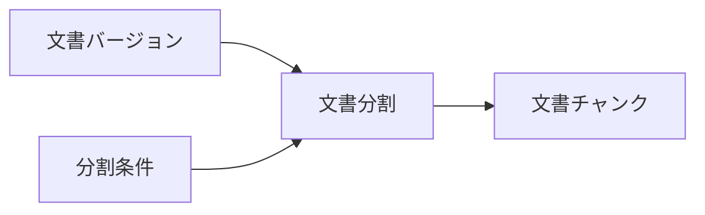

# 文書分割設計

文書バージョンを分割条件に従って文書チャンクへ分割する処理を扱う。

## 機能オーバービュー

```mermaid
flowchart LR
    Version["文書バージョン"]
    Condition["分割条件"]
    Split["文書分割"]
    Chunk["文書チャンク"]

    Version --> Split
    Condition --> Split
    Split --> Chunk
```

分割条件、文書チャンクの生成規則、文書バージョンと文書内位置への追跡に必要な扱いを具体化する。文書チャンクから検索用データを準備する処理は[検索用データ準備設計](./検索用データ準備設計.md)で扱う。
