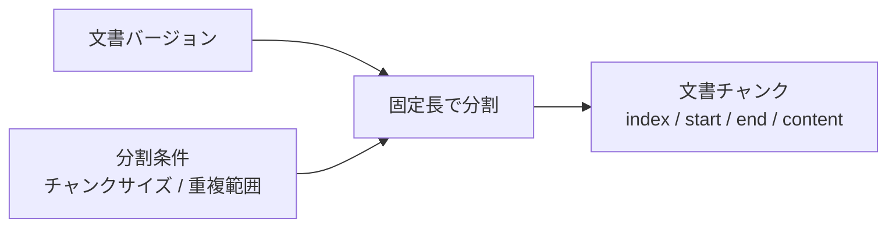

# 文書分割設計

> [!abstract] この文書の役割
> 文書バージョンを分割条件に従って文書チャンクへ分割し、各チャンクを元の文書バージョンと文書内位置へ追跡できるようにする。

## 1. 入力と結果

文書分割は、1つの文書バージョンと1つの分割条件を入力とする。

現在の分割方式は、正規化後の本文をUnicodeコードポイント数で固定長に切る方式である。分割条件は次を持つ。

| 条件 | 規則 |
|---|---|
| チャンクサイズ | 1以上のUnicodeコードポイント数 |
| 重複範囲 | 0以上、チャンクサイズ未満のUnicodeコードポイント数 |

成功した場合は、その文書バージョンと分割条件に対応する文書チャンク列が保存される。

## 2. 処理

本文の先頭を位置0とし、最初の文書チャンクは位置0から始める。

チャンクサイズを `s`、重複範囲を `o` とすると、次のチャンクの開始位置は直前の開始位置へ `s - o` を加えた位置とする。チャンクの終了位置が本文末尾へ到達した時点で分割を終了する。

各文書チャンクには少なくとも次の情報を持たせる。

- 元の文書バージョン
- 使用した分割条件
- 0始まりで連続する文書チャンクのindex
- 正規化後の本文に対する開始位置
- 正規化後の本文に対する終了位置
- その範囲の本文

開始位置と終了位置はUnicodeコードポイント単位の半開区間 `[start, end)` とする。

## 3. 文書チャンクの不変条件

同じ文書バージョンと分割条件から生成した文書チャンク列は、次をすべて満たす。

1. 文書チャンクは1件以上ある。
2. indexは0から始まる欠番のない連続値である。
3. 各文書チャンクは同じ文書バージョンと同じ分割条件を参照する。
4. `content`は文書バージョンの正規化後本文の `[start, end)` と完全に一致する。
5. `0 <= start < end <= 本文長` を満たす。
6. 最初の文書チャンクの`start`は0である。
7. 最後の文書チャンクの`end`は本文長と一致する。
8. 隣り合う文書チャンクの重なりは、最後の短いチャンクを除いて分割条件の重複範囲と一致する。
9. 同じ文書バージョンと同じ分割条件からは、同じ位置・順序・本文の文書チャンク列を生成する。

この位置情報を、正解根拠と文書チャンクを同じ文書バージョン上で比較する基準として使用する。

## 4. 保存と再生成

分割条件は識別できる状態で保存し、文書チャンクから使用した分割条件へ遡れるようにする。

同じ文書バージョンと同じ分割条件について完全な文書チャンク列がすでに存在する場合は再利用し、重複する文書チャンク列を作らない。

分割条件が変わった場合は、既存の文書チャンクを書き換えず、新しい分割条件に対応する文書チャンク列を別に生成する。文書が更新された場合も、新しい文書バージョンから別の文書チャンク列を生成する。

これにより、過去の検索結果や実験結果が参照した文書チャンクを残したまま、新しい版や条件の検索用データを再生成できる。

1つの文書バージョンと分割条件に対応する文書チャンク列は、途中まで保存された状態を正常な結果として公開しない。

## 5. 失敗時の扱い

次の場合は文書分割を失敗とする。

- 対象の文書バージョンが存在しない。
- チャンクサイズが1未満である。
- 重複範囲が0未満、またはチャンクサイズ以上である。
- 文書バージョンの本文が不変条件を満たしていない。
- 文書チャンク列を完全に保存できない。

分割計算そのものは同じ入力に対して同じ結果になるため、計算失敗に対する自動再試行は行わない。DBの一時的な失敗へ再試行を適用する場合も、同じ文書バージョンと分割条件に対して重複した文書チャンク列を作らない。

## 関連文書

- [RAGScope要求定義「1.1 文書」](<../../../RAGScope要求定義.md#1.1 文書>)
- [RAGScope要求定義「1.2 評価データ」](<../../../RAGScope要求定義.md#1.2 評価データ>)
- [RAGScope要求定義「2.1 追跡可能性」](<../../../RAGScope要求定義.md#2.1 追跡可能性>)
- [RAGScope用語集「文書チャンク」](<../../../RAGScope用語集.md#文書チャンク>)
- [文書・版管理設計](<./文書・版管理設計.md>)
- [検索用データ準備設計](./検索用データ準備設計.md)
