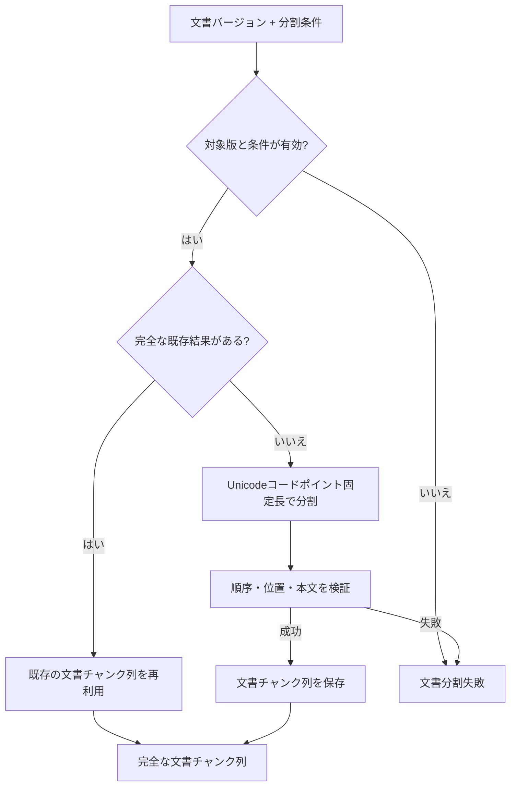

# 文書分割設計

> [!abstract] この文書の役割
> 文書バージョンの正規化後本文を分割条件に従って文書チャンクへ変換し、各文書チャンクを元の文書バージョン内の位置へ追跡できる状態を定義する。

## 1. 目的と適用範囲

文書分割は、1つの文書バージョンと1つの分割条件から、順序付けられた文書チャンク列を生成する機能である。文書チャンクは検索用データの生成と、検索結果・正解根拠の追跡に使用する。

初期方式は、正規化後本文をUnicodeコードポイント数で固定長に分割する方式とする。Markdownの見出し、段落、文、単語などの意味的な境界は、この方式では考慮しない。

## 2. 責務と入出力

### 2.1 責務と境界

この機能は、文書バージョンの本文と分割条件から、文書チャンクの順序、位置、本文を決定し、完全な文書チャンク列として保存する。文書本文の正規化は[文書取り込み設計](./文書取り込み設計.md)、文書チャンクから検索用データを作る処理は[検索用データ準備設計](./検索用データ準備設計.md)が担当する。

分割方式は分割条件として明示し、文書バージョンの内容やEmbeddingプロファイルから暗黙に決めない。

### 2.2 入力・成功結果・失敗結果

| 項目 | 内容 |
|---|---|
| 文書バージョン | 分割対象の正規化後本文を持つ文書バージョン |
| 分割方式 | 現在はUnicodeコードポイント固定長方式 |
| チャンクサイズ | 1以上のUnicodeコードポイント数 |
| 重複範囲 | 0以上かつチャンクサイズ未満のUnicodeコードポイント数 |
| 成功結果 | 文書バージョンと分割条件に対応する完全な文書チャンク列 |

## 3. 処理設計

### 3.1 全体フロー

### 3.2 処理規則

本文の先頭を位置0とし、文書チャンクの範囲はUnicodeコードポイント単位の半開区間`[start, end)`で表す。チャンクサイズを`s`、重複範囲を`o`とすると、次のチャンクの開始位置は直前の開始位置に`s - o`を加えた位置とする。

例えば本文長10、`s = 4`、`o = 1`の場合、範囲は`[0,4)`、`[3,7)`、`[6,10)`となる。

同じ文書バージョンと分割条件から得られる文書チャンク列は決定的である。固定長方式を初期方式とする理由と比較は[ADR-0012](<../../../adr/ADR-0012 初期文書分割にUnicodeコードポイント固定長方式を採用する.md>)に記録する。

同じ文書バージョンと分割条件に対応する完全な文書チャンク列が存在する場合は再利用する。条件が異なる場合は、既存の文書チャンク列を上書きせず、別の組み合わせとして扱う。

計算途中の文書チャンク列は、完全性を検証するまで検索用データ準備へ渡さない。

## 4. 失敗時の扱い

| 失敗 | 判定 | 扱い |
|---|---|---|
| 対象版なし | 指定した文書バージョンが存在しない | 文書チャンクを作成しない |
| 不正なチャンクサイズ | 1未満である | 分割しない |
| 不正な重複範囲 | 0未満、またはチャンクサイズ以上である | 分割しない |
| 本文の不変条件違反 | 正規化後本文として扱えない | 分割しない |
| 保存失敗 | 完全な文書チャンク列を保存できない | 不完全な列を成功結果にしない |

保存結果が不明になった場合は、同じ文書バージョンと分割条件で再実行する。完全な既存結果を確認できた場合は再利用し、不完全な結果は検索用データ準備へ公開しない。

## 5. 契約と受け渡し

### 5.1 不変条件

- 文書チャンクは1つの文書バージョンと1つの分割条件に対応する。
- 文書チャンクのindexは0から始まる欠番のない連続値である。
- `content`は文書バージョン本文の`[start, end)`と一致する。
- `0 <= start < end <= 本文長`を満たす。
- 最初の文書チャンクの`start`は0である。
- 最後の文書チャンクの`end`は本文長と一致する。
- 隣り合う文書チャンクの重複は、分割条件の重複範囲と一致する。
- 同じ本文と分割条件から、同じ位置、順序、本文の列が得られる。
- 完全性を確認していない文書チャンク列を検索用データ準備へ渡さない。

### 5.2 他機能・コンポーネントへの受け渡し

| 受け渡し先 | 渡すもの | 渡してよい条件 | 相手が担当すること |
|---|---|---|---|
| 検索用データ準備 | 完全な文書チャンク列、文書バージョン、分割条件 | 不変条件の検証と保存が完了した場合 | 検索方式ごとの検索用データと準備状態 |
| 評価データ | 文書バージョンと文書内の位置情報 | 正解根拠が本文と比較される場合 | 正解根拠の登録と評価 |
| 検索・回答生成 | 検索用データから参照できる文書チャンク | 対応する準備単位が`ready`の場合 | 検索対象の確定と順位付き検索 |

## 関連文書

- [RAGScope要求定義「1.1 文書」](<../../../RAGScope要求定義.md#1.1 文書>)
- [RAGScope要求定義「1.2 評価データ」](<../../../RAGScope要求定義.md#1.2 評価データ>)
- [RAGScope要求定義「2.1 追跡可能性」](<../../../RAGScope要求定義.md#2.1 追跡可能性>)
- [RAGScope用語集「文書チャンク」](<../../../RAGScope用語集.md#文書チャンク>)
- [RAGScopeドメインモデル](../../RAGScopeドメインモデル.md)
- [システムアーキテクチャ](../../システムアーキテクチャ.md)
- [ADR-0012](<../../../adr/ADR-0012 初期文書分割にUnicodeコードポイント固定長方式を採用する.md>)
- [文書取り込み設計](./文書取り込み設計.md)
- [検索用データ準備設計](./検索用データ準備設計.md)
