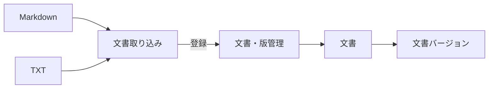

# 文書取り込み設計

技術文書をRAGScopeへ取り込み、文書と文書バージョンとして登録する処理を扱う。

## 処理概要

文書取り込みは、対象形式の技術文書から本文を取得し、その内容をRAGScopeで管理できる文書バージョンとして登録する。文書を同一文書として扱う条件、文書バージョンの識別、保存、更新時の扱いは[文書・版管理設計](<./文書・版管理設計.md>)で定義する。

文書チャンクへの分割と検索用データの準備は、この機能では行わない。
