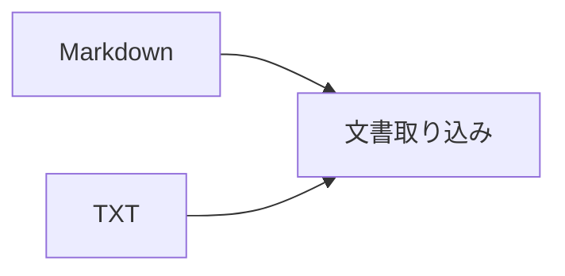

# 文書取り込み設計

技術文書をRAGScopeへ取り込む処理を扱う。

## 概要

```mermaid
flowchart LR
    Markdown["Markdown"]
    Text["TXT"]
    Ingest["文書取り込み"]

    Markdown --> Ingest
    Text --> Ingest
```

対象形式ごとの入力をどう受け取り、RAGScopeで扱える状態にするかを設計する。文書集合、文書、文書バージョンの管理は[文書・版管理設計](<./文書・版管理設計.md>)、文書チャンクへの分割は[文書分割設計](./文書分割設計.md)で扱う。
