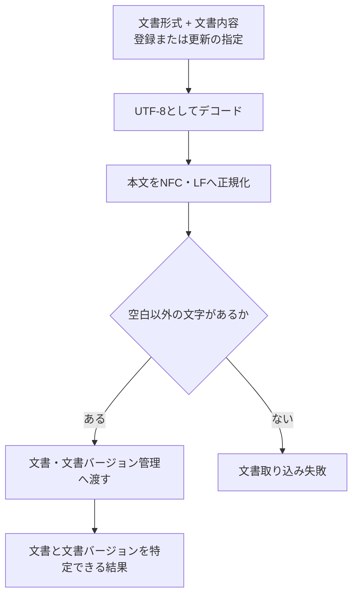

# 文書取り込み設計

> [!abstract] この文書の役割
> Markdown / TXTの技術文書をRAGScopeへ取り込み、正規化した本文を文書バージョンとして登録・更新する処理を定義する。文書チャンクや検索用データはこの処理では生成しない。

## 1. 目的と適用範囲

文書取り込みは、利用インターフェースから渡された技術文書を、RAGScope内部で扱う文書と文書バージョンへ変換する入口である。新しい文書の登録と、既存文書の内容更新を扱う。

CLIがファイルを開く処理やAPIがアップロードを受け取る処理は利用インターフェース側の責務である。この機能は、文書形式と文書内容を受け取ったところから開始する。

現在の対象形式はMarkdownとTXTである。Markdownの見出し、リンク、Frontmatterなどを解析する処理は行わず、文書内容を本文として扱う。

文書チャンクへの分割と検索用データの生成は、[文書分割設計](./文書分割設計.md)と[検索用データ準備設計](./検索用データ準備設計.md)の責務である。

## 2. 責務と入出力

### 2.1 責務と境界

この機能は、文書内容をUTF-8として解釈し、RAGScope内部の位置基準となる本文へ正規化したうえで、文書・文書バージョン管理へ渡す。正規化後本文の保存と現在の文書バージョンの切り替えは、[文書・文書バージョン管理設計](<./文書・文書バージョン管理設計.md>)が担当する。

この機能が担当しないものは次のとおりである。

- ファイルパスの解決、ファイルの読み込み、HTTP multipartなどの利用インターフェース固有処理
- Markdown構造の解析やHTMLへの変換
- 文書チャンク、文書チャンクのEmbedding、全文検索用データの生成
- 文書集合への所属変更

### 2.2 入力・成功結果・失敗結果

| 項目 | 新規登録 | 更新 |
|---|---|---|
| 文書形式 | MarkdownまたはTXT | MarkdownまたはTXT |
| 文書内容 | 利用インターフェースが取得した内容 | 利用インターフェースが取得した内容 |
| 対象文書 | 不要 | 更新対象の文書 |
| 期待する現在の文書バージョン | 不要 | 更新開始時に呼び出し側が確認した文書バージョン |

入力の具体的な型や、文書・文書バージョンの識別子の形式は、コード、Schema、migrationを正本とする。

成功時は、登録または更新された文書と、その内容を保持する文書バージョンを特定できる結果を返す。更新時に本文が現在の文書バージョンと同じ場合は、既存の文書バージョンを成功結果として返す。

失敗時は、文書または文書バージョンを部分的に登録した状態を成功結果として返さない。

## 3. 処理設計

### 3.1 全体フロー

### 3.2 処理規則

本文の正規化は次の順序で行う。

1. 文書内容をUTF-8としてデコードする。
2. 先頭にUTF-8 BOM由来のU+FEFFがある場合だけ除去する。
3. CRLFと単独のCRをLFへ変換する。
4. Unicode正規化形式NFCへ変換する。

Markdown記法、空白、インデント、末尾改行など、それ以外の本文は変更しない。NFCとLFへの正規化後本文を、文書バージョン、文書チャンク、正解根拠が参照する位置と文字列の基準とする。元入力のコードポイント位置はRAGScope内部の正規位置として保持しない。

正規化後の本文にUnicodeの空白文字以外が1文字もない場合は、空本文として失敗させる。空白だけの文書からは検索対象として意味のある文書チャンクを作れず、後続処理で特別扱いが必要になるためである。

正規化と検証に成功した本文は、文書・文書バージョン管理へ渡す。新規登録では文書と最初の文書バージョンを作り、更新では期待する現在の文書バージョンを使って競合を検出する。更新の詳細な判定と保存単位は、文書・文書バージョン管理設計を正本とする。

この正規化の採用理由と、NFC・NFKC・無変換の比較は[ADR-0011](<../../../adr/ADR-0011 文書本文をNFC・LFへ正規化し、正規化後本文を位置の基準とする.md>)に記録する。

## 4. 失敗時の扱い

| 失敗 | 判定 |
|---|---|
| 対象外の形式 | Markdown / TXT以外が指定された |
| デコード失敗 | 文書内容をUTF-8としてデコードできない |
| 空本文 | 正規化後の本文に空白以外の文字がない |
| 更新対象なし | 更新時に指定した文書が存在しない |
| 更新競合 | 更新開始時に期待した文書バージョンから現在の文書バージョンが変わっている |
| 永続化失敗 | 文書と文書バージョンを一体として保存できない |

入力のデコードまたは本文検証に失敗した場合、文書・文書バージョン管理へ保存を依頼しない。更新競合では現在の文書バージョンを変更せず、呼び出し側が最新状態を確認して新しい更新として再実行できる結果を返す。

## 5. 契約と受け渡し

### 5.1 不変条件

- 保存される文書バージョンの本文は、正規化規則を適用済みである。
- 文書バージョンの本文は登録後に変更しない。
- 文書取り込みは文書チャンク、文書チャンクのEmbedding、その他の検索用データを生成しない。
- CLIやAPIの入力形式を、文書バージョンの本文へそのまま保存することを前提にしない。

### 5.2 他機能・コンポーネントへの受け渡し

| 受け渡し先 | 渡すもの | 渡す条件 | 相手が担当すること |
|---|---|---|---|
| 文書・文書バージョン管理 | 文書形式、正規化後本文、登録または更新の指定、更新時の期待する現在の文書バージョン | UTF-8デコードと空本文検証に成功した場合 | 文書・文書バージョンの保存、更新競合の判定、現在の文書バージョンの切り替え |
| 文書分割 | 文書バージョン | 登録済みの文書バージョンを検索可能にするとき | 分割条件に従う文書チャンクの生成と保存 |
| 検索用データ準備 | 文書バージョンと文書チャンク | 必要な分割が完了したとき | 検索方式ごとの検索用データの準備と`ready`判定 |

## 関連文書

- [RAGScope要求定義「1.1 文書」](<../../../RAGScope要求定義.md#1.1 文書>)
- [RAGScope要求定義「1.2 評価データ」](<../../../RAGScope要求定義.md#1.2 評価データ>)
- [RAGScope用語集「文書」](<../../../RAGScope用語集.md#文書>)
- [RAGScopeドメインモデル](../../RAGScopeドメインモデル.md)
- [ユースケース設計](../../ユースケース設計.md)
- [システムアーキテクチャ](../../システムアーキテクチャ.md)
- [文書・文書バージョン管理設計](<./文書・文書バージョン管理設計.md>)
- [文書分割設計](./文書分割設計.md)
- [検索用データ準備設計](./検索用データ準備設計.md)
