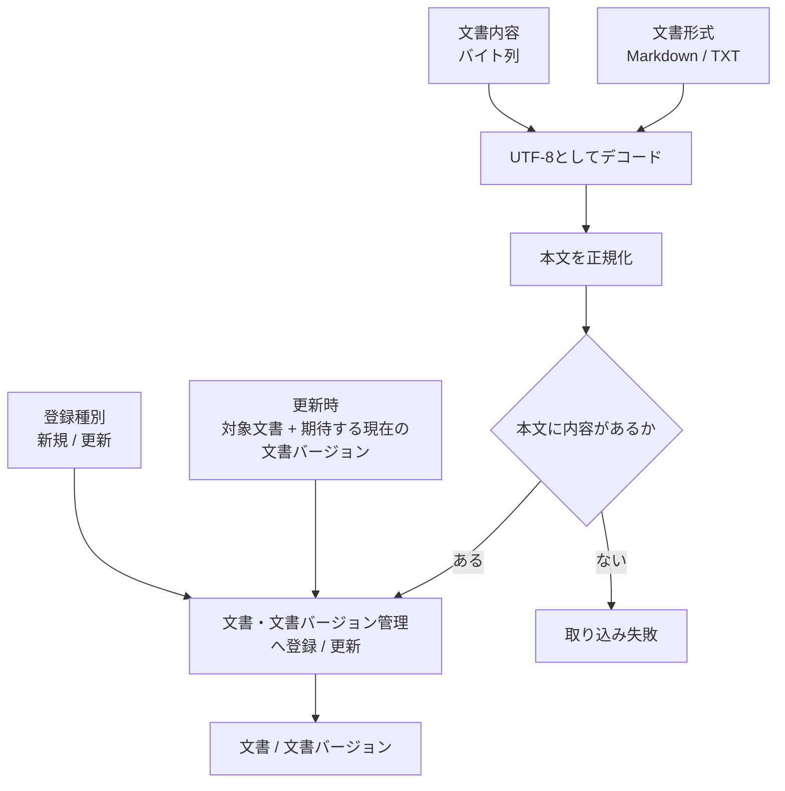

# 文書取り込み設計

> [!abstract] この文書の役割
> Markdown / TXTの技術文書をRAGScopeへ取り込み、正規化した本文を文書と文書バージョンとして登録・更新する処理を定義する。

## 1. 目的と範囲

文書取り込みは、利用インターフェースから渡された技術文書をRAGScope内部の文書として登録する入口である。新しい文書の登録と、既存文書の内容更新を扱う。

CLIでファイルを開く処理やAPIでアップロードを受け取る処理は利用インターフェース側の責務であり、この機能は文書形式と文書内容を受け取ったところから開始する。

文書チャンクへの分割と検索用データの生成は行わない。登録した文書バージョンを検索可能にする処理は、[文書分割設計](./文書分割設計.md)と[検索用データ準備設計](./検索用データ準備設計.md)で扱う。

## 2. 入力と結果

| 項目 | 新規登録 | 更新 |
|---|---|---|
| 文書形式 | MarkdownまたはTXT | MarkdownまたはTXT |
| 文書内容 | 利用インターフェースが取得したバイト列 | 利用インターフェースが取得したバイト列 |
| 対象文書 | 不要 | 更新する文書 |
| 期待する現在の文書バージョン | 不要 | 更新開始時に呼び出し側が確認した現在の文書バージョン |

成功した場合は、登録対象の文書と、その内容を保持する文書バージョンを特定できる結果を返す。

新規登録では文書と最初の文書バージョンを作る。更新では[文書・文書バージョン管理設計](<./文書・文書バージョン管理設計.md>)の競合検出規則に従い、現在の文書バージョンを安全に更新する。

## 3. 処理

### 3.1 本文の正規化

RAGScopeは、文書バージョンが保持する本文と、文書チャンクや正解根拠が参照する文書内の位置の基準を1つにするため、取り込み時に本文を正規化する。

正規化は次の順序で行う。

1. 文書内容をUTF-8としてデコードする。
2. 先頭にUTF-8 BOM由来のU+FEFFがある場合だけ除去する。
3. 改行コードをLFへ統一する。CRLFはLFへ、単独のCRもLFへ変換する。
4. Unicode正規化形式NFCへ変換する。

Markdown記法、空白、インデント、末尾改行など、それ以外の内容は変更しない。MarkdownをHTMLへ変換したり、見出しやリンク記法を除去したりもしない。

NFCは、同じ文字を合成済み文字と結合文字列で表す差異を保存本文へ持ち込まず、本文比較と位置計算の基準を統一するために採用する。NFCによって元入力のコードポイント列や長さが変わる場合があるため、元入力の位置はRAGScope内部の位置として保持せず、以後の文書バージョンの本文、文書チャンク、正解根拠はすべて正規化後本文を基準にする。

この判断の背景と選択肢は[ADR-0011 文書本文をNFC・LFへ正規化し、正規化後本文を位置の基準とする](<../../../adr/ADR-0011 文書本文をNFC・LFへ正規化し、正規化後本文を位置の基準とする.md>)を正本とする。

### 3.2 空の文書

正規化後の本文にUnicodeの空白文字以外が1文字もない場合は取り込みを失敗とする。

空白だけの文書を登録しても検索対象として意味のある文書チャンクを作れず、後続処理で特別扱いが必要になるためである。

### 3.3 登録と更新

本文の正規化と検証に成功した後、[文書・文書バージョン管理設計](<./文書・文書バージョン管理設計.md>)に従って文書と文書バージョンを登録する。

新規登録では文書と最初の文書バージョンを同じトランザクションで作る。

更新では、対象文書、期待する現在の文書バージョン、正規化後本文を文書・文書バージョン管理へ渡す。文書・文書バージョン管理は次の順序で判定する。

1. 現在の文書バージョンの本文が正規化後本文と同じなら、新しい文書バージョンを作らず現在の文書バージョンを返す。
2. 本文が異なり、現在の文書バージョンが期待する現在の文書バージョンと異なるなら競合として失敗する。
3. 本文が異なり、現在の文書バージョンが期待する現在の文書バージョンと一致するなら、新しい文書バージョンを作り現在の文書バージョンへ切り替える。

この順序により、成功応答を受け取れなかった更新を直後に同じ入力で再実行した場合は、すでに作成済みの現在の文書バージョンを再利用できる。一方、その間に別の更新が現在の文書バージョンを変更していた場合は競合として失敗し、古い更新要求によって現在の文書バージョンを巻き戻さない。

## 4. 失敗時の扱い

次の場合は文書取り込みを失敗とし、文書または文書バージョンを部分的に登録しない。

| 失敗 | 判定 |
|---|---|
| 対象外の形式 | Markdown / TXT以外が指定された |
| デコード失敗 | 文書内容をUTF-8としてデコードできない |
| 空本文 | 正規化後の本文に空白以外の文字がない |
| 更新対象なし | 更新時に指定した文書が存在しない |
| 更新競合 | 現在の文書バージョンの本文が入力本文と異なり、現在の文書バージョンが期待する現在の文書バージョンとも異なる |
| 永続化失敗 | 文書または文書バージョンを一体として保存できない |

更新競合は自動的に上書きして回復しない。呼び出し側は最新の現在の文書バージョンを取得し、その内容を確認したうえで新しい更新として実行する。

## 5. 境界と不変条件

- 文書取り込みが保存する本文は、必ず3.1の規則で正規化済みである。
- 1つの文書バージョンの本文は登録後に変更しない。
- 文書更新は既存の文書バージョンを書き換えず、新しい内容を別の文書バージョンとして扱う。
- 更新要求は期待する現在の文書バージョンを持ち、別更新が介在した古い要求で現在の文書バージョンを巻き戻さない。
- 文書取り込みでは文書チャンク、文書チャンクのEmbedding、その他の検索用データを生成しない。
- 文書形式や本文をCLIのファイルパス、HTTPのmultipart形式などの利用インターフェース固有表現として保持しない。

正確な識別子、保存項目、データベース制約は、実装時の型、Schema、migrationを機械可読な正本とする。

## 関連文書

- [RAGScope要求定義「1.1 文書」](<../../../RAGScope要求定義.md#1.1 文書>)
- [RAGScope要求定義「1.2 評価データ」](<../../../RAGScope要求定義.md#1.2 評価データ>)
- [RAGScope用語集「文書」](<../../../RAGScope用語集.md#文書>)
- [ADR-0011](<../../../adr/ADR-0011 文書本文をNFC・LFへ正規化し、正規化後本文を位置の基準とする.md>)
- [文書・文書バージョン管理設計](<./文書・文書バージョン管理設計.md>)
- [文書分割設計](./文書分割設計.md)
