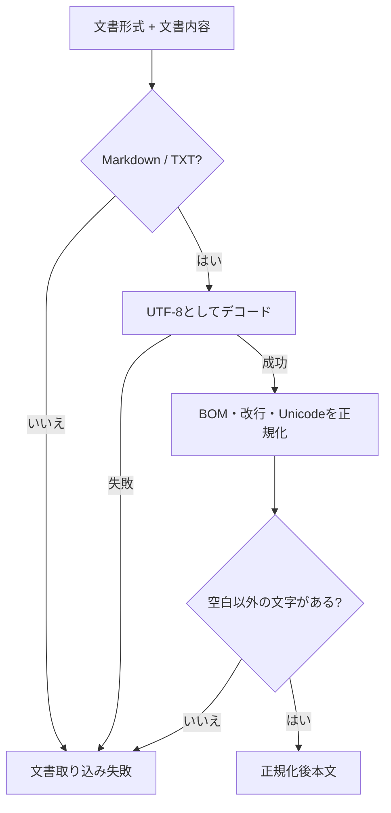

# 文書取り込み設計

> [!abstract] この文書の役割
> 外部から受け取ったMarkdown / TXTの内容を、RAGScope内部で共通して扱う正規化後本文へ変換する処理を定義する。文書や文書バージョンの保存は、[文書・文書バージョン管理設計](<./文書・文書バージョン管理設計.md>)が担当する。

## 1. 目的と適用範囲

文書取り込みは、文書形式と内容を検証し、RAGScope内部の本文の基準へ変換する機能である。

現在扱う文書形式はMarkdownとTXTである。Markdownの見出し、リンク、Frontmatterなどを解析して別の構造へ変換する処理は扱わず、入力内容を本文として扱う。

この機能は文書・文書バージョンを永続化しない。正規化と入力検証に成功した本文を、文書・文書バージョン管理へ渡す。

## 2. 責務と入出力

### 2.1 責務と境界

この機能が担当する範囲は、文書形式の判定、UTF-8としてのデコード、本文の正規化、空本文の検証である。

次の処理は担当しない。

- ファイルパスの解決、ファイル読み込み、HTTP multipartなどの利用インターフェース固有処理
- 文書、文書バージョン、文書集合の識別と永続化
- Markdown構造の解析やHTMLへの変換
- 文書チャンクの生成
- 検索用データや文書チャンクのEmbeddingの生成

### 2.2 入力・成功結果・失敗結果

| 項目 | 内容 |
|---|---|
| 文書形式 | MarkdownまたはTXT |
| 文書内容 | 利用インターフェースが取得したUTF-8のバイト列 |
| 成功結果 | 正規化後本文 |
| 失敗結果 | 対象外形式、UTF-8デコード失敗、空本文などの失敗理由 |

成功結果の正規化後本文は、文書バージョンへ保存する本文、文書チャンクの位置、正解根拠の位置を共有する基準となる。

## 3. 処理設計

### 3.1 全体フロー

### 3.2 処理規則

本文の正規化は、次の順序で行う。

1. 文書内容をUTF-8としてデコードする。
2. 先頭にUTF-8 BOM由来のU+FEFFがある場合だけ除去する。
3. CRLFと単独のCRをLFへ変換する。
4. Unicode正規化形式NFCへ変換する。

Markdown記法、空白、インデント、末尾改行など、それ以外の本文は変更しない。正規化の採用理由と比較は[ADR-0011](<../../../adr/ADR-0011 文書本文をNFC・LFへ正規化し、正規化後本文を位置の基準とする.md>)に記録する。

正規化後本文にUnicodeの空白文字以外が1文字もない場合は、空本文として失敗させる。空本文は文書チャンクや検索用データを作る対象にしない。

正規化に成功した本文は、文書・文書バージョン管理へ渡す。文書バージョンの識別、登録、更新競合の判定は受け渡し先の責務である。

## 4. 失敗時の扱い

| 失敗 | 判定 | 扱い |
|---|---|---|
| 対象外形式 | Markdown / TXT以外が指定された | 正規化後本文を返さない |
| デコード失敗 | 文書内容をUTF-8としてデコードできない | 正規化後本文を返さない |
| 空本文 | 正規化後本文に空白以外の文字がない | 文書管理へ保存を依頼しない |

この機能は入力値だけで結果が決まるため、外部サービスへの再試行を行わない。文書管理への受け渡し後に発生した保存失敗や更新競合は、文書・文書バージョン管理の失敗として扱う。

## 5. 契約と受け渡し

### 5.1 不変条件

- 成功結果はUTF-8として解釈可能な正規化後本文である。
- 成功結果では、BOM除去、改行変換、NFC正規化以外の本文変更を行わない。
- RAGScope内部の本文位置は、入力ファイルのbyte offsetではなく正規化後本文のUnicodeコードポイント位置を基準とする。
- 文書取り込みは文書チャンク、Embedding、全文検索用データを生成しない。
- 失敗時に、文書または文書バージョンを部分的に保存した状態を成功結果として返さない。

### 5.2 他機能・コンポーネントへの受け渡し

| 受け渡し先 | 渡すもの | 渡してよい条件 | 相手が担当すること |
|---|---|---|---|
| 文書・文書バージョン管理 | 正規化後本文、登録または更新の指定、更新時の対象文書と期待する現在の文書バージョン | 形式判定、UTF-8デコード、正規化、空本文検証に成功した場合 | 文書と文書バージョンの識別・保存、更新競合の判定 |

## 関連文書

- [RAGScope要求定義「1.1 文書」](<../../../RAGScope要求定義.md#1.1 文書>)
- [RAGScope用語集「文書」](<../../../RAGScope用語集.md#文書>)
- [RAGScopeドメインモデル](../../RAGScopeドメインモデル.md)
- [システムアーキテクチャ](../../システムアーキテクチャ.md)
- [ADR-0011](<../../../adr/ADR-0011 文書本文をNFC・LFへ正規化し、正規化後本文を位置の基準とする.md>)
- [文書・文書バージョン管理設計](<./文書・文書バージョン管理設計.md>)
