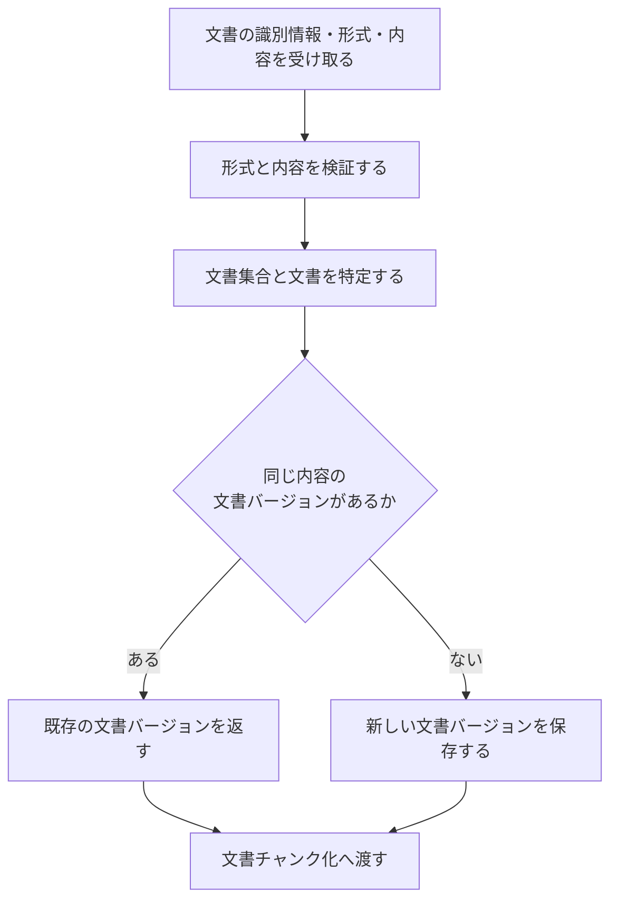

# 文書取り込み設計

> [!abstract] この文書の役割
> MarkdownまたはTXTの技術文書を受け取り、文書集合・文書・文書バージョンの関係を保った追跡可能な版として保存する機能を定義する。
> 保存した文書バージョンは、文書チャンク化へ渡す入力となる。

## 1. 目的と適用範囲

文書取り込みは、外部の技術文書をRAGScope内の文書バージョンへ変換し、後続処理が同じ本文を参照できる状態にする。

| 扱うこと | 扱わないこと |
|---|---|
| Markdown / TXT文書の読み込みと形式の検証 | PDF、OCR、画像、複雑なレイアウトの解析 |
| 文書集合・文書・文書バージョンの識別と保存 | 文書チャンクへの分割 |
| 同じ文書の内容が変わった場合の新しい文書バージョンの作成 | 過去の文書バージョンの上書き |
| 後続処理が位置を参照する基準となる本文の確定 | 検索用データの生成、検索、回答生成 |

この機能は`REQ-DOC-001`と`REQ-DOC-004`を実現し、`REQ-DOC-003`と`REQ-NF-TRACE-002`に必要な追跡の起点を作る。

## 2. 責務と入出力

| 区分 | 内容 |
|---|---|
| 入力 | 文書集合を識別する情報、文書を識別する情報、文書形式、文書内容の取得に必要な情報 |
| 前提 | 文書形式がMarkdownまたはTXTであり、入力元を特定して読み取り境界を呼び出せる |
| 成功結果 | 文書集合と文書に関連付けて保存した文書バージョン |
| 失敗結果 | 文書を読み込めない、形式を扱えない、UTF-8として解釈できない、本文が空である、または保存できないことを表す処理失敗 |
| 後続処理への入力 | 保存済みの文書バージョンを識別する情報 |

RAGScopeアプリケーションは入力元を選び、文書内容を取得する境界をこの機能へ渡す。この機能は、その境界から取得した内容を検証して保存する。入力元がファイルである場合のパスや、RAGScope APIで受け取る項目など、利用インターフェース固有の表現は機能内部の契約へ持ち込まない。

## 3. 処理設計

### 3.1 全体フロー

いずれかの処理に失敗した場合は文書バージョンを成功結果として返さず、文書チャンク化へ進めない。

### 3.2 文書と文書バージョンの識別

- 文書集合は、検索や実験の対象としてまとめて扱う単位として識別する。
- 文書は、同じ技術文書の版を継続して関連付けられる単位として識別する。
- 文書バージョンは、確定した本文が異なる版を区別できるように識別する。
- 同じ文書について同じ本文がすでに保存されている場合は、同じ文書バージョンを再利用する。
- 同じ文書について本文が異なる場合は、新しい文書バージョンを作成する。過去の文書バージョンは上書きしない。
- 文書集合内で文書を同定する具体的な識別子と一意性制約は、データモデルとmigrationを正本とする。

### 3.3 本文の確定

文書の内容はUTF-8として文字列へ変換し、その結果を文書バージョンの本文として保存する。Markdownの記号やTXT内の空白を意味的に解釈して削除しない。

文書チャンクと正解根拠が参照する位置は、保存した文書バージョンの本文を基準とする。入力元の表現を変換する場合は、同じ変換規則から常に同じ本文を得られなければならない。変換規則を変更した結果、確定する本文が変わる場合は、既存の文書バージョンを書き換えず、新しい文書バージョンとして扱う。

本文の文字数が0の場合は失敗とする。空白、改行、Markdown記号だけの内容は、この機能で意味を判定せず本文として扱う。

### 3.4 保存の単位

文書集合、文書、文書バージョンの関係は、成功結果を返す時点ですべて保存されていなければならない。途中まで保存した関係を、後続処理が利用可能な文書バージョンとして公開しない。

同じ入力による再実行では、同じ文書バージョンを再利用できるようにする。これにより、保存結果を確認できないまま呼び出し側が安全に再実行した場合でも、同じ内容の版を重複して作らない。

## 4. 失敗時の扱い

| 失敗 | この機能の扱い | 自動再試行 |
|---|---|---|
| 入力元から読み取れない | 読み取りの処理失敗を返す | 同じ入力のままでは行わない |
| 対象外の文書形式 | 対応していない形式として失敗を返す | 行わない |
| UTF-8として解釈できない | 内容を解釈できない失敗を返す | 行わない |
| 本文が空 | 入力不備として失敗を返す | 行わない |
| 文書の識別条件が既存データと矛盾する | 識別の競合を表す処理失敗を返す | 条件を変えずには行わない |
| データベースへ保存できない | 保存の処理失敗を返す | 呼び出し側が一時的失敗と判断し、同じ処理を安全に繰り返せる場合だけ行う |

具体的な失敗型は処理単位で定義し、DB driverやファイル入出力ライブラリ固有の例外を機能境界から漏らさない。失敗の共通方針は[RAGScopeアプリケーション失敗設計](../../RAGScopeアプリケーション失敗設計.md)に従う。

### 4.1 観測

文書取り込み専用のRAGScope独自SpanやEventRecordは定義しない。データベース処理に適用できるOpenTelemetry Semantic Conventionと標準計装を使用し、開始・成功・失敗や処理失敗の発生だけを理由にEventRecordを追加しない。

呼び出し側がこの機能を含む処理をSpanで追跡する場合、文書取り込みの最終結果がそのSpan自身の失敗になったときだけ、具体的な処理失敗からSpan Statusと`error.type`を決める。Telemetryの記録・送信失敗によって、文書取り込みの結果を変更しない。

## 5. 契約と受け渡し

### 5.1 不変条件

1. 文書バージョンは、1件の文書とその文書が属する文書集合へ追跡できる。
2. 文書バージョンの本文は保存後に書き換えない。
3. 同じ文書の異なる本文を、同じ文書バージョンとして扱わない。
4. 同じ識別情報と本文による再実行は、同じ文書バージョンを再利用できる。
5. 成功結果として返す文書バージョンは、保存済みであり、後続処理から取得できる。

### 5.2 文書チャンク化への受け渡し

文書チャンク化へは、保存済みの文書バージョンを識別する情報を渡す。後続処理は、その識別情報から保存した本文を取得し、入力元のファイルや要求本文を読み直さない。

文書取り込みは分割条件を決めず、文書チャンクを作らない。文書バージョンをどの条件で分割するかは[文書チャンク化設計](./文書チャンク化設計.md)の責務とする。

## 6. 機械可読な正本

正確な型、識別子、DBのテーブル・カラム・一意性制約、トランザクション境界、利用インターフェースの入力形式は、実装時のコード、migration、OpenAPI、テストを正本とする。

## 関連文書

- [RAGScope要求定義「1.1 文書」](<../../../RAGScope要求定義.md#1.1 文書>)
- [RAGScope要求定義「2.1 追跡可能性」](<../../../RAGScope要求定義.md#2.1 追跡可能性>)
- [RAGScopeドメインモデル「2.1 文書」](<../../RAGScopeドメインモデル.md#2.1 文書>)
- [システムアーキテクチャ「4.1 文書を検索可能にする」](<../../システムアーキテクチャ.md#4.1 文書を検索可能にする>)
- [文書チャンク化設計](./文書チャンク化設計.md)
- [Observability設計](../../observability/README.md)
