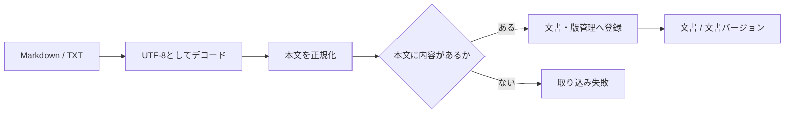

# 文書取り込み設計

> [!abstract] この文書の役割
> Markdown / TXTの技術文書をRAGScopeへ取り込み、正規化した本文を文書と文書バージョンとして登録する処理を定義する。

## 1. 目的と範囲

文書取り込みは、利用インターフェースから渡された技術文書をRAGScope内部の文書として登録する入口である。新しい文書の登録と、既存文書の内容更新を扱う。

CLIでファイルを開く処理やAPIでアップロードを受け取る処理は利用インターフェース側の責務であり、この機能は文書形式と文書内容を受け取ったところから開始する。

文書チャンクへの分割と検索用データの生成は行わない。登録した文書バージョンを検索可能にする処理は、[文書分割設計](./文書分割設計.md)と[検索用データ準備設計](./検索用データ準備設計.md)で扱う。

## 2. 入力と結果

| 項目 | 内容 |
|---|---|
| 文書形式 | MarkdownまたはTXT |
| 文書内容 | 利用インターフェースが取得した文書のバイト列 |
| 登録種別 | 新規登録、または既存文書の更新 |
| 更新対象 | 更新時だけ、対象の文書を識別する情報 |

成功した場合は、登録対象の文書と、その内容を保持する文書バージョンを特定できる結果を返す。

新規登録では文書と最初の文書バージョンを作る。更新では既存の文書へ新しい文書バージョンを追加する。ただし、正規化後の本文が現在の文書バージョンと同じ場合は新しい版を作らず、現在の文書バージョンを結果とする。

## 3. 処理

### 3.1 本文の正規化

RAGScopeは、文書バージョンが保持する本文と、文書チャンクや正解根拠が参照する文書内位置の基準を1つにするため、取り込み時に本文を正規化する。

正規化は次の順序で行う。

1. 文書内容をUTF-8としてデコードする。
2. 先頭にUTF-8 BOM由来のU+FEFFがある場合だけ除去する。
3. 改行コードをLFへ統一する。CRLFはLFへ、単独のCRもLFへ変換する。
4. Unicode正規化形式NFCへ変換する。

Markdown記法、空白、インデント、末尾改行など、それ以外の内容は変更しない。MarkdownをHTMLへ変換したり、見出しやリンク記法を除去したりもしない。

以後、文書バージョンの本文、文書チャンクの位置、正解根拠の位置は、この正規化後の本文を基準にする。

### 3.2 空の文書

正規化後の本文にUnicodeの空白文字以外が1文字もない場合は取り込みを失敗とする。

空白だけの文書を登録しても検索対象として意味のある文書チャンクを作れず、後続処理で特別扱いが必要になるためである。

### 3.3 登録

本文の正規化と検証に成功した後、[文書・版管理設計](<./文書・版管理設計.md>)に従って文書と文書バージョンを登録する。

新規登録では文書と最初の文書バージョンを同じ永続化処理で作る。どちらか一方だけが保存された状態を成功として残さない。

更新では、指定された文書へ正規化後の本文を新しい文書バージョンとして追加する。文書の識別方法、版の不変条件、同じ本文を再登録した場合の扱いは文書・版管理設計を正本とする。

## 4. 失敗時の扱い

次の場合は文書取り込みを失敗とし、文書または文書バージョンを部分的に登録しない。

| 失敗 | 判定 |
|---|---|
| 対象外の形式 | Markdown / TXT以外が指定された |
| デコード失敗 | 文書内容をUTF-8としてデコードできない |
| 空本文 | 正規化後の本文に空白以外の文字がない |
| 更新対象なし | 更新時に指定した文書が存在しない |
| 永続化失敗 | 文書または文書バージョンを保存できない |

同じ文書更新を再実行しても、正規化後の本文が同じなら新しい版を増やさない。この性質により、呼び出し側は処理結果が不明な失敗から同じ入力で再実行しても、同一内容の版を重複させない。

## 5. 境界と不変条件

- 文書取り込みが保存する本文は、必ず3.1の規則で正規化済みである。
- 1つの文書バージョンの本文は登録後に変更しない。
- 文書更新は既存の文書バージョンを書き換えず、新しい内容を別の文書バージョンとして扱う。
- 文書取り込みでは文書チャンク、Embedding、その他の検索用データを生成しない。
- 文書形式や本文をCLIのファイルパス、HTTPのmultipart形式などの利用インターフェース固有表現として保持しない。

正確な識別子、保存項目、DB制約は、実装時の型、Schema、migrationを機械可読な正本とする。

## 関連文書

- [RAGScope要求定義「1.1 文書」](<../../../RAGScope要求定義.md#1.1 文書>)
- [RAGScope要求定義「1.2 評価データ」](<../../../RAGScope要求定義.md#1.2 評価データ>)
- [RAGScope用語集「文書」](<../../../RAGScope用語集.md#文書>)
- [文書・版管理設計](<./文書・版管理設計.md>)
- [文書分割設計](./文書分割設計.md)
