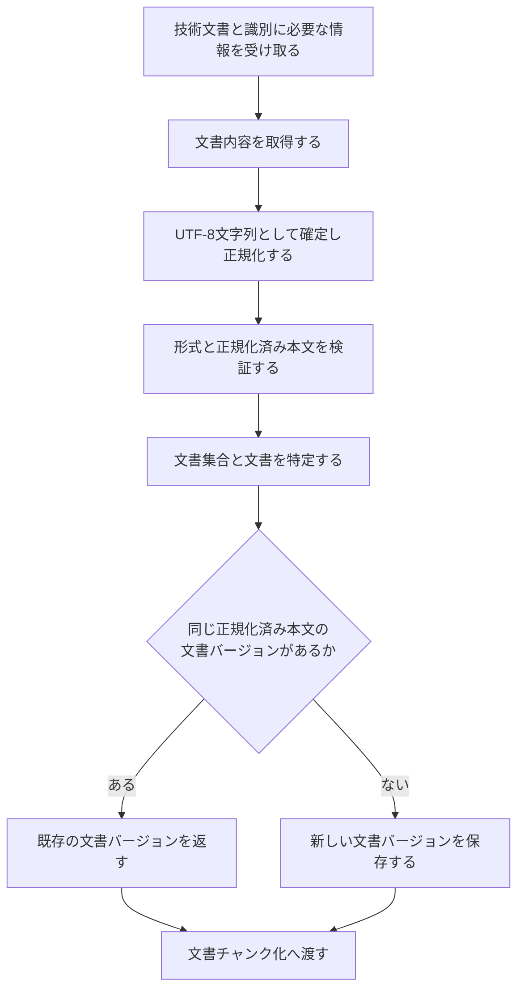

# 文書取り込み設計

> [!abstract] この文書の役割
> MarkdownまたはTXTの技術文書を読み取り、文書集合・文書・文書バージョンの関係を保ったまま、追跡可能な版として保存する機能を定義する。
> 保存した文書バージョンは、文書チャンク化へ渡す入力となる。

## 1. 目的と適用範囲

文書取り込みは、外部の技術文書を読み込み、その内容をRAGScope内の文書バージョンとして保存し、後続処理が同じ本文を参照できる状態を作る。

| 扱うこと | 扱わないこと |
|---|---|
| Markdown / TXT文書を読み取り、形式を検証する | PDF、OCR、画像、複雑なレイアウトを解析する |
| 文書集合、文書、文書バージョンを識別して保存する | 文書を文書チャンクへ分割する |
| 同じ文書の内容が変わった場合に、新しい文書バージョンを作成する | 過去の文書バージョンを上書きする |
| 後続処理が位置を参照するときの基準となる本文を確定する | 検索用データを生成する、検索する、回答を生成する |

この機能は`REQ-DOC-001`を実現し、`REQ-DOC-004`のうち文書集合・文書・文書バージョンを識別し、異なる版を混同せず管理する部分を担う。また、`REQ-DOC-003`と`REQ-NF-TRACE-002`に必要な追跡の起点を作る。

## 2. 責務と入出力

| 区分 | 内容 |
|---|---|
| 入力 | 取り込むMarkdown / TXTの技術文書と、その文書を文書集合・文書として識別するために必要な情報 |
| 前提 | 対象の技術文書を取得でき、文書集合・文書として扱うために必要な情報がそろっている |
| 成功結果 | 文書集合と文書に関連付けて保存した文書バージョン |
| 失敗結果 | 文書内容を取得できない、形式を扱えない、UTF-8として解釈できない、正規化できない、正規化済み本文が空である、または保存できないことを表す処理失敗 |
| 後続処理への入力 | 保存済みの文書バージョン |

この設計書では、入力元から文書内容を取得し、UTF-8への変換、正規化、検証、保存を行うことを文書取り込みの責務とする。

一方、文書取り込みを呼び出す側が、ファイルパス、バイト列、文字列、読み取り処理などのどの形で入力を渡すかは、現時点では決めない。CLI / APIなど利用インターフェース固有の入力形式もこの設計書では決めず、対応するユースケース、インターフェース契約、実装の正本で具体化する。

## 3. 処理設計

### 3.1 全体フロー

いずれかの処理に失敗した場合は、文書バージョンを成功結果として返さず、文書チャンク化へ進めない。

### 3.2 文書と文書バージョンの識別

- 文書集合は、検索や実験の対象として複数の文書をまとめて扱う単位として識別する。
- 文書は、同じ技術文書の複数の版を継続して関連付ける単位として識別する。
- 文書バージョンは、確定した正規化済み本文が異なる版を区別できるように識別する。
- 同じ文書について、同じ正規化済み本文がすでに保存されている場合は、その文書バージョンを再利用する。
- 同じ文書について、正規化済み本文が異なる場合は、新しい文書バージョンを作成する。過去の文書バージョンは上書きしない。
- 文書集合の中で文書を一意に識別するための具体的な識別子と一意性制約は現時点では未決定であり、実装時にコード、migration、テストで定義する。

### 3.3 正規化済み本文の確定

この機能は、入力形態に応じて文書内容を取得し、必要な場合はバイト列をUTF-8として文字列へ変換したうえで、採用済みの正規化規則を適用した結果を、文書バージョンの**正規化済み本文**として保存する。正規化済み本文は、文書チャンクと正解根拠が共通して参照する唯一の本文である。

正規化規則の具体的な内容は現時点では未決定である。改行、Unicode、空白、Markdown記号などを具体的にどう変換するかは、この設計書から推測して決めない。正規化規則を決定するときは、この節と対応する設定Schema、テストを同時に更新する。採用済みの正規化規則がないままでは、`REQ-DATASET-002`と`REQ-DATASET-003`を満たす実装が完了したとは扱わない。

同じ入力には同じ正規化規則を適用し、常に同じ正規化済み本文が得られなければならない。正規化規則の変更によって結果が変わる場合は、既存の文書バージョンを書き換えず、新しい文書バージョンとして扱う。

正規化済み本文のUnicodeコードポイント数が0の場合は失敗とする。空白、改行、Markdown記号だけの内容を空とみなすかどうかは正規化規則で決め、この機能では正規化規則にない判定を追加しない。

### 3.4 保存の単位

文書集合、文書、文書バージョンの関係は、成功結果を返すまでにすべて保存を完了していなければならない。途中まで保存した関係を、後続処理から利用できる文書バージョンとして扱わない。

同じ入力を再実行した場合は、同じ正規化規則から得た正規化済み本文が一致する文書バージョンを再利用できるようにする。これにより、保存結果を確認できないまま呼び出し側が同じ処理をやり直した場合でも、同じ内容の文書バージョンを重複して作らない。

## 4. 失敗時の扱い

| 失敗 | この機能の扱い | 自動再試行 |
|---|---|---|
| 文書内容を取得できない | 文書内容取得の処理失敗を返す | 同じ入力のままでは行わない |
| 対象外の文書形式 | 対応していない形式として失敗を返す | 行わない |
| UTF-8への変換が必要な入力をUTF-8として解釈できない | 内容を解釈できない失敗を返す | 行わない |
| 採用済みの正規化規則を適用できない | 正規化の処理失敗を返す | 同じ入力と規則のままでは行わない |
| 正規化済み本文が空 | 入力不備として失敗を返す | 行わない |
| 文書の識別条件が既存データと矛盾する | 識別の競合を表す処理失敗を返す | 条件を変えずには行わない |
| データベースへ保存できない | 保存の処理失敗を返す | 呼び出し側が一時的失敗と判断し、同じ処理を安全に繰り返せる場合だけ行う |

具体的な失敗型は処理単位で定義する。DB driverや入力取得に使用するライブラリ固有の例外は、この機能の呼び出し側へそのまま返さない。失敗の共通方針は[RAGScopeアプリケーション失敗設計](../../RAGScopeアプリケーション失敗設計.md)に従う。

### 4.1 観測

文書取り込みのためだけのRAGScope独自SpanやEventRecordは定義しない。データベース処理には、適用できるOpenTelemetry Semantic Conventionと標準計装を使用する。文書取り込みの開始、成功、失敗や処理失敗の発生を記録するためだけにEventRecordを追加しない。

呼び出し側が文書取り込みを含む処理をSpanで追跡する場合は、文書取り込みの最終結果によってそのSpan自体を失敗とするときだけ、具体的な処理失敗からSpan Statusと`error.type`を決める。Telemetryの記録や送信に失敗しても、文書取り込みの結果は変更しない。

## 5. 契約と受け渡し

### 5.1 不変条件

1. 文書バージョンから、その文書と文書が属する文書集合へ追跡できる。
2. 文書バージョンの正規化済み本文は、保存後に書き換えない。
3. 同じ文書の異なる正規化済み本文を、同じ文書バージョンとして扱わない。
4. 同じ識別情報、正規化規則、正規化済み本文で再実行した場合は、同じ文書バージョンを再利用できる。
5. 成功結果として返す文書バージョンは保存済みであり、後続処理から取得できる。

### 5.2 文書チャンク化への受け渡し

文書チャンク化へは、保存済みの文書バージョンを渡す。文書チャンク化は、その文書バージョンが保持する正規化済み本文を使用し、元の入力から本文を作り直さない。

文書バージョンを識別子として渡すか、別の値として渡すかという正確な受け渡し方は、この設計書では固定しない。正確な型と識別子は、実装時のコード、migration、テストを正本とする。

文書取り込みでは分割条件を決めず、文書チャンクも作らない。文書バージョンをどの条件で分割するかは[文書チャンク化設計](./文書チャンク化設計.md)で定義する。

## 6. 機械可読な正本

| 定義対象 | 現在参照できる正本 | 実装時に追加する機械可読な正本 |
|---|---|---|
| 責務、入出力、不変条件 | この設計書、[RAGScope用語集](../../../RAGScope用語集.md)、要求定義 | なし |
| 正規化規則 | 未決定。この設計書の3.3節が現在の決定状態を示す | 設定Schema、規則ごとのテスト |
| 型、識別子、一意性制約、トランザクション境界 | 現時点では存在しない | コード、migration、テスト |
| 利用インターフェースの入力形式 | 現時点では存在しない | OpenAPIまたは同等のインターフェースSchema |

存在しないコード、migration、OpenAPIを現在の参照先として扱わない。実装時に表に示した機械可読な正本を追加し、この設計書の概念と対応付ける。

## 関連文書

- [RAGScope要求定義「1.1 文書」](<../../../RAGScope要求定義.md#1.1 文書>)
- [RAGScope要求定義「2.1 追跡可能性」](<../../../RAGScope要求定義.md#2.1 追跡可能性>)
- [RAGScopeドメインモデル「2.1 文書」](<../../RAGScopeドメインモデル.md#2.1 文書>)
- [システムアーキテクチャ「4.1 文書を検索可能にする」](<../../システムアーキテクチャ.md#4.1 文書を検索可能にする>)
- [文書チャンク化設計](./文書チャンク化設計.md)
- [Observability設計](../../observability/README.md)
