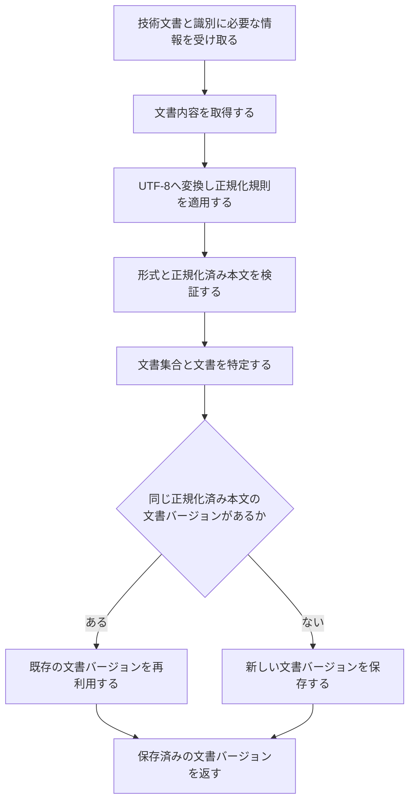

# 文書取り込み詳細設計

> [!abstract] この文書の役割
> [文書取り込み基本設計](./文書取り込み基本設計.md)で定義した責務と境界を前提に、文書内容の取得、正規化、文書バージョンの識別・保存、失敗時の扱い、不変条件を定義する。

## 1. 前提と未決定事項

この詳細設計は、Markdown / TXTの技術文書を文書バージョンとして保存し、成功結果として呼び出し元へ返すまでの内部処理を扱う。

次は現時点では未決定であり、この設計書から推測して決めない。

- 呼び出し側からファイルパス、バイト列、文字列、読み取り処理などのどの形で入力を渡すか
- 文書集合、文書、文書バージョンの正確な識別子と一意性制約
- 正規化規則の具体的な内容
- 正確な失敗型、トランザクション境界、利用インターフェースのSchema

## 2. 処理フロー

いずれかの処理に失敗した場合は、文書バージョンを成功結果として返さない。

## 3. 文書と文書バージョンの識別

- 文書集合は、検索や実験の対象として複数の文書をまとめて扱う単位として識別する。
- 文書は、同じ技術文書の複数の版を継続して関連付ける単位として識別する。
- 文書バージョンは、確定した正規化済み本文が異なる版を区別できるように識別する。
- 同じ文書について、同じ正規化済み本文がすでに保存されている場合は、その文書バージョンを再利用する。
- 同じ文書について、正規化済み本文が異なる場合は、新しい文書バージョンを作成する。過去の文書バージョンは上書きしない。

## 4. 正規化済み本文の確定

文書内容をUTF-8として文字列へ変換し、正規化規則を適用した結果を、文書バージョンの**正規化済み本文**として保存する。正規化済み本文は、文書チャンクと正解根拠が共通して参照する本文である。

正規化規則の具体的な内容は現時点では未決定である。改行、Unicode、空白、Markdown記号などを具体的にどう変換するかは、この設計書から推測して決めない。正規化規則を決定するときは、この節と対応する設定Schema、テストを同時に更新する。具体的な正規化規則が決まるまでは、この正規化処理を実装済みとは扱わない。

同じ入力には同じ正規化規則を適用し、常に同じ正規化済み本文が得られなければならない。正規化規則の変更によって結果が変わる場合は、既存の文書バージョンを書き換えず、新しい文書バージョンとして扱う。

正規化済み本文のUnicodeコードポイント数が0の場合は失敗とする。空白、改行、Markdown記号だけの内容を空とみなすかどうかは正規化規則で決め、この機能では正規化規則にない判定を追加しない。

## 5. 保存の単位と再実行

文書集合、文書、文書バージョンの関係は、成功結果を返すまでにすべて保存を完了していなければならない。途中まで保存した関係を成功結果として返さない。

同じ入力を再実行した場合は、同じ正規化規則から得た正規化済み本文が一致する文書バージョンを再利用する。保存結果を確認できないまま呼び出し側が同じ処理をやり直した場合でも、同じ内容の文書バージョンを重複して作らない。

## 6. 失敗時の扱い

| 失敗 | この機能の扱い | 自動再試行 |
|---|---|---|
| 文書内容を取得できない | 文書内容取得の処理失敗を返す | 同じ入力のままでは行わない |
| 対象外の文書形式 | 対応していない形式として失敗を返す | 行わない |
| UTF-8として解釈できない | 内容を解釈できない失敗を返す | 行わない |
| 正規化規則を適用できない | 正規化の処理失敗を返す | 同じ入力と規則のままでは行わない |
| 正規化済み本文が空 | 入力不備として失敗を返す | 行わない |
| 文書の識別条件が既存データと矛盾する | 識別の競合を表す処理失敗を返す | 条件を変えずには行わない |
| データベースへ保存できない | 保存の処理失敗を返す | 呼び出し側が一時的失敗と判断し、同じ処理を安全に繰り返せる場合だけ行う |

具体的な失敗型は処理単位で定義する。DB driverや入力取得に使用するlibrary固有の例外は、この機能の呼び出し側へそのまま返さない。失敗の共通方針は[RAGScopeアプリケーション失敗設計](../../RAGScopeアプリケーション失敗設計.md)に従う。

## 7. Observability

文書取り込みのためだけのRAGScope独自SpanやEventRecordは定義しない。データベース処理には、適用できるOpenTelemetry Semantic Conventionと標準計装を使用する。文書取り込みの開始、成功、失敗や処理失敗の発生を記録するためだけにEventRecordを追加しない。

呼び出し側が文書取り込みを含む処理をSpanで追跡する場合は、文書取り込みの最終結果によってそのSpan自体を失敗とするときだけ、具体的な処理失敗からSpan Statusと`error.type`を決める。Telemetryの記録や送信に失敗しても、文書取り込みの結果は変更しない。

## 8. 不変条件

1. 文書バージョンから、その文書と文書が属する文書集合へ追跡できる。
2. 文書バージョンの正規化済み本文は、保存後に書き換えない。
3. 同じ文書の異なる正規化済み本文を、同じ文書バージョンとして扱わない。
4. 同じ識別情報、正規化規則、正規化済み本文で再実行した場合は、同じ文書バージョンを再利用する。
5. 成功結果として返す文書バージョンは保存済みである。

## 9. 機械可読な正本

| 定義対象 | 現在参照できる正本 | 実装時に追加する機械可読な正本 |
|---|---|---|
| 責務と境界 | [文書取り込み基本設計](./文書取り込み基本設計.md) | なし |
| 処理規則、不変条件 | この設計書、[RAGScope用語集](../../../RAGScope用語集.md)、要求定義 | なし |
| 正規化規則 | 未決定。この設計書の4節が現在の決定状態を示す | 設定Schema、規則ごとのテスト |
| 型、識別子、一意性制約、トランザクション境界 | 現時点では存在しない | コード、migration、テスト |
| 利用インターフェースの入力形式 | 現時点では存在しない | OpenAPIまたは同等のインターフェースSchema |

存在しないコード、migration、OpenAPIを現在の参照先として扱わない。

## 関連文書

- [文書取り込み基本設計](./文書取り込み基本設計.md)
- [RAGScopeアプリケーション失敗設計](../../RAGScopeアプリケーション失敗設計.md)
- [Observability設計](../../observability/README.md)
